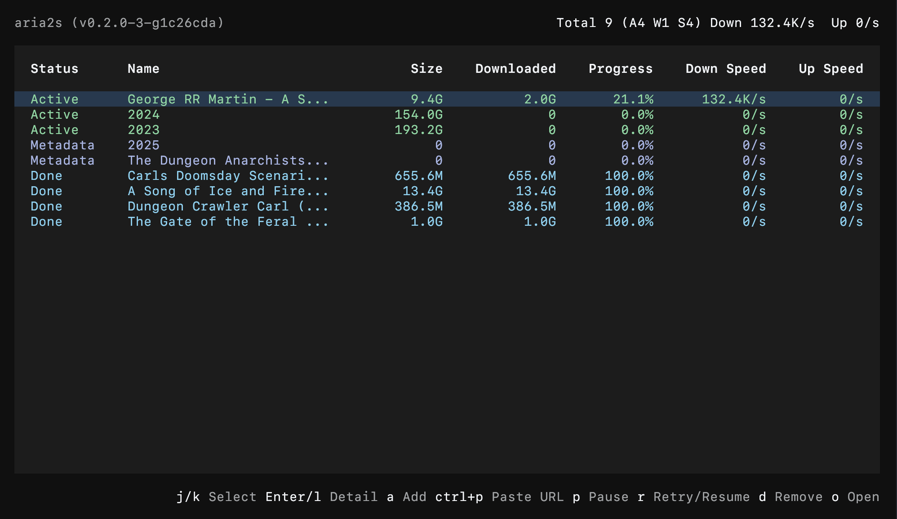

# `aria2s` - Your `aria2c`, always on.

`aria2s` turns `aria2c` into an always-on download service with a terminal dashboard to manage downloads.



## Install

One-liner (macOS / Linux)
```bash
curl -fsSL https://raw.githubusercontent.com/amio/aria2s/main/install.sh | sh
```
Or if you have Go installed
```bash
go install github.com/amio/aria2s@latest
```

## Uninstall

```bash
aria2s uninstall           # remove the registered background service
rm "$(command -v aria2s)"  # remove the binary
```

## Quick Start

```bash
aria2s install --start     # install & launch the background service
aria2s dashboard           # open the interactive terminal dashboard to manage downloads
```

or simply:

```bash
aria2s                     # ensure install/start, open the terminal dashboard
```

## Commands

| Command | What it does |
|---------|-------------|
| `aria2s` | Daily entrypoint: repair managed setup if needed, start the service, then open the responsive full-screen dashboard without blocking on RPC readiness. |
| `aria2s install [--start]` | Set up `aria2c` as a background service through `launchd` on macOS or `systemd --user` on Linux. Re-running it reasserts the managed service state and writes a default `~/.aria2/aria2.conf` only when that file is missing. |
| `aria2s uninstall` | Remove the registered background service. |
| `aria2s start` / `stop` / `restart` | Control the background service. `start` returns immediately when the service is already healthy. Stop & restart save the session first. |
| `aria2s status` | Show service state, port, version, and log paths at a glance. |
| `aria2s doctor` | Check for common issues (missing binary, port conflicts, unloaded or stopped supervisor). |
| `aria2s version` / `-v` / `--version` | Print the aria2s version. |
| `aria2s logs` | Print recent log output. |
| `aria2s add <url-or-magnet>` | Submit a download via RPC — no need to remember the port or token. |
| `aria2s dashboard` | Explicit dashboard entrypoint. Uses the same repair/start flow as bare `aria2s`; while aria2 reconnects, the UI stays interactive and preserves the last successful in-memory snapshot. |

`aria2s` is a thin wrapper around `aria2c`: user-tuned download settings live in `~/.aria2/aria2.conf`, while the managed RPC and session flags are passed to `aria2c` through the service definition.

The default config also enables `bt-save-metadata`, `bt-load-saved-metadata`, and `bt-seed-unverified` so BitTorrent downloads survive restarts without re-fetching magnet metadata or re-verifying already-completed payloads. Since `install` never overwrites an existing `aria2.conf`, add these three lines manually if your config predates them.

### Staging directory

Downloads added through aria2s are staged in a sibling `.incomplete` directory of their target (e.g. `/Volumes/SynoPub/News` → `/Volumes/SynoPub/.incomplete/News`), so in-progress payloads, `.aria2` control files, and saved `.torrent` metadata never appear in the target folder. When a download completes, aria2c invokes a generated hook (`on-complete-hook.sh` → `aria2s complete-hook`) as a one-shot process — no resident aria2s process is involved — which moves the payload into place via instant same-volume rename, repoints aria2 so seeding continues uninterrupted, and flushes the session. A sweep on `aria2s start`/dashboard launch retries any moves the hook missed. If a destination filename is already taken, the payload stays in staging (nothing is ever overwritten). Downloads added by other RPC clients are unaffected.

Dashboard reads are bounded, batched RPC requests. Slow or unavailable RPC never blocks
navigation or quit, failed refreshes keep last-known-good rows visible, and mutations with an
unconfirmed outcome are reconciled without automatic resubmission.

## Development

```bash
make build        # build
make test         # run all tests
```

Dashboard runtime and shortcut-key migration notes live in `docs/implemented/bubbletea-v2-upgrade.md`.

Smoke-test in an isolated environment:

> Linux note: service startup still needs a live `systemd --user` session even when `HOME` is overridden for an isolated test directory.

```bash
TMP_HOME=$(mktemp -d)
HOME="$TMP_HOME" ./bin/aria2s install --start
HOME="$TMP_HOME" ./bin/aria2s status
HOME="$TMP_HOME" ./bin/aria2s add https://example.com/file.zip
HOME="$TMP_HOME" ./bin/aria2s uninstall
rm -rf "$TMP_HOME"
```

## License

MIT
