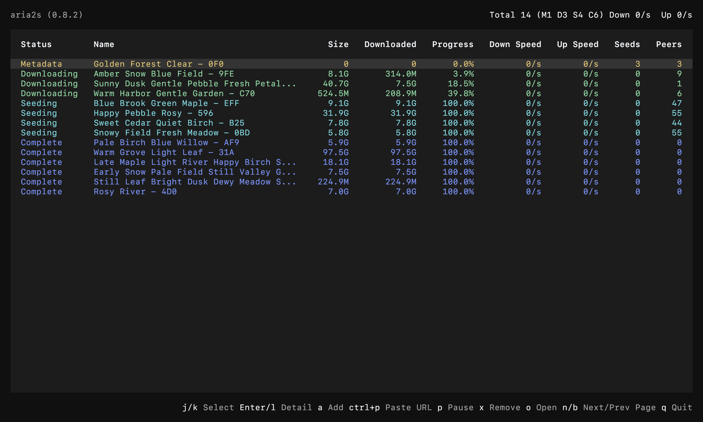

# `aria2s` - Your `aria2c`, always on.

`aria2s` turns `aria2c` into an always-on download service with a terminal dashboard to manage downloads.



## Install

One-liner (macOS / Linux)
```bash
curl -fsSL https://raw.githubusercontent.com/amio/aria2s/main/install.sh | sh
```
Or if you have Go installed
```bash
go install github.com/amio/aria2s@latest
```

Install a specific release:

```bash
curl -fsSL https://raw.githubusercontent.com/amio/aria2s/main/install.sh | \
  sh -s -- --version v0.4.0
```

This replaces the current `aria2s` binary and runs that release's setup. It is primarily a
recovery path for finishing v1 tasks before reinstalling the latest managed runtime. The
downloaded release is verified with its published checksum.

## Uninstall

```bash
aria2s uninstall           # remove the registered background service
rm "$(command -v aria2s)"  # remove the binary
```

## Quick Start

```bash
aria2s install --start     # install & launch the background service
aria2s dashboard          # open the interactive terminal dashboard to manage downloads
```

After installation, the daily entrypoint is:

```bash
aria2s                    # open the dashboard; start the installed service if needed
```

`aria2s` and `aria2s dashboard` reuse the running managed service. If it is stopped,
they validate and start the installed service. For first-time setup or incomplete
installation, run `aria2s install` explicitly; add `--start` to launch it immediately.

## How it works

- `aria2s install` registers `aria2c` as a background service; use `install --start` or `aria2s start` to run it.
- The dashboard is only a task viewer and manager. Quitting it does not stop downloads; use `aria2s stop` to do that.
- Control download-service behavior through the standard `~/.aria2/aria2.conf`; after editing it, run `aria2s restart` for the changes to take effect.
- Managed logs suppress aria2's interactive progress spam and rotate at 50 MiB on startup, retaining the current file plus `.1` and `.2` archives.

## Commands

| Command | What it does |
|---------|-------------|
| `aria2s` | Open the full-screen dashboard, reusing the running managed service or validating and starting the installed service without blocking on RPC readiness. Setup and repair require an explicit `aria2s install`. |
| `aria2s install [--start]` | Set up `aria2c` as a background service through `launchd` on macOS or `systemd --user` on Linux. Re-running it reasserts the managed service state and writes a default `~/.aria2/aria2.conf` only when that file is missing. |
| `aria2s uninstall` | Remove the registered background service. |
| `aria2s start` / `stop` / `restart` | Control the background service. `start` returns immediately when the service is already healthy. Stop & restart save the session first. |
| `aria2s status` | Show service state, port, version, and log paths at a glance. |
| `aria2s doctor` | Diagnose installation integrity, service/RPC health, and existing download tasks, with evidence and recovery suggestions. |
| `aria2s update` | Download the latest GitHub release, require its published checksum, verify the new binary, and atomically replace the current CLI. Running downloads are not restarted. |
| `aria2s version` / `-v` / `--version` | Print the aria2s version. |
| `aria2s logs` | Print recent log output. |
| `aria2s add <url-or-magnet>` | Submit a download via RPC — no need to remember the port or token. |
| `aria2s dashboard` | Same as bare `aria2s`. While aria2 reconnects, the UI stays interactive and preserves the last successful in-memory snapshot. |

`aria2s` is a thin wrapper around `aria2c`: user-tuned download settings live in `~/.aria2/aria2.conf`, while the managed RPC and session flags are passed to `aria2c` through the service definition.

Doctor groups checks into **Installation**, **Service & RPC**, and **Downloads**.
It checks local task records, storage and payload identity, native transfer errors,
and unfinished publication/removal. Paused, waiting, and seeding tasks are normal;
a single zero-speed observation is not considered a failure. If RPC is unavailable,
local checks still run and live task coverage is explicitly marked unchecked.

```sh
aria2s doctor                     # grouped checks, evidence, and next steps
aria2s doctor --summary           # compact overview
aria2s doctor --all               # every task and full diagnostic text
aria2s doctor --json              # one versioned JSON report for tools
aria2s doctor --ascii --no-color  # plain terminal output
```

The default report shows up to ten task findings and five distinct suggestions;
`--all` and `--json` include the full results. Human output wraps to the terminal
width, capped at 100 columns (also the fallback for redirected output). Headings,
status, and references use distinct styles; `NO_COLOR` and `--no-color` disable
color. Long names are shortened by default; `--all` keeps them in full and still
wraps to the available width. Home-directory paths appear as `~/` in human
output; JSON retains full paths. Source URLs and RPC credentials are
redacted in every mode. JSON goes to stdout; progress and repair messages go to
stderr. Exit status is nonzero for errors or incomplete checks, and zero for
warnings alone. JSON includes separate `healthy` (no observed errors) and
`complete` (no unchecked observations) fields; automation should check both.

Diagnosis does not start services, retry tasks, or write task/storage state.
When Doctor identifies a supported startup blocker, follow its explicit
`aria2s doctor --repair --discard-unmanaged-tasks` recommendation. This recovery
preserves managed downloads and verifies RPC; the acknowledgement accepts that
unmanaged tasks cannot be preserved while RPC is blocked. It does not repair
individual download tasks. Filesystem checks inspect payload roots, not every
downloaded byte, and the report describes a point-in-time observation.

Managed magnet downloads save metadata and reuse retained torrent metainfo during
restart recovery, even when an existing `aria2.conf` lacks metadata settings. No manual
metadata configuration is needed for managed downloads, and `install` preserves your
existing config. Unfinished staged torrents verify existing bytes when native resume
state is unavailable; only already-published final seeds use `bt-seed-unverified`.

Dashboard reads are bounded, batched RPC requests. Slow or unavailable RPC never blocks
navigation or quit, failed refreshes keep last-known-good rows visible, and mutations with an
unconfirmed outcome are reconciled without automatic resubmission.

## Development

```bash
make build        # build
make test         # run all tests
```

Dashboard runtime and shortcut-key migration notes live in `docs/implemented/bubbletea-v2-upgrade.md`.

Smoke-test in a dedicated OS test account or VM. A different `HOME` directory does not
isolate the service: launchd labels and systemd unit names are shared within the same
user account. On Linux, log in with a live `systemd --user` session.

From a checkout in that test environment:

```bash
make build
CANDIDATE="$(pwd)/bin/aria2s"
"$CANDIDATE" install --start
"$CANDIDATE" status
"$CANDIDATE" dashboard
# Add a small, known test download; check pause/resume, then quit the dashboard.
"$CANDIDATE" restart
"$CANDIDATE" dashboard
# Confirm the task recovers and its completed payload is correct, then quit.
"$CANDIDATE" uninstall
```

Keep the candidate at the installed path while testing. After rebuilding or replacing
it, rerun `"$CANDIDATE" install` to register its new identity before starting a stopped
service. Uninstall removes the service registration; it leaves download data in place.

## License

MIT
