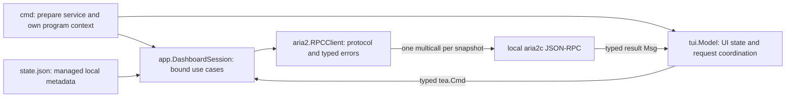

# Dashboard Runtime Architecture

Status: Proposed

## Managed Lifecycle Supersession

`docs/reliable-managed-download-lifecycle.md` supersedes this document only where the new
managed-job lifecycle needs durable publication intent. The asynchronous runtime mechanics
here remain authoritative: `PrepareDashboard` still returns without waiting for RPC, there
is one bounded snapshot pipeline, I/O stays outside `Update`/`View`, last-known-good data is
retained, and unknown mutations are never blindly repeated.

For new managed jobs, apply these newer contracts instead of the older examples below:

- aria2 remains authoritative for transfer progress/protocol state, while the small jobs
  store owns target, activity, publication WAL, retained metainfo, and restart recipe;
- stable task ID (also the sole managed GID) is selection and pending-mutation identity;
- `SetActivity(jobID, running)` replaces separate Pause/Resume workflows and `Retry(jobID)`
  reconciles the same task instead of creating a replacement GID;
- app snapshots join manifests with native aria2 facts and return canonical status groups;
- Dashboard preparation may still reconcile managed service artifacts as described below,
  but preparation and snapshots do not reconcile managed-job lifecycle or storage;
  `managed-exec`, event hooks, and explicit Retry own those task mutations.

Under the managed runtime schema, a native row without a manifest is an unsupported external
mutation: it may use its GID as temporary display identity, but no replacement-GID Retry or
durable compatibility path applies. Pre-managed tasks are never imported by the new runtime.

## Context

The dashboard currently performs RPC and local I/O from Bubble Tea's `Update` path. A
slow endpoint therefore prevents the event loop from processing input, rendering, resizing,
or quitting. Moving individual actions into `tea.Cmd` did not close the boundary because
refresh, detail, pagination, Add, and action-result paths still perform synchronous work.

The fix needs one request lifecycle and one data-consistency policy, not more handler-level
async wrappers.

## Assumptions

- `aria2c` remains the authoritative and only durable owner of downloads.
- The RPC endpoint remains local loopback and should respond quickly when healthy.
- `aria2s` remains a thin service wrapper, not another daemon or download database.
- The dashboard may retain the last successful snapshot in memory only.
- Explicit lifecycle commands such as `aria2s start` keep their synchronous readiness
  contract.

## Goals

- Keep every interaction responsive while any I/O is pending, failed, or stuck.
- Give reads and mutations explicit pending, success, deterministic failure, timeout,
  unknown-outcome, and stale-result handling.
- Preserve last-known-good data and recover automatically.
- Guarantee deterministic ordering with Bubble Tea's existing `Cmd` and `Msg` model.
- Keep package ownership cohesive and the implementation small.

## Non-Goals

- Persist download snapshots outside aria2.
- Add a repository abstraction, event bus, scheduler, or background process.
- Make the TUI own install/start/stop policy.
- Optimistically mutate aria2-owned rows.
- Redesign styling or shortcuts.

## Architecture



### Ownership

| Layer | Owns | Must not own |
| --- | --- | --- |
| `cmd` | Preparation, session context, program lifetime | RPC encoding or UI state |
| `app` | Lifecycle policy, dashboard use cases, bound RPC identity, local metadata | Bubble Tea messages or rendering |
| `aria2` | JSON-RPC encoding, multicall decoding, primitive operations, protocol errors | UI retry timers or presentation |
| `tui` | Interaction state, request scheduling, pending state, one-off OS helpers inside `tea.Cmd` | Direct I/O in `Update`/`View`, remote policy, or persistence policy |
| `state` | Atomic managed-metadata persistence | Download snapshots |
| `service` | Supervisor install/start/stop/load primitives | Dashboard recovery policy |

`app` continues to coordinate lifecycle policy because it sees managed state, RPC, and
supervisor state together. `service.Backend` remains a raw supervisor adapter.

## Executable App Boundary

### Dashboard Preparation

Dashboard preparation and explicit lifecycle readiness are separate use cases.

```go
func (app *App) PrepareDashboard(ctx context.Context) (*DashboardSession, error)
```

The implementation reuses lifecycle policy through three private seams, rather than calling
the current blocking methods or copying their decisions:

```go
func (app *App) inspectDashboard(ctx context.Context) (dashboardInspection, error)
func (app *App) reconcileManagedRuntime(ctx context.Context, desired state.State) (state.State, error)
func (app *App) startSupervisor(ctx context.Context) error
```

`inspectDashboard` is the read-only fast path. It uses stored state first, checks only managed
structure and supervisor state, and never calls `LookPath` or RPC when the stored executable
is usable. User-tuned `aria2.conf` content is not a daily-dashboard repair trigger.

`reconcileManagedRuntime` is the side-effecting body extracted from `Install`: it applies one
desired state to managed files and supervisor registration and returns the final state. An
explicit `Install` still discovers the binary from `PATH`; dashboard repair reuses a valid
stored binary and discovers one only when that identity is absent or invalid.

`startSupervisor` starts only when necessary and never probes RPC. `Start` becomes
`preflight + startSupervisor + waitForRPC`; `Install(ctx, true)` becomes
`reconcile + startSupervisor + waitForRPC`. `PrepareDashboard` performs inspection, runs the
same reconcile seam only when needed, calls `startSupervisor`, and returns a session without
`waitForRPC`. It replaces `EnsureDashboardReady` rather than leaving two dashboard policies.

Program ownership stays in `cmd`; the policy-free `App.RunDashboard` callback is removed. A
small unexported `newRoot(application, runner)` keeps command tests injectable. The default
runner is explicitly cancellable:

```go
sessionCtx, cancel := context.WithCancel(ctx)
defer cancel()

model := tui.NewModel(sessionCtx, session, interval, version)
program := tea.NewProgram(model, tea.WithContext(sessionCtx))
_, err := program.Run()
```

Every `tea.Cmd` captures `sessionCtx`; Bubble Tea does not cancel already-started command I/O
on its own. Parent cancellation exits the program, while normal quit returns from `Run` and
the deferred cancel stops outstanding RPC and context-aware helpers.

### Bound Dashboard Session

`DashboardSession` binds only immutable RPC identity from `state.json`: endpoint, secret,
and managed paths. It does not reload those fields for every request and does not adopt a
concurrently replaced identity; restart the dashboard after reinstall or identity change.

`RecentDirs` is different mutable metadata. Its reads and updates continue using the latest
state through app-owned methods rather than a cached session copy. Cross-process concurrent
metadata editing is not added to this design; atomic replacement prevents torn or invalid
state, while lifecycle commands and one dashboard remain the supported writers.

The consumer-owned interface remains in `tui`; `DashboardSession` implements it. Synchronous
methods are intentional because Bubble Tea commands control where they execute. App use-case
results live in `app`, not in the RPC protocol package.

```go
type DashboardService interface {
    Snapshot(context.Context, app.DashboardQuery) (app.DashboardRead, error)
    TaskDetail(context.Context, string) (app.TaskDetail, error)
    AddURI(context.Context, string, aria2.AddOptions) (app.AddResult, error)
    RecentDirs(context.Context) ([]string, error)
    DefaultDir() string
    Pause(context.Context, string) error
    Resume(context.Context, string) error
    Retry(context.Context, string) (app.RetryResult, error)
    Remove(context.Context, string) error
    ClearStopped(context.Context, string) error
}

type AddResult struct {
    GID     string
    Warning error
}

type RetryResult struct {
    NewGID         string
    CleanupWarning error
}
```

Read and mutation deadlines are injectable `app.Options` values and applied by the session.
Recommended local defaults are two and five seconds; the HTTP client timeout remains a final
safety net. Clipboard and process helpers use their own small TUI-local deadlines where the
OS API supports cancellation.

## Read Model

### One Batched Poll

Progress and speed require polling. aria2 WebSocket notifications report lifecycle events,
not continuous progress, so keeping WebSocket beside polling adds reconnect and channel
state while improving external lifecycle updates by at most one second. The dashboard removes
its WebSocket path.

Every completed interval starts one HTTP `system.multicall` containing:

- `aria2.tellActive`;
- bounded `aria2.tellWaiting`;
- the requested `aria2.tellStopped` page;
- optional `aria2.tellStatus` for the visible detail GID;
- optional `aria2.getUris` only while initially resolving detail source data.

Native protocol types live in `internal/aria2`. The app converts that bounded observation into
its product read model before returning it; `tui` depends only on the app query, row, and detail
types.

```go
// internal/app
type DashboardListWindow struct {
    WaitingLimit  int
    StoppedOffset int
    StoppedLimit  int
}

type DashboardQuery struct {
    List                DashboardListWindow
    DetailGID           string
    ResolveDetailSource bool
}

type DashboardRead struct {
    Downloads       TaskSnapshot
    ListErr         error
    Detail          *TaskDetail
    DetailErr       error
    DetailSourceErr error
}

// internal/aria2
type ReadBatchQuery struct {
    List                ListOptions
    DetailGID           string
    ResolveDetailSource bool
    ObserveGIDs         []string
}
```

The three list calls are one validity unit: a nested list fault sets `ListErr`, rejects the
new list, and preserves the previous snapshot while valid detail results may still apply. A
detail fault does not discard a valid list. Only an outer transport/decode/shape failure uses
the returned `error` and makes all subresults unusable.

### Multicall Protocol Seam

`system.multicall` must not reuse the existing ordinary-call parameter encoder unchanged:

- outer `params` is exactly `[]any{calls}` and has no token parameter;
- each call is `{methodName, params}`;
- each nested method prepends `token:<secret>` to its own params;
- result count must equal call count and each success must be a one-item array;
- a nested fault decodes code/message and maps back to its method and index;
- one descriptor slice builds calls and decodes their indexes, including optional detail calls;
- any count or shape mismatch is a malformed whole-read failure;
- outer transport/decode failure fails the whole read.

This logic belongs in one dedicated `RPCClient.multicall` encoder/decoder, backed by protocol
tests. It is not exposed to `app` or `tui`.

### Poll Cadence

The next one-second timer is scheduled only after the current read finishes. Slow or failed
reads therefore cannot accumulate timer messages. A fixed interval is preferred over an
exponential-backoff state machine: the endpoint is local, one failed request per completed
interval is bounded, and fast recovery matters.

## Data And Refresh State

List and detail validity are independent because one multicall may produce a valid list and
a failed detail. The combined wire query is not reused as applied UI state.

```go
type ListState struct {
    Requested     app.DashboardListWindow
    Applied       app.DashboardListWindow
    Snapshot      app.TaskSnapshot
    HasSnapshot   bool
    Attempted     bool
    LastSuccessAt time.Time
    LastError     error
}

type DetailState struct {
    RequestedGID   string
    AppliedGID     string
    Detail         app.TaskDetail
    HasDetail      bool
    SourceResolved bool
    LastError      error
    SourceError    error
}

type RefreshState struct {
    InFlight   bool
    Queued     bool
    Generation uint64
    TimerToken  uint64
}
```

List health is derived instead of maintained as another enum:

- Connecting: `!Attempted`;
- Fresh: `HasSnapshot && LastError == nil`;
- Stale: `HasSnapshot && LastError != nil`;
- Unavailable: `Attempted && !HasSnapshot && LastError != nil`.

Pagination keeps showing and labelling the applied history page while the header/footer says
that the requested page is loading. It never relabels old stopped rows as the target page.

On a current result, list success updates `ListState.Applied` and list timestamps even when
detail fails; `ListErr` preserves the old list without blocking a valid detail. `tellStatus`
failure updates only `DetailState.LastError` and preserves matching detail data. Successful
`tellStatus` applies its immutable result-query GID immediately. A source found in
`tellStatus` (or retained for the same GID) resolves the source and suppresses a redundant
`getUris` fault. aria2's permanent `No URI data is available` answer also resolves without
retry or SOURCE noise (common for completed downloads). Other empty-source `getUris` faults
keep `SourceError` and retry until resolved. An old detail is never rendered for a different
requested GID.

The transitions are exact:

- outer read failure sets `Attempted` and the scoped list/detail errors while preserving all
  applied data;
- `ListErr` sets `Attempted = true` and `LastError = ListErr`, preserving `Applied`,
  `Snapshot`, `HasSnapshot`, and `LastSuccessAt`; multiple nested list faults use
  `errors.Join` so every method/index remains visible;
- list success sets `Attempted = true`, clears `LastError`, replaces the snapshot, sets
  `Applied = result.Query.List`, `HasSnapshot = true`, and advances `LastSuccessAt`;
- detail-target change clears target-scoped errors and `SourceResolved`, while old detail is
  retained but hidden when its `AppliedGID` does not match;
- query construction sets `ResolveDetailSource` when
  `AppliedGID != RequestedGID || !SourceResolved`;
- successful `tellStatus` sets `AppliedGID = result.Query.DetailGID`, `HasDetail = true`, and
  clears `LastError`; source success clears `SourceError` and sets `SourceResolved = true`.

### Refresh Coordinator

Rules:

1. At most one snapshot is in flight.
2. Any number of triggers during a read collapse into one `Queued` bit.
3. List-query changes, detail-target changes, and mutation completion advance `Generation`.
4. A result carries its generation and immutable query; it applies only when current.
5. An immediate refresh invalidates an old timer with `TimerToken`.
6. After a result, run the latest queued query immediately or schedule the next timer.

A separate snapshot request ID is unnecessary because the single pipeline cannot have two
reads in flight.

### Selection And Detail

GID is selection identity; rendered index is only a fallback when a task disappears. On
apply, prefer a desired Add/Retry GID, then the existing selected GID, then the nearest valid
fallback index.

Entering detail changes mode immediately and updates `DetailState.RequestedGID`. The command
builds one immutable `DashboardQuery` from current list/detail state. Back, navigation,
scrolling, resize, and quit remain active while loading. Matching prior detail stays visible
with refreshing/stale status; a new target without data shows an inline loading or error
shell. Regular snapshots include `tellStatus` for that target, avoiding a second detail poll.

## Mutation Model

Task mutations run independently from the single read pipeline. At most one mutation per GID
may be pending; different GIDs may proceed concurrently. This makes `Kind + GID` sufficient
to match a result, without a global action request ID.

On start:

- record pending intent by GID and render `Pausing...`, `Removing...`, or similar;
- disable incompatible actions for that GID only;
- keep navigation and quit available;
- do not optimistically rewrite the snapshot.

On completion:

- clear matching pending intent;
- advance read generation so a pre-mutation snapshot cannot apply afterward;
- retain a replacement GID as desired selection when present;
- show scoped success, warning, deterministic error, or unknown-outcome feedback;
- request one coalesced refresh.

### Safe Retry Ownership And Order

Retry is a multi-step use case and belongs in `app.DashboardSession`, not in
`aria2.RPCClient`. Its order is:

1. read source URIs, directory, and required task metadata;
2. add the replacement and obtain `NewGID`;
3. only after confirmed Add success, best-effort clear the old stopped result;
4. return `NewGID` plus an optional cleanup warning.

If Add is rejected, the old error row remains. If Add has unknown outcome, do not clear the
old row and do not automatically resend. If cleanup fails, the confirmed replacement remains
selected and the old row may remain for manual cleanup. No transaction manager is needed.

Primitive RPC operations and encoding remain in `aria2`; only orchestration moves to `app`.
The compile-time seam is explicit:

```go
type RetrySource struct {
    Status string
    Dir    string
    URIs   []string
}

func (*RPCClient) RetrySource(context.Context, string) (RetrySource, error)
func (*RPCClient) AddURIs(context.Context, []string, AddOptions) (string, error)
func (*RPCClient) RemoveDownloadResult(context.Context, string) error
```

`LocalRPC` exposes state-bound equivalents to `DashboardSession`. `RetrySource` resolves
usable URIs, including the current info-hash fallback when needed; it never mutates the old
task.

### Mutation Outcome

The RPC boundary uses a mutation-specific call path. Client validation/request encoding
failure and a completely decoded `RPCError` are deterministic. aria2 carries some valid
JSON-RPC faults in HTTP 400 responses, so the body is decoded before applying HTTP status
policy. Once a request is handed to HTTP, any failure without valid JSON-RPC success/error
confirmation is conservatively unknown: transport error, timeout, non-2xx status without a
decodable RPC fault, EOF, response JSON failure, or result-shape failure.

`OutcomeUnknownError` identifies `ErrOutcomeUnknown` and unwraps its cause, so both
`errors.Is(err, ErrOutcomeUnknown)` and checks such as
`errors.Is(err, context.DeadlineExceeded)` work. Reads use the same underlying typed causes
without the unknown marker and become stale/unavailable instead.

- Unknown classification covers Add, Pause/Resume, Remove, ClearStopped, and both mutating
  phases of Retry.
- Unknown outcomes are never automatically repeated.
- Every unknown outcome triggers reconciliation and explains possible server-side success.

### Add

Form Add and clipboard quick-add share one serialized Add pipeline. While one Add is pending,
both Submit and Paste Add are disabled; this removes the need for an Add request ID. The state
retains the pending intent and, when necessary, the last unknown intent.

- Keep field contents while pending.
- Confirmed success resets the form, returns to list, remembers the new GID, and refreshes.
- Deterministic failure stays in the form and allows correction/retry.
- Unknown outcome preserves the form or clipboard intent, warns that the task may already
  exist, and refreshes without automatic resubmission.
- The user may explicitly retry after accepting duplicate risk; URI matching is only a hint
  and is not treated as reliable deduplication.
- A recent-directory persistence failure after confirmed Add becomes `AddResult.Warning`; it
  must not downgrade remote success or invite a duplicate retry.

`RetryResult.CleanupWarning` follows the same confirmed-success-plus-warning rule.

## Error And Notice Model

Reuse standard and existing error identity instead of defining a class for every failure:

- `ErrTransportUnavailable` wraps connection, EOF, and HTTP availability failures;
- `context.DeadlineExceeded` remains the standard timeout identity;
- `RPCError` retains method, JSON-RPC code, and message;
- nested multicall faults retain method/index context and wrap `RPCError`;
- `ErrOutcomeUnknown` marks an unconfirmed mutation and preserves its underlying cause;
- malformed read responses are contextual errors; malformed mutation responses after
  dispatch are outcome-unknown.

Data refresh errors, detail errors, Add state, per-GID action state, and local notices remain
independent. A transient notice carries `NoticeID`; its expiry message clears only the same
notice, never a newer one.

| Failure | Data/UI behavior | Recovery |
| --- | --- | --- |
| Initial read unavailable | Unavailable placeholder; input and quit stay live | Automatic poll |
| Refresh unavailable after success | Keep and label last snapshot stale with timestamp | Automatic poll |
| List multicall fault | Preserve list; apply any valid detail | Automatic poll |
| Detail/source-only fault | Apply list and usable detail portions; show scoped error | Next detail read |
| Deterministic action/Add error | Clear pending; preserve authoritative data or form | Explicit retry |
| Unknown action/Add outcome | Warn of possible success; never auto-repeat | Immediate reconciliation |
| Local clipboard/open error | Do not change remote state | Notice and user retry |

## Local Helpers

Clipboard reads, `os.Stat`, path resolution, and file-manager launch remain local to the TUI
package because they are one-off interaction details. They run only inside typed `tea.Cmd`
functions, never in `Update` or `View`. Their results update local operation or notice state;
opening a file does not trigger an unrelated download refresh.

List-level Open still needs task paths absent from compact rows. It captures the selected GID,
uses session `TaskDetail` inside the same command, then runs the OS helper. This one-off read
does not apply list/detail model data and may overlap a snapshot; at most one Open command is
pending, and a cached matching detail avoids the RPC. Context-aware process helpers use
`exec.CommandContext`; unavoidable local calls such as `os.Stat` remain off the event loop.

## User-Visible Contract

| State | Presentation and available interaction |
| --- | --- |
| Starting | Connecting indicator; resize and quit work immediately |
| Fresh | Interactive table; no recurring full-screen loading flash |
| Refreshing | Keep data interactive; optional subtle activity marker |
| Stale | Keep last rows/detail, show last-success time and reconnecting status |
| Unavailable | Show retrying guidance, including `aria2s doctor`/logs; Add and quit remain reachable |
| Page pending | Keep applied page correctly labelled; show requested page loading |
| Detail pending/error | Open shell immediately; Back/navigation/quit remain active |
| Action pending | Mark only that GID pending; other rows remain usable |
| Add pending/error | Preserve form; distinguish deterministic and unknown outcomes |
| Quit | Cancel session context and restore terminal immediately |

## Repo Impact

- `cmd/dashboard.go` and `cmd/root.go`: own the injectable runner, use `PrepareDashboard`, pass
  context/session through `tea.WithContext`, and remove the app runner callback.
- `internal/app`: decompose lifecycle reconciliation/start/wait, add `DashboardSession`,
  injectable deadlines, Add/Retry results, and safe Retry orchestration; keep recent-directory
  access fresh without downgrading confirmed Add.
- `internal/aria2`: add exact multicall encoding/decoding, typed protocol/mutation errors,
  exported Retry primitives, and remove WebSocket code.
- `internal/tui`: replace synchronous paths with typed commands; add generation-based read
  coordination and independent list/detail/add/action/open/notice state.
- `internal/state`: make managed-state replacement atomic; do not add another data store.
- `README.md`: update dashboard startup/recovery wording only during implementation.

## Alternatives Rejected

- **Wrap each call in `tea.Cmd`:** still leaves overlapping refreshes, stale results, and no
  common cancellation or outcome policy.
- **Keep or expand WebSocket:** progress still requires polling, while request correlation and
  reconnect state add complexity for negligible dashboard benefit.
- **Add a cache/database daemon:** duplicates aria2 ownership and creates reconciliation and
  migration work without an offline workflow.
- **Optimistically mutate rows:** transport loss creates rollback and unknown-outcome problems;
  pending intent plus authoritative refresh is safer and simpler.

## Trade-Offs

- External lifecycle changes may appear up to one second later without WebSocket.
- A running dashboard does not adopt a concurrently replaced RPC identity.
- Fixed retry may produce one failed local request per completed interval while offline.
- Different-GID action concurrency requires per-GID pending state, but avoids blocking
  unrelated work.
- `system.multicall` adds necessary nested-fault parsing, isolated in one protocol helper.

## Verification

Testing targets state machines and protocol/persistence boundaries, not styling.

### TUI

- A blocked read/action/helper does not block navigation, resize, mode changes, or quit.
- Many triggers during one read produce exactly one follow-up read.
- Old generation, query, page, detail, timer, and notice messages are ignored.
- Requested and applied history pages are never confused.
- Last-known-good data survives transport, timeout, RPC, and decode failures.
- List success remains fresh when detail fails; detail/source partial success merges correctly.
- Pending actions are scoped by GID and always reach a terminal state.
- One Add pipeline serializes form/clipboard intents and never auto-resubmits unknown results.
- Confirmed Add with metadata warning still closes the form and selects its GID.
- Retry cleanup warnings preserve and select the confirmed replacement.
- Parent cancellation and quit cancel blocked commands; blocked helpers never delay the loop.

### RPC And App

- One snapshot emits one correctly authenticated `system.multicall` request.
- Outer params are `[]any{calls}` without token; every nested call includes it.
- Count/shape validation, success arrays, and nested faults map to the descriptor method/index.
- List faults reject the list; detail/source faults preserve usable parts.
- Retry adds replacement before clearing the old result across every failure point.
- Every post-dispatch mutation failure is outcome-unknown unless a valid RPC result/error exists.
- `PrepareDashboard` never waits for RPC; `Start` and `Install(..., true)` still do.
- A healthy stored install bypasses `PATH`; repair, explicit install, and start share one policy.
- Dashboard identity loads once; recent-directory updates use fresh metadata.
- Atomic state replacement preserves permissions and valid JSON.

Run at minimum:

```bash
go test ./...
go test -race ./internal/tui ./internal/app ./internal/aria2
```

The race command currently exposes `connectCount` in `internal/aria2/ws_test.go`; that code is
deleted with the WebSocket path. Implementation acceptance requires the command to pass after
deletion, not a waiver for the baseline race.

## References

- [aria2 RPC interface and `system.multicall`](https://aria2.github.io/manual/en/html/aria2c.html#system-multicall)
- [aria2 WebSocket notifications](https://aria2.github.io/manual/en/html/aria2c.html#notifications)
- [Bubble Tea v2 commands and program context](https://pkg.go.dev/charm.land/bubbletea/v2)

## Documentation Lifecycle

This file remains active in `docs/` until implementation is accepted. During implementation,
fold only non-obvious invariants into concise comments beside the coordinator, multicall
encoding, Retry ordering, and unknown-outcome handling. After acceptance, move the file
briefly to `docs/implemented/`, then delete it once code comments and README changes are the
verified durable record.
