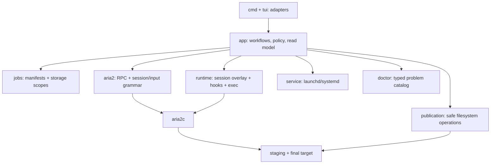

# Reliable Managed Download Lifecycle

Status: Code implementation complete; core local validation passed. Slice 0 passed on
macOS/APFS with aria2 1.37.0 on 2026-07-22: the full HTTP session-fidelity matrix,
resolving-magnet restart, RPC-added staged torrent recovery, final-seed
regeneration/omission, session-write interruption, and direct HTTP/BitTorrent hook
reentrancy all preserved one path, allocation, and GID. The Go suite, focused race suite,
vet, and Linux publication cross-build pass, and independent gap review found no remaining
code correctness blocker. Focused subprocess crash/integration gates and an isolated real
macOS launchd lifecycle pass locally. `.github/workflows/linux-ci.yml` now owns Linux tests,
race detection, vet, and build validation but still needs its first GitHub run;
representative SMB/NFS and real Linux `systemd --user` behavior remain external release
gates, so this document stays active rather than moving to `implemented`.

## Decision Summary

The irreducible problem is the conjunction of three product promises:

1. the target stays clean until one complete payload appears atomically;
2. publication never allocates a second payload or downloads the bytes again;
3. unfinished downloads and requested seeding survive process restart.

The first two promises force same-filesystem staging plus one rename without copying. The third
forces aria2s to detach aria2 before the rename and, for BitTorrent, rehydrate one seed from
retained metainfo at the final path. That transaction is the lifecycle core; simplifying it
away would weaken the product rather than simplify the implementation.

Everything around that core is intentionally smaller than the previous proposal:

1. **aria2 session plus manifest overlay.** aria2's managed `runtime-v2.session` preserves
   transport-specific restart details and `.aria2` files preserve block progress. A job
   manifest stores only aria2s-owned control facts: submitted source, target/storage,
   publication phase, activity intent, known payload root, and retained metainfo. Startup
   conservatively filters and normalizes native session blocks by managed GID instead of
   reconstructing every HTTP redirect, `Content-Disposition`, magnet, and pause variant
   from scratch.
2. **A deliberately small startup fallback.** aria2 cannot persist every RPC-added torrent
   without `rpc-save-upload-metadata=true`; enabling that for a final seed would write a
   hash-named `.torrent` into the target. aria2s therefore keeps
   `rpc-save-upload-metadata=false` and generates only two non-empty-work manifest-derived
   input forms: a staged torrent from retained metainfo and a published final seed. A valid
   HTTP block may be normalized with a safely inferred output root; a missing block beside
   partial artifacts is retained as a recoverable error rather than guessed.
3. **One atomic publication transaction.** Complete payloads are detached according to
   their native status, conflict-checked and moved once with portable same-filesystem rename, and optionally re-added
   as a final seed. Active torrent seeds require pause/remove; completed HTTP results require
   only result clear. `JobPhase` makes only this transaction durable across crashes.
4. **No persistent catalog subsystem.** Dashboard scans manifests on each asynchronous
   snapshot, joins them with one RPC snapshot, and keeps the last complete result. At MVP
   scale, an O(number of jobs) local scan is cheaper and safer than generation, journal,
   dirty-state, and cache-rebuild protocols.
5. **A hard legacy upgrade boundary.** The new binary never runs an old service artifact or
   offers `LegacyRuntime`. A non-empty pre-managed session blocks installation until the
   user temporarily reinstalls the last v1 release to finish it or explicitly passes
   `--discard-legacy-tasks`. The release installer accepts an exact version and overwrites
   the same binary path, so reinstalling latest afterward leaves no compatibility binary.
   Managed v2 uses a new versioned session path, so discard can leave the old session and all
   payloads untouched; no archive transaction or legacy session parser is needed.
6. **Weak-identity crash recovery follows path presence.** Publication uses ordinary rename
   on local and network filesystems. If a crash leaves only the destination, the durable
   `Publishing` state plus source absence is enough to converge to `Published`; reliable
   filesystems additionally verify the preserved object identity.
7. **Single identity and canonical status remain.** One managed job ID is its only aria2
   GID. `follow-torrent=false` prevents implicit child tasks. The app layer alone derives
   the seven product statuses and action capabilities for both managed and unmanaged rows.
8. **DHT and full Inspector stay out of the lifecycle activation.** The lifecycle release
   includes only the typed problems needed to recover its own failures. Managed dual-stack
   DHT and full supervisor/config/log diagnosis remain a follow-up release.

This design prefers eventual, inspectable recovery over seamless automation in rare crash
windows. It never overwrites or deletes the only payload to improve an error-path user
experience.

## Context

### Current Behavior

- `App.Add` passes the user's `dir` directly to `aria2.addUri`, so partial payloads,
  `.aria2` control files, and saved metadata appear in the final target.
- aria2 periodically writes a session file and resumes unfinished work, but final seeding is
  not durable unless explicitly represented.
- Dashboard exposes aria2 transport buckets and derives labels/counts again in the TUI,
  which lets presentation and actions disagree.
- `doctor` has message-only findings, so startup, Dashboard, and CLI recovery advice can
  diverge.

### Why the Earlier Staging Approach Was Insufficient

The reverted implementation moved torrent files individually. Multi-file tasks could become
partially visible, and a crash could split one payload across staging and target. Its
`stat`-then-`os.Rename` sequence had a TOCTOU window and could replace an existing file on
Unix. It also treated `changeOption(dir)` and session updates as best-effort even though they
controlled redownload and restart behavior.

A real aria2 spike disproved `changeOption(dir)` as a rebind operation: RPC reported the new
option, but `tellStatus.files[].path` remained in staging and unpause downloaded a second
copy there. The viable mechanism is detach, rename, and rehydrate.

## Assumptions

- Supported sources remain HTTP(S) and magnet. Each job yields one publishable root: one
  file for HTTP/single-file torrents or one root directory for multi-file torrents.
- “Target stays clean” means no partial payload, `.aria2` control file, or saved `.torrent`
  metadata or capability probe is created below `TargetDir`.
- The target already exists and belongs to a filesystem that can host one private staging
  namespace outside the target. New jobs use a mount-root staging scope when that root is
  writable, otherwise they reuse or create a same-mount scope beside the target. A target
  equal to the mount root is unsupported because no staging anchor can then remain outside it.
- macOS and Linux are in scope. Publication requires ordinary same-filesystem rename, not
  optional no-replace syscall support; there is no copy fallback.
- Job counts are expected to remain in the low hundreds for MVP. A full local manifest scan
  per asynchronous Dashboard refresh is acceptable.
- Local state is private to the user. aria2s still parses native session output
  defensively, but this is crash/corruption protection rather than a hostile-input security
  boundary.
- Pre-managed tasks are never imported. The user either drains them after reinstalling the
  checksummed last v1 release or explicitly abandons their restart state during upgrade.
- The durability promise covers aria2/aria2s process death and supervisor restart. On a
  provider that explicitly does not support directory sync, host or NAS power-loss
  durability is outside the guarantee and is reported as a capability warning.

## Goals

- Keep partial artifacts out of the target and publish exactly one complete root atomically.
- Preserve an existing target entry and publish the later payload under the first available
  numeric suffix. Concurrent external writes during the narrow preflight/rename interval
  are outside the guarantee.
- Never copy, clone, hard-link, or redownload a complete payload as part of publication.
- Resume normal unfinished transfers and requested final seeds after graceful restart and
  representative abrupt process death.
- Persist a stopped intent before its RPC side effect so an abrupt restart cannot silently
  resume user-stopped work.
- Keep publication and restart state small enough to audit as one state machine.
- Keep unavailable storage isolated to its jobs and expose explicit Retry after recovery.
- Give every visible task one of seven canonical statuses from one app-owned classifier.
- Make upgrade incompatibility explicit without adding a temporary second runtime mode.

## Non-Goals

- Import or migrate pre-managed session entries.
- Adopt tasks created by another RPC client into managed durability. They remain visible and
  receive bounded native controls only.
- Make cross-filesystem publication atomic or fall back to copying.
- Provide a strong no-overwrite guarantee against concurrent external target writers.
- Make every corrupt or missing native session automatically reconstructible. If safe input
  cannot be derived without risking a second payload, aria2s retains the bytes and asks for
  explicit manual recovery.
- Poll unavailable storage in the background or add a resident aria2s controller.
- Persist canonical history for unmanaged native tasks.
- Delete, move, validate, or archive legacy payloads/session state during upgrade.
- Guarantee cancellation of kernel I/O on a hard-hung network mount.
- Ship managed dual-stack DHT or the full runtime Inspector in the lifecycle release.

## Requirements and Invariants

### Publication

1. `WorkDir` is one isolated job directory in a registered same-filesystem staging scope
   outside `TargetDir`. `StorageID` permanently pins a job to that scope; Add selects the
   writable mount-root scope as canonical without relocating existing jobs.
2. Publication moves one payload root, never its children individually.
3. Publication serializes managed name selection and rename under one short cross-process
   lock, then selects the first available numeric suffix. Existing content observed by
   aria2s is untouched; concurrent external writers are not a supported synchronization
   boundary.
4. `Publishing` plus the staging payload root, selected destination root, and observed
   identity is durable before aria2 is detached. `Published` is durable against the stated
   process-crash model after the rename and every supported directory sync; an actual sync
   I/O error or unknown outcome keeps `Publishing`. Explicitly unsupported directory sync
   records a power-loss durability warning but does not pretend the atomic rename failed.
5. Native detach is status-aware. An active torrent seed is paused and removed; a completed
   HTTP result is already inactive and is cleared directly. Result-not-found after removal
   proves the GID is free and is idempotent success. A live aria2 task never points at an
   empty staging path.
6. Valid torrent metainfo is retained in the local job control directory before detach.
7. No cleanup path removes the only known payload. A conflict or uncertain state retains
   all recoverable bytes.

### Restart and Seeding

1. `runtime-v2.session` is aria2's native transport restart artifact. It is parsed into a
   conservative app-owned startup overlay, not treated as product truth.
2. The manifest is authoritative for ownership, `ActivityIntent`, target, publication
   phase, payload root, and retained metainfo. Session options can never override those
   facts.
3. `ActivityStopped` is persisted before pause/remove. Startup forces the corresponding
   normalized entry to `pause=true` or omits a completed seed, even if the last session save
   captured it as running.
4. A staged torrent and a running published seed may be generated from validated retained
   metainfo because aria2 cannot safely persist those RPC-added forms without target-side
   metadata. Other native session blocks are preserved rather than regenerated.
5. A missing or corrupt block is reconstructed only from retained torrent metainfo or when
   the isolated `WorkDir` has no payload/control artifacts and the persisted submitted source
   is a complete launch input. A valid HTTP block may use a safely inferred sole root to
   force `out`; a missing block beside any partial artifact becomes `RestartStateMissing`
   and starts no new I/O.
6. One job ID remains the only GID across descriptor acquisition, torrent payload transfer,
   publication, and final seeding.
7. Final seeds use `bt-seed-unverified=true`, `check-integrity=false`, and
   `force-save=false`; restart re-adds them from retained metainfo without target-side
   control files.
8. Storage unavailability never changes `ActivityIntent`.

### Status and Statistics

1. The app classifies each visible row exactly once as `Downloading`, `Seeding`, `Queued`,
   `Paused`, `Finished`, `Error`, or `Removed`.
2. Ownership is independent of status. An unmanaged task is not an error merely because it
   lacks managed publication/restart guarantees.
3. The same classification pass owns row/detail status, grouping, counts, phase labels, and
   available actions. The TUI renders these values without inference.
4. `Visible == Downloading + Seeding + Queued + Paused + Finished + Error + Removed` for
   every applied snapshot.
5. A failed native list cannot prove GID absence. After the bounded display windows, every
   uncovered managed GID is resolved with `tellStatus` in the same bounded multicall; only a
   per-GID not-found fault proves absence. Dashboard retains its last complete snapshot on
   outer/shape failure and applies no mutation inferred from a partial read.

### Upgrade

1. `install` checks schema and supervisor loaded/enabled/running facts before mutating current
   service/state artifacts. Unless discard is explicit, it also requires the legacy session
   to be provably empty: only an absent path or a stable, regular, zero-length file counts;
   non-empty, unreadable, non-regular, or concurrently changing state blocks conservatively
   without parsing it. Because an enabled supervisor could race the first read, install
   repeats the same proof after disable/unload verification and before writing v2 artifacts.
2. A running old service blocks the new installer by default so legacy tasks remain under
   the old runtime's control. With `--discard-legacy-tasks`, the installer instead stops and
   disables/unloads the old service itself, then verifies it cannot auto-start before
   changing schema or service files.
3. A stopped old schema with a non-empty legacy session blocks by default. Only
   `--discard-legacy-tasks` acknowledges that the new runtime will ignore it.
4. Managed v2 uses a new, fixed versioned session path. The old session and all legacy
   payload/control files remain untouched.
5. With the old service inactive and disabled/unloaded, install writes and validates the v2
   artifact without enabling/loading it, creates the fresh session, then commits v2 state
   and schema. Only afterward may it enable/load/start the new artifact. `managed-exec`
   validates v2 schema and stored executable/service identity before exec.
6. No command in the new binary starts, validates, or connects to an old runtime artifact.

## Proposed Architecture



### Ownership Boundaries

| Owner | Owns | Does not own |
| --- | --- | --- |
| `internal/app` | Use-case sequencing, managed/unmanaged policy, lifecycle reconciliation, pure session-overlay planning, classification, action capabilities | Session grammar, persistence encoding, RPC wire fields, filesystem syscalls, supervisor syntax, TUI layout |
| `internal/jobs` | Versioned manifests/storage scopes, CAS writes, per-job locks, retained metainfo, full scans | Native progress, RPC, session grammar, publication syscalls, UI grouping |
| `internal/aria2` | JSON-RPC, native facts/mutations, strict/lossless session parsing, option schema, deterministic input encoding | Manifest joins, product status, target policy, job phases, recovery wording |
| `internal/publication` | No-follow path validation, mount/object facts, guarded portable move, directory durability, cleanup primitives | Jobs, RPC ordering, user recovery policy |
| `internal/runtime` | Instance lease/FD inheritance, hook/worker mechanics, atomic startup input, and final `exec` | Choosing job policy, parsing sessions, interpreting phases, supervisor semantics |
| `internal/service` | Structured launchd/systemd inspection and install/start/stop | Task/session policy, diagnosis wording |
| `internal/doctor` | Stable problem codes, wording, recovery steps, redaction | Lifecycle mutation or storage probing |
| `cmd` / `internal/tui` | Arguments/input, async coordination, rendering app-owned models | Calling mechanisms directly or inferring capabilities |

There is no `internal/upgrade` package. The hard schema check is a small install workflow in
`internal/app` over `state`, `paths`, and `service` facts. It has no reusable lifecycle and
therefore does not justify a permanent owner.

Infrastructure packages do not import app product types. `publication` accepts narrow path
and identity requests; `runtime` accepts normalized input bytes and an executable spec;
`service` accepts a structured service spec. Interfaces are declared by consumers only when
tests need a seam.

### Minimal App API

```go
type TaskService interface {
    Snapshot(context.Context, DashboardQuery) (DashboardSnapshot, error)
    Detail(context.Context, TaskRef) (TaskDetail, error)
    AddManaged(context.Context, AddRequest) (TaskRef, error)
    Perform(context.Context, ActionRequest) error
}

type InstanceService interface {
    Start(context.Context) error
    Stop(context.Context, StopOptions) error
    Restart(context.Context, StopOptions) error
    Install(context.Context, InstallRequest) error
    Diagnose(context.Context) (doctor.Report, error)
}
```

`Perform` covers activity toggle, Retry, Remove, and Clear. There is no publication-confirm
API. `TaskRef` may retain an opaque live-task guard to prevent an unmanaged GID reused by
another RPC client from receiving a stale mutation; that guard is unrelated to weak
publication identity.

The jobs repository needs `Create`, `Load`, `SaveCAS`, `DeleteCAS`, `Scan`, storage CRUD, and
per-job locking. It has no `Changes`, generation, journal, or catalog lock API.

## Durable Model

```text
<state-dir>/
  state.json                     # RuntimeSchemaVersion + executable/service identity
  runtime-v2.session             # aria2-owned transport restart state
  startup.input                  # derived on each start; never a fallback truth source
  storages/<storage-id>.json
  jobs/<job-id>/
    manifest.json
    metainfo.torrent             # only for seed-capable jobs
  hooks/<event-name>
  instance.lock
```

Local authoritative writes use one shared primitive:

```text
write temp -> fsync file -> rename -> fsync parent
```

The primitive is tested once with crash injection and reused for state, storage records,
manifests, retained metainfo, hooks, and `startup.input`. The design does not require a
separate crash matrix for every caller.

```go
type StorageScope struct {
    Version       int
    ID            string
    MountPoint    string
    StagingAnchor string
    Marker        ObjectIdentity
}

type Job struct {
    Version           int
    ID                string // 16 hex characters; sole managed aria2 GID
    Source            string
    TargetDir         string
    TargetIdentity    ObjectIdentity
    StorageID         string
    Phase             JobPhase
    ActivityIntent    ActivityIntent
    PayloadRoot       string // validated staging source root when known
    DestinationRoot   string // optional durable final root; empty means PayloadRoot
    PayloadIdentity   ObjectIdentity
    PayloadLength     *int64
    ProblemCode       string
    CreatedAt         time.Time
    UpdatedAt         time.Time
}
```

`ObjectIdentity` contains mount identity, the best available object ID, and whether the
platform/provider contract makes that ID reliable across rename for crash recovery. The
strength distinction is used only for destination-only reconciliation; it does not create a
user confirmation protocol or block an otherwise supported normal rename.

`JobPhase` has five values:

- `Pending`: manifest exists, but native Add has not been confirmed; startup never emits a
  `Pending` entry without explicit Retry, so no separate preflight-complete bit is needed;
- `Staged`: aria2 owns or may safely restore unpublished work in `WorkDir`;
- `Publishing`: detach/rename/commit may be incomplete;
- `Published`: the final root is authoritative;
- `Removed`: a durable tombstone written before native removal or staging deletion; startup
  emits nothing, any published payload is retained, and explicit Retry first converges
  cleanup before restarting the same job.

There are no durable resolving, transferring, detached, conflict, cleanup, closed, or
failed phases. Transport state comes from aria2/session; storage and publication failures
are typed problems over one of the five phases.

Derived paths are deterministic:

```text
StorageRoot = StagingAnchor/.aria2s_staging/StorageID
WorkDir     = StorageRoot/JobID
FinalPath   = TargetDir/(DestinationRoot or PayloadRoot)
```

`ActivityIntent` is only `Running` or `Stopped`. It is persisted before the corresponding
RPC mutation. Observed aria2 state remains the immediate UI truth while the reconciler
converges.

`Removed` is not a shortcut out of an uncertain publication. A `Publishing` job must first
reconcile to `Staged` or `Published`; unresolved source/destination identity keeps the
publication problem and rejects Remove rather than discarding the only recovery state.

## Managed Workflows

### Add

1. Resolve the physical target and reject a mount-root target. If the mount root is writable,
   reuse or register its canonical `StorageScope`; otherwise reuse the mount's registered
   scope or register one beside the target.
2. Create one private `WorkDir` directly under
   `.aria2s_staging/<storage-id>/`. aria2 receives that directory as `dir`; there is no
   target-name, `work`, `control`, or per-job marker layer.
3. Create the manifest as `Pending` using a random 16-hex ID/GID.
4. Every Add validates target identity and same-mount staging placement. It does not run a
   speculative rename capability probe: file probes cannot prove directory rename behavior,
   and optional no-replace syscalls reject otherwise usable NAS/removable filesystems.
5. Add the URI with managed invariants: `gid`, `dir`, `allow-overwrite=false`,
   `auto-file-renaming=false`, `remove-control-file=false`, and
   `follow-torrent=false`. Magnets additionally use metadata-only/save/load options.
6. After confirmed Add, persist `Staged` and request a native session checkpoint. Unknown
   Add stays `Pending`; explicit Retry revalidates storage, reconciles live/session GID
   evidence, and only then advances or resubmits. Deterministic rejection records a problem
   for Retry. A failed checkpoint retains the managed task and reports degraded restart
   durability rather than pretending Add did not happen.
7. When magnet or remote torrent metadata completes, validate and retain the metainfo,
   clear the descriptor result, and add the torrent payload with the same GID. Automatic
   following never creates a second managed identity.
8. Record `PayloadRoot` as soon as native file facts determine one validated root. Because
   aria2 1.37 does not save a redirect/`Content-Disposition`-selected `out`, startup may also
   infer and CAS-persist it only when an isolated HTTP `WorkDir` contains exactly one
   no-follow payload root plus its optional adjacent control file and no unexpected entry.

Recent-directory history stores `TargetDir`, never `WorkDir`.

### Activity

One use case owns Pause, Resume, Stop seeding, and Start seeding:

```go
SetActivity(jobID string, running bool)
```

It persists intent first, applies the appropriate aria2 mutation, and requests a native
`saveSession` checkpoint after a confirmed incomplete-transfer change. The checkpoint
reduces restart lag but is not the only safety mechanism: startup still overlays the
manifest intent onto the last complete session block.

Completed HTTP publication stores `Published + Stopped` together. Stopping a seed removes
and clears it but keeps metainfo. Starting a seed validates the final root and re-adds that
metainfo. `Remove` remains a separate terminal intent and never deletes a published payload.

Remove is ordered as a crash-safe tombstone transaction:

1. `Publishing` first reconciles to `Staged` or `Published`; an uncertain publication cannot
   be removed.
2. For `Pending`, `Staged`, or `Published`, persist `Removed + Stopped` before any RPC or
   filesystem side effect. Startup then emits no entry even if the process dies immediately.
3. Detach or clear any native row according to status and prove the GID absent. A `Pending`
   task with unknown Add outcome retains its staging bytes until this proof succeeds.
4. Delete an unpublished staging payload and sync its parent; retain a published final root.
   Failure leaves the tombstone plus a retryable cleanup problem.
5. Clear may delete the tombstone/control metadata only after native absence and required
   staging cleanup are proven.

Before a controlled Stop or Restart, the instance workflow first applies the independent
complete unmanaged-task census, then requests a native `saveSession` checkpoint. A failed
checkpoint is reported as `RestartCheckpointFailed`, but does not trap the user in a broken
runtime: stop continues using the last session plus manifest fallback and may require
explicit recovery for a task whose latest transport block was never saved.

## Publication and Recovery

### Detach, Move, Rehydrate

Once aria2 reports one complete payload root:

1. validate and durably retain metainfo for BitTorrent;
2. under the publication lock, allocate a conflict-free `DestinationRoot` and
   persist it with `Publishing`, `PayloadRoot`, and the observed payload identity;
3. detach according to observed native status: force-pause and force-remove an active
   torrent seed, but skip those invalid calls for an already complete HTTP result;
4. clear a completed/error/removed result when present and confirm the GID is free;
   `removeDownloadResult` not-found after force-remove is idempotent success;
5. reopen source parent, target directory, storage marker, and payload root without
   following symlinks; revalidate mount and identities;
6. move the root once using ordinary same-filesystem rename; an observed late destination
   conflict keeps `Publishing`, and Retry allocates and persists the next suffix;
7. sync supported source/destination parents and persist `Published`; for HTTP and any
   renamed torrent also persist `Stopped` in the same manifest write;
8. if this is a running torrent published under its original metainfo root, re-add retained
   metainfo at `TargetDir` under the same GID and confirm every native file path is below
   the final root.

Both platforms use Go's portable `os.Rename` after source, destination-parent, mount, and
destination-absence validation. Cross-device results are errors. There is no hard-link,
clone, or copy fallback. POSIX rename may replace a destination created by another process
between the absence check and the syscall; aria2s deliberately does not claim synchronization
with concurrent external target writers.

The seed interruption is intentional. A torrent that needs a suffixed final root cannot be
re-added from unchanged metainfo without path remapping, so it commits as stopped and does
not advertise Start seeding. A non-conflicting torrent preserves normal final seeding.

### Crash Reconciliation

The state table is deliberately limited to the publication boundary:

| Durable/observed facts | Recovery |
| --- | --- |
| `Publishing`, native GID exists | Finish the status-aware detach/clear; do not move while ownership is uncertain. |
| GID absent, matching source exists, final absent | Retry the guarded portable move. |
| Source absent, final reliable identity matches | Treat rename as committed, sync, persist `Published`. |
| Source absent, final exists, identity is weak/unreliable | Treat the durable move as committed and persist `Published`. |
| Source and selected final both exist | Keep both, allocate and persist the next available suffix, then retry the guarded move. |
| Source absent, final differs or both are absent | Retain manifest/metainfo and report payload state error. |
| `Published`, running torrent lacks seed | Re-add final seed from retained metainfo. |
| `Published`, stopped | Remove any stale native row and emit no startup entry. |
| Storage absent or normally failing | Omit this job; keep intent for explicit Retry. |
| Mounted storage marker/target identity mismatches | Fail closed; never auto-adopt replacement storage. |

Weak-identity storage cannot prove inode continuity across rename. The durable `Publishing`
record, absence of the private staging source, and presence of the final destination form
the recovery evidence instead. This avoids a manual confirmation/abandon workflow on NAS
while reliable local filesystems retain the stronger identity check.

### Cleanup

After `Published` and final seed rehydration are confirmed, remove the now payload-free
`WorkDir`. Retained metainfo remains while Start seeding is supported. A `Removed` tombstone
allows deletion of an unpublished staging payload only after native ownership is confirmed
absent; it never deletes a published final root. Cleanup failure retains the tombstone so a
service restart cannot reload the task. Explicit Retry first converges those ownership and
cleanup conditions, then restarts unpublished work from its retained source or rehydrates a
published final seed under the same GID. Clear removes an already-clean tombstone without
restarting it. A `Publishing` task must reconcile through Retry before Clear can remove its
metadata.

The storage registration and empty storage-ID marker are not automatically collected. This
avoids reference counting and marker-adoption races in MVP.

## Restart Contract

### Native Session Overlay

The supervisor executes `aria2s managed-exec`. That command acquires the instance lock,
proves the previous managed process is gone, reconciles publication states on available
storage, derives a fresh `startup.input`, and `exec`s aria2c with:

```text
--input-file=<state-dir>/startup.input
--save-session=<state-dir>/runtime-v2.session
--save-session-interval=60
--rpc-save-upload-metadata=false
```

`runtime-v2.session` uses aria2's documented input-file grammar. `internal/aria2` parses it
losslessly into blocks and validates option syntax; it never sees manifests. A pure planner
in `internal/app` accepts parsed blocks plus job/storage facts and performs this algorithm:

1. scan all manifests and storage scopes;
2. parse the last native session into URI plus option blocks;
3. discard blocks with no current managed manifest, duplicate GIDs, invalid grammar, or a
   phase/path contradiction;
4. preserve transport-specific URI/options for valid `Staged` blocks, but replace managed
   policy fields such as GID, `dir`, overwrite/rename/follow options, and `pause` from
   manifest facts; for a non-empty HTTP `WorkDir`, require a persisted or safely inferred
   `PayloadRoot` and force `out=PayloadRoot` so a stale redirect or `Content-Disposition`
   value cannot allocate a second file;
5. generate a staged torrent entry from retained metainfo when no safe native block exists.
   A persisted HTTP/magnet source may be regenerated only while its isolated `WorkDir` is
   empty; a missing block beside partial artifacts is never rebuilt from source plus name;
6. generate a final seed entry for `Published + Running` torrents;
7. emit nothing for `Published + Stopped`, HTTP `Published`, `Removed`, offline/mismatched
   storage, or blocking problems;
8. atomically replace `startup.input`, then exec. A previous file is never executed after a
   failed rebuild.

This is a permanent but narrow dependency on aria2's own session/input grammar. It replaces
the larger obligation to infer every transport launch recipe. Grammar stays cohesive in
`internal/aria2`, product overlay policy stays in `internal/app`, and `internal/runtime`
only writes the already encoded candidate and execs it.

The launch behavior by phase is:

| Managed state | Startup behavior |
| --- | --- |
| `Pending` | Emit nothing until explicit Retry repeats preflight and resolves Add ownership. |
| `Staged` with valid native block | Normalize and preserve the block; force `pause=true` when stopped and force a persisted/inferred HTTP `out` for every non-empty work directory. |
| `Staged` torrent with retained metainfo and no block | Generate one staged torrent entry, paused according to intent. |
| `Staged` HTTP/magnet with no block and an empty `WorkDir` | Regenerate only from the complete persisted submitted source and managed options. |
| `Staged` HTTP/magnet with no block beside any partial artifact | Omit and report `RestartStateMissing`; never guess, bind a name to unknown transport state, or redownload. |
| `Publishing` | Reconcile filesystem facts first, then select only the resulting staged/final behavior. |
| `Published + Running` torrent | Generate one final seed entry. |
| `Published + Stopped`, published HTTP, or `Removed` | Emit nothing. |

An individual corrupt manifest or session block omits only that job and surfaces a typed
problem. Duplicate blocks for one managed GID omit that GID rather than choosing one. The
MVP Add contract persists its complete per-task launch input (one HTTP(S) or magnet source
plus managed options); adding ephemeral headers, credentials, or mirrors later requires a
corresponding durable recipe before those inputs can participate in fallback.
Unreadable global state or inability to replace the new startup file aborts before exec. An
absent NAS omits only its jobs, allowing RPC and healthy storage jobs to start.

The managed session may contain tasks created through another RPC client. They are filtered
from the next managed start because they lack manifests. Before a controlled stop/restart,
aria2s runs a separate complete native census: all active tasks plus `tellWaiting` and
`tellStopped` pages until exhaustion. It refuses while an unmanaged task is active or
incomplete unless the user acknowledges `--discard-unmanaged-tasks`. The bounded Dashboard
window is never reused as proof of completeness. Abrupt process death still provides no
durability promise for unmanaged tasks.

### Hooks and Process-Lifetime Proof

`managed-exec` duplicates the instance-lock descriptor into aria2c and records its number in
`ARIA2S_INSTANCE_LOCK_FD`; aria2c holding that descriptor is the process-lifetime proof used
by the next pre-exec reconciliation. Generated hook launchers `exec` a private aria2s hook
command. Its first action is to parse and close that inherited descriptor before RPC,
per-job locking, or child creation; failure aborts the hook. A hook or worker never acquires
the instance lock held by the aria2 process, only the affected job lock.

`on-bt-download-complete` drives publication while seeding and `on-download-complete`
handles HTTP completion, descriptor promotion fallback, and natural seed shutdown. The
normal path is a direct short-lived hook command that calls back into the same aria2 RPC and
runs the idempotent transaction. Direct hook/RPC reentrancy is a Slice 0 validity gate, not
a late integration assumption.

Hooks reload the manifest after taking the per-job lock and dispatch by durable phase plus
validated native facts; the event name alone never selects a destructive workflow:

| Event and guard | Transition |
| --- | --- |
| `on-download-complete`, `Staged`, completed HTTP payload | Persist `Publishing`, clear the already inactive result, then publish without calling pause/remove. |
| `on-download-complete`, `Pending` or `Staged`, completed torrent descriptor | Validate and retain metainfo, reconcile unknown Add if needed, clear the descriptor result, and same-GID add the staged torrent while remaining `Staged`. |
| `on-bt-download-complete`, `Staged`, active torrent seed | Persist `Publishing`, force-pause/remove, accept result-not-found as clear, then publish and same-GID rehydrate the final seed. |
| `on-download-complete`, `Published + Running` torrent | Persist `Stopped` before clearing the naturally completed seed result, so restart does not seed again. |
| Duplicate/stale event already reflected by the manifest | No-op after validating that it cannot advance another branch; a contradictory GID/path becomes a typed problem. |

Descriptor promotion, staged publication, and final-seed shutdown are therefore mutually
exclusive transitions without a new durable hook state. A final-seed re-add may itself emit
another BitTorrent completion hook; `Published` makes that callback an idempotent no-op.

If aria2 synchronously blocks RPC while waiting for the hook command, the proven fallback is
still not a resident controller: the hook closes the inherited lock FD, spawns one detached
short-lived `managed-hook-worker`, and returns immediately. The worker waits for RPC
readiness, takes the per-job lock, and performs the same transaction. Process/service death
may kill it; durable `Publishing` plus the next `managed-exec` then converges the job.

### Why This Is Simpler Than Manifest-Only Regeneration

The previous design had to derive redirect-selected HTTP names, `Content-Disposition`,
magnet discovery inputs, paused forms, torrent payload entries, and final seeds solely from
manifests. Every durable phase multiplied that restart test matrix.

The overlay preserves aria2's own transport representation in the common path. Manifests
generate only entries that aria2 cannot persist without violating the clean-target rule, or
an explicitly unambiguous fallback. Corruption recovery may require user action; it does not
grow the normal-path state machine.

## Explicit Legacy Upgrade Gate

There is no compatibility runtime in the new binary.

For an old schema:

1. `install` checks whether the known old supervisor is loaded/enabled or running. If it is
   running, plain installation changes nothing and gives an exact command that reinstalls
   the last v1 release; explicit discard authorizes the installer to stop it directly.
2. Without explicit discard, once the old supervisor is confirmed stopped, install opens
   the known legacy session as a no-follow regular file and verifies stable identity/size
   before and after the read. Only an absent path or a stable zero-length file is empty;
   whitespace, comments, any other byte, unreadable/non-regular state, or concurrent change
   is conservatively not empty. This check precedes every service/state mutation and needs
   no legacy grammar.
3. If the old session is not provably empty, plain install changes nothing. The user either
   reinstalls v1 temporarily or supplies `--discard-legacy-tasks`.
4. Explicit discard authorizes stopping the old supervisor and means “do not load old
   restart state into managed v2.” It does not delete, move, parse, validate, or archive that
   session or any payload/control file.
5. Once continuation/discard is resolved, Linux performs `disable --now` and verifies the
   unit disabled/inactive; macOS performs `bootout` and verifies the job unloaded. Merely
   stopping an enabled systemd unit is insufficient because it may auto-start after login
   or reboot.
6. Unless the user supplied explicit discard, install repeats the stable empty-session proof
   after disable/unload. If it changed, install stops before v2 mutation and reports that the
   old service is now disabled but its restart state is untouched.
7. The installer writes and validates the v2 artifact while it remains disabled/unloaded,
   creates/validates an empty `runtime-v2.session`, then commits state with
   `RuntimeSchemaVersion`, the v2 session path, controller executable identity, and service
   identity. Only after that commit may it enable/load/start v2.

The crash outcomes remain small:

| Last durable step | Recovery |
| --- | --- |
| Before old disable/unload | Old runtime remains authoritative and may still be used after reinstalling the last v1 release. |
| Old disabled/unloaded, before v2 artifact/state | No service can auto-start; rerun install or deliberately restore the old artifact. |
| V2 artifact written, before schema commit | `managed-exec` rejects the old schema; rerun install. |
| V2 schema committed, before enable/load/start | The exact v2 artifact and state agree; rerun install or start it normally. |
| After v2 activation begins | Ordinary v2 service drift/readiness recovery applies. |

The versioned path removes the old archive transaction entirely. At no crash point can an
enabled legacy service load the old session under the v2 schema, and v2 `managed-exec`
refuses to run before the v2 state commit.

`start`, Dashboard, Add, and task mutation reject an old schema with `UpgradeRequired`.
`doctor` and `install` remain available to explain the two choices. Users who need to drain
legacy work temporarily reinstall the checksummed last-v1 release; keeping an exact-artifact
validator in the new code would create a second service/runtime lifecycle for one upgrade
window.

## Canonical Dashboard Read Model

### Status, Ownership, and Actions

```go
type TaskStatus string
type TaskOwnership string
type TaskAction string

const (
    StatusDownloading TaskStatus = "downloading"
    StatusSeeding     TaskStatus = "seeding"
    StatusQueued      TaskStatus = "queued"
    StatusPaused      TaskStatus = "paused"
    StatusFinished    TaskStatus = "finished"
    StatusError       TaskStatus = "error"
    StatusRemoved     TaskStatus = "removed"
)

const (
    OwnershipManaged   TaskOwnership = "managed"
    OwnershipUnmanaged TaskOwnership = "unmanaged"
)
```

There is no `RuntimeMode`; a supported managed schema is a prerequisite for the task UI.
Managed rows expose durable activity, publication Retry, storage Retry, and Start seeding
when facts permit. Unmanaged rows expose only meaningful native detail, Pause, Resume, Stop
seeding, Remove, and Clear for the current process.

Classification precedence remains:

1. managed GID/path contradiction -> `Error`;
2. durable `Removed` -> `Removed`;
3. blocking storage/publication/restart problem -> `Error`;
4. stopped incomplete without native activity -> `Paused`;
5. stopped published -> `Finished`;
6. native error -> `Error`;
7. running waiting work -> `Queued`;
8. active final seeder -> `Seeding`;
9. active pre-publish work -> `Downloading`;
10. healthy publication transaction -> `Downloading` with phase `publishing`;
11. unknown managed combination -> typed `Error` rather than an eighth status;
12. native row without a manifest -> the corresponding native-derived status plus
    `Unmanaged` ownership.

Observed activity remains the primary status while a requested pause/start is converging;
secondary phase text explains `pausing`, `resuming`, `stopping`, or `starting-seed`.

### Full Manifest Scan

Every asynchronous Dashboard snapshot:

1. scans and decodes all manifests;
2. builds one bounded `system.multicall` containing the active/display windows plus
   `tellStatus` for every managed GID not covered by those windows;
3. joins facts, classifies rows, sorts managed history by `UpdatedAt`, and applies paging;
4. publishes only the complete result.

An unknown-GID nested fault from one `tellStatus` is the only proof that managed GID is
absent. Any outer transport/protocol/shape failure invalidates the native snapshot;
Dashboard keeps the last complete result (or shows loading/error before the first). The
multicall has an explicit low-hundreds cap matching the MVP job limit; exceeding it reports
a typed capacity problem rather than silently treating uncovered jobs as absent.

If the manifest scan or native snapshot fails, Dashboard never exposes a partially rebuilt
catalog.
Individual malformed job files are represented as `CorruptManifest` rows keyed by their
job-directory IDs; only inability to enumerate the jobs store invalidates the whole scan.

At the expected scale this is simpler than maintaining `catalog.generation`, a journal,
dirty/clean transitions, and asynchronous repair. If measured scans later exceed the UI
budget, add an in-memory cache scoped to one Dashboard process first. Persistent
invalidation metadata requires its own evidence and design, not an MVP placeholder.

## Diagnostics and Discovery Phasing

The lifecycle release evolves `internal/doctor` to stable problem codes with severity,
summary, explanation, evidence, and recovery steps. It includes only lifecycle-required
problems such as:

- `UpgradeRequired` / `LegacySessionPresent`;
- `StorageOffline` / `StorageMismatch`;
- `PublicationConflict` / `PublicationStateUncertain`;
- `RestartStateMissing` / `CorruptManifest`;
- `ManagedIdentityConflict`;
- `UnmanagedTasksWouldBeLost`;
- `RestartCheckpointFailed` / `InstallIncomplete`;
- controller/session/RPC failures required to start the lifecycle.

`start`, `doctor`, and Dashboard render the same catalog. Dashboard health work remains
asynchronous and preserves last-known-good tasks. Task Retry revalidates registered storage;
ordinary refresh never mutates storage state.

Managed IPv4/IPv6 DHT arguments, routing-table paths, bootstrap entries, and the complete
supervisor/config/log Inspector remain a follow-up release. They do not change the job,
publication, or session-overlay contracts.

## Alternatives Considered

### Keep Manifest-Only Launch Generation

Rejected for MVP. It avoids parsing the native session grammar, but recreates transport
details aria2 already persists and makes redirects, `Content-Disposition`, magnet metadata,
pause intent, and every phase part of aria2s's launch-recipe test matrix. The session overlay
is a narrower dependency and fails closed when a block cannot be trusted.

### Load Native Session Without Filtering

Rejected. A stale session can resume a user-stopped task, recreate a staging entry after
publication, or load an unmanaged external task. Managed-exec must map blocks to manifests
and override intent/path policy before aria2 reads them.

### Enable `rpc-save-upload-metadata` for All Torrents

Rejected. It would make RPC-added torrent tasks session-persistable, but final seed
rehydration can save a hash-named `.torrent` beside the published payload. Keeping the
target clean is a core invariant, so the overlay generates the small torrent forms that
native session output cannot safely represent.

### `changeOption(dir)` After Move

Rejected by black-box evidence. aria2 kept its old file paths and downloaded a second copy
into staging after unpause.

### Hard-Link, Clone, or Copy Publication

Rejected. Hard links are unavailable on important macOS SMB paths; clones are not portable
to NAS; copies double space and write traffic. Ordinary same-filesystem rename is the only
supported one-allocation publication primitive.

### Migrate Registered Staging Scopes to the Mount Root

Rejected. Moving active work would couple this layout change to native session rewriting and
storage-marker replacement. Jobs already resolve their scope through `StorageID`, so new Add
operations can select the canonical mount-root scope while existing jobs finish in place.

### Path Convention Without Manifests

Rejected. Paths do not encode user activity intent, publication commit state, retained
metainfo, or final target identity. The reduced manifest stores only these control facts.

### Persistent Catalog Generation and Journal

Rejected for MVP. It is a second crash-consistency subsystem for a rebuildable view over
O(10^2) files. Full scans have one truth source and are easy to measure before optimizing.

### Exact-Artifact `LegacyRuntime`

Rejected. Validating and running an old supervisor artifact creates a second runtime mode,
task capability matrix, service path, and removal plan. A hard install boundary is less
convenient for one upgrade window but leaves the long-lived architecture smaller.

### Archive Legacy Session During Discard

Rejected. A versioned v2 session path makes archive/rename/schema crash transactions
unnecessary. Leaving the old session untouched is both simpler and more recoverable.

### Automatic or Confirmed Weak-Identity Commit

Rejected for MVP. Full-content verification adds a complete read and protocol-specific
branches; explicit confirmation adds a privileged app/CLI workflow that still cannot prove
the file is the moved payload. Manual move-back plus ordinary Retry is sufficient for the
rare crash window.

### Continue Seeding During Publication Conflict

Rejected. Re-adding a staging seed only to detach it again on Retry creates another
placement branch for a rare error. The payload remains safe but inactive.

### Resident aria2s Controller

Rejected. It would simplify post-start reconciliation but duplicate signal forwarding,
child lifecycle, and logging already owned by launchd/systemd. Pre-exec session normalization
plus idempotent hooks keeps aria2 as the only resident process.

## Trade-offs and Risks

### Session Grammar Dependency

aria2s now deliberately parses the documented input/session format. The parser must be
strict, preserve only validated blocks, and have fixtures from supported aria2 versions.
This permanent dependency is accepted because the project already depends on the same input
grammar and `.aria2` control format, and it removes a larger reconstruction subsystem.

### Missing or Corrupt Restart State

The common case resumes from native session state. If that state is missing and one safe
entry cannot be derived, aria2s stops the job and retains staging bytes. Recovery is less
automatic than the former proposal, but it never risks a second allocation to make an
exception look seamless.

### Brief Seeding Interruption

Publication pauses/removes the staging seed and creates the final seed. This is preferred
over a second allocation or an unproven live path mutation. A failed rehydration remains
recoverable from the `Published` manifest and retained metainfo.

### Breaking Upgrade

Users with old active tasks need to reinstall v1 temporarily or must abandon restart state.
The new binary does not offer a compatibility view. The cost is visible and temporary;
avoiding a second runtime mode permanently reduces service and recovery complexity. Old
session and payload files remain available for manual recovery.

### Weak-Identity Manual Recovery

On some NAS providers, a crash after rename but before manifest commit cannot be proven
automatically. Users may need to inspect and move one completed root back to staging before
Retry. This is intentionally a documented recovery procedure, not another durable protocol.

### Network Filesystems

No-replace rename or directory fsync may be unsupported, and hard-mounted I/O may hang in
the kernel. aria2s fails closed on unsupported rename. After a successful atomic move, an
explicitly unsupported directory sync records a warning that host/NAS power-loss durability
is unavailable, while the documented process-crash recovery remains supported. Any other
sync error or unknown outcome keeps `Publishing` for filesystem reconciliation instead of
committing `Published`. Hard-hang limits remain documented rather than hidden by a timeout
that cannot cancel kernel I/O.

### Full Manifest Scan

Dashboard refresh cost grows linearly with retained jobs. This is acceptable for the stated
MVP scale and is observable. Optimization is deferred until measurements justify a cache.

## Validation and Rollout

### Completed Local Evidence

On aria2 1.37.0 and APFS, disposable black-box spikes established:

1. staging remained the only payload location until one same-filesystem move;
2. `changeOption(dir)` caused a second download and is unusable;
3. force-remove allowed immediate same-GID torrent re-add; from a BitTorrent completion
   hook, `removeDownloadResult` may already return not-found and must be idempotent success;
4. final seed rehydration used the moved inode, created no target `.aria2`, and survived
   restart from retained metainfo;
5. `follow-torrent=false` kept magnet metadata and payload under one GID;
6. natural seed completion emitted the completion hook while graceful shutdown did not
   falsely persist stopped intent;
7. the earlier `renamex_np(RENAME_EXCL)` spike preserved identity and rejected collisions,
   but later NAS/removable-disk evidence showed that optional operation was not portable;
8. a native saved HTTP session block contained the URI plus `gid`, `pause=true`, `dir`,
   `allow-overwrite=false`, `auto-file-renaming=false`,
   `remove-control-file=false`, and `follow-torrent=false`, confirming that managed
   activity/path/policy details are available to a conservative overlay, but it omitted the
   redirect/`Content-Disposition`-resolved `out`;
9. forcing an inferred `out` into that valid block resumed by Range from the same GID and
   inode with one payload root even after the server changed its suggested filename;
10. a real HTTP completion hook observed native `complete` and successfully ran
    `removeDownloadResult -> rename`; `forcePause` is invalid in that state;
11. a real BitTorrent completion hook observed native `active` and synchronously ran
    `forcePause -> forceRemove -> rename -> same-GID addTorrent`; the final target contained
    only the payload, and the RPC-added seed was absent from native session output when
    `rpc-save-upload-metadata=false`.
12. the complete disposable Slice 0 harness was rerun from a clean temporary directory on
    2026-07-22. Plain, redirect-selected, and `Content-Disposition` HTTP downloads each
    resumed in running and paused forms with the same GID and inode and no second root; a
    kill concurrent with `saveSession` recovered from the prior complete block; a resolving
    magnet resumed from its native block; retained metainfo restored a paused partial
    RPC-added torrent and a running final seed while stopped final-seed intent emitted no
    entry; direct HTTP and BitTorrent hooks completed synchronously, and duplicate final-seed
    completion callbacks were harmless behind the durable publication-state guard. Final
    seeds created no target-side `.aria2` control file. The harness used only localhost peers
    and APFS, so it does not satisfy the separate SMB/NFS release gate.

Focused automated validation additionally proves that an authoritative atomic file remains
entirely old before rename and entirely new after rename when a helper process exits at the
commit boundary; publication converges after detach and after rename; Remove converges after
its tombstone and before native detach; duplicate completion hooks are idempotent; one
offline storage does not suppress a healthy peer; and a hook process closes the inherited
instance-lock FD without retaining the lease. A disposable, uniquely labelled LaunchAgent
also passed real `bootstrap -> kickstart -> running -> bootout` validation without touching
the installed aria2s service.

The Linux CI workflow uses Ubuntu 24.04 to run the complete suite, focused race tests, vet,
and a native Linux build. It pins GitHub-maintained actions to immutable full commit SHAs,
uses the Go version and cache dependency from the module files, grants only `contents: read`,
cancels superseded branch runs, and bounds the job runtime. Its first GitHub-hosted result is
still required before Linux is considered validated.

### Slice 0: Mechanism Proofs Before Architecture Investment

Before implementing durable schemas, repositories, or service migration, disposable real
aria2 spikes must prove the two assumptions on which the simplified architecture depends:

1. **Session fidelity:** interrupt partial running/paused HTTP across plain responses,
   redirect-selected names, and `Content-Disposition`; restart from the normalized block and
   prove the same path/inode resumes, no second payload root appears, GID is unchanged, and
   stopped intent remains paused. Also cover resolving magnet, RPC-added staged torrent,
   running/stopped final seed, and process kill during periodic session serialization.
2. **Hook executability:** run the real completion launcher and prove its direct
   status-aware calls are accepted by the same aria2 process: HTTP complete-result clear and
   rename; BitTorrent pause/remove, optional clear, rename, and addTorrent. If direct
   reentrancy blocks in any remaining case, prove the detached short-lived worker fallback
   returns from the hook promptly, closes the inherited instance-lock FD, and converges the
   same transaction.

The HTTP spike established that native session output does not retain the resolved output
name. The overlay therefore forces a persisted or safely inferred `PayloadRoot` into every
valid block beside a non-empty HTTP `WorkDir`. If no valid block exists beside partial
artifacts, startup fails closed instead of guessing a minimal entry. The completed Slice 0
matrix proved one-path, one-allocation behavior before the v2 schema implementation began.

### Release Gates

After Slice 0 passes, focus validation on the core boundaries, not every theoretical
phase/artifact combination:

- strict session parser plus app overlay-planner fixtures, duplicate-GID rejection, managed
  option/known-`out` override, and stale/unmanaged block filtering;
- explicit missing/corrupt session cases proving only empty-work or retained-metainfo
  reconstruction, valid-block HTTP root forcing, and no-I/O `RestartStateMissing` beside
  partial artifacts;
- crash injection at four publication cuts: before detach, after detach, after rename, and
  after `Published` before seed rehydration;
- Remove crash injection before tombstone, after tombstone, after native detach, and during
  staging cleanup, proving no removed task reloads and no uncertain publication is erased;
- one reusable local atomic-write primitive crash suite rather than per-caller duplication;
- same-GID descriptor promotion and unknown RPC outcome reconciliation;
- file and multi-file payload-root validation with no-follow path checks;
- representative macOS SMB, Linux SMB, and NFS checks for ordinary file/directory rename,
  identity reliability, storage replacement, directory sync, and disconnect behavior;
- one unavailable storage alongside one healthy storage;
- managed-GID `tellStatus` completion, nested not-found faults, complete unmanaged census,
  seven-status/action/count invariants, and last-known-good Dashboard behavior;
- old-schema install refusal, stable zero-length/absent legacy-session acceptance,
  non-empty/unreadable/changing-session refusal, explicit discard to a versioned v2 session,
  disable/unload verification, and every upgrade crash-table row;
- launchd/systemd argv parity, inherited-lock closure, per-job hook serialization, and every
  row of the phase/fact hook transition table including duplicate callbacks.

Do not add tests for styling, trivial command wiring, generation/journal behavior, legacy
runtime compatibility, publication confirmation, or exhaustive combinations that do not
change one of the core boundary outcomes.

### Rollout

| Slice | Owners | Outcome | Exit gate |
| --- | --- | --- | --- |
| 0. Mechanism proof | disposable spikes only | Session fidelity and hook execution mode are known before durable architecture work. | Redirect/`Content-Disposition`, magnet/torrent/seed, session-kill, and direct-or-worker hook scenarios preserve one path/allocation/GID. |
| A. Durable core | `jobs`, `publication`, `aria2`, `app` | Reduced manifest/storage schemas, full scans, guarded portable move, strict session parsing, and the pure overlay planner exist behind an inactive schema. | Persistence primitive, parser/planner, path, and filesystem tests pass. |
| B. Lifecycle runtime | `app`, `runtime`, `service`, `aria2` | Add, same-GID promotion, session overlay, activity intent, hooks, publication, rehydration, and cleanup work in isolated integration tests. | Restart and four publication crash cuts converge without overwrite, duplicate allocation, or new GID. |
| C. Product activation | `app`, `doctor`, `cmd`, `tui` | Canonical status/actions, path-based weak-identity recovery, hard upgrade gate, and managed service switch ship together. | Storage, complete native joins/census, Dashboard, unmanaged-loss guard, and upgrade scenarios pass. |
| D. Discovery and full inspection | `doctor`, `aria2`, `service` | Managed dual-stack DHT and the full runtime Inspector follow without changing lifecycle state. | Opt-in network and diagnosis matrices pass. |

Before Slice 0 passes, no durable implementation slice begins. Before Slice C, production
install does not commit the v2 schema and `AddManaged` creates no
manifest or staging directory. At activation, schema, session overlay, publication, recovery
messages, and public Add become available together.

Move this document to `docs/implemented/` only after Slice C integration scenarios pass.
During implementation, fold durable invariants into owner package headers and comments, and
update `AGENTS.md` only when the implemented component ownership actually changes.

## Resolved Review Decisions

- The detach/move/rehydrate transaction is irreducible because it alone satisfies
  clean target, one allocation, and post-move seeding.
- aria2's native session returns as the common transport restart representation, while the
  manifest overlays product intent/publication facts, generates torrent forms that cannot
  be safely persisted natively, and regenerates submitted HTTP/magnet sources only when
  their isolated work directory is empty.
- Persistent catalog generation/journal metadata is removed; Dashboard scans manifests.
- Legacy compatibility mode and session archive transaction are removed; upgrade is a hard
  boundary onto a new versioned managed session path.
- Weak-identity destination-only recovery uses the durable `Publishing` record plus path
  presence; no publication confirmation/adoption API is needed.
- Upgrade disables/unloads legacy supervision before writing v2 artifacts, and v2 schema is
  committed only after the inactive artifact and versioned session are ready.
- Session grammar belongs to `internal/aria2`; app owns overlay policy, runtime owns only
  lock/hook/write/exec mechanics.
- Session fidelity and hook RPC behavior are Slice 0 gates; the design does not invest in a
  schema until both mechanisms are proven with real aria2.
- Publication detach is native-status-aware without another durable phase: HTTP complete
  results clear directly, active torrent seeds pause/remove, and post-remove not-found is
  idempotent success.
- A valid HTTP session block may be normalized with a persisted or safely inferred root;
  missing blocks beside partial artifacts fail closed instead of using a name-only fallback.
- Remove writes a tombstone before native/filesystem effects and cannot bypass uncertain
  `Publishing`; legacy upgrade similarly proceeds without discard only for an absent or
  stable zero-length session.
- The crash guarantee is process-scoped on providers without directory sync. Real sync
  errors keep `Publishing`; explicit lack of sync support is a visible power-loss warning.
- Canonical writable mount-root staging for new jobs, `StorageID`-pinned existing scopes,
  single GID, `follow-torrent=false`, portable guarded rename, and app-owned seven-status
  classification are the retained lifecycle contracts.

## Remaining Open Decisions

1. Should managed DHT/IPv6 be non-negotiable service capability or user-disableable through
   an explicit aria2s setting in the follow-up release?
2. Should a later release add an explicit storage forget/adopt workflow, or keep recovery
   limited to remounting the original registered storage?

## External Behavioral References

- [aria2 1.37 manual: input/session saving, hooks, RPC, and file options](https://aria2.github.io/manual/en/html/aria2c.html)
- [aria2 README: DHT routing-table behavior and BitTorrent file layout](https://github.com/aria2/aria2/blob/master/README.rst)
- [Apple SMBClient: mounted SMB hard-link operation returns unsupported](https://github.com/apple-oss-distributions/SMBClient/blob/main/kernel/smbfs/smbfs_vnops.c)
- [Linux CIFS client: SMB mount behavior](https://docs.kernel.org/6.8/admin-guide/cifs/usage.html)
- [SMB no-replace rename protocol structures](https://learn.microsoft.com/en-us/openspecs/windows_protocols/ms-fscc/280df540-49d6-4a06-b337-3cdef045cb2a)
- [NFSv4 protocol](https://www.rfc-editor.org/rfc/rfc7530.html)
