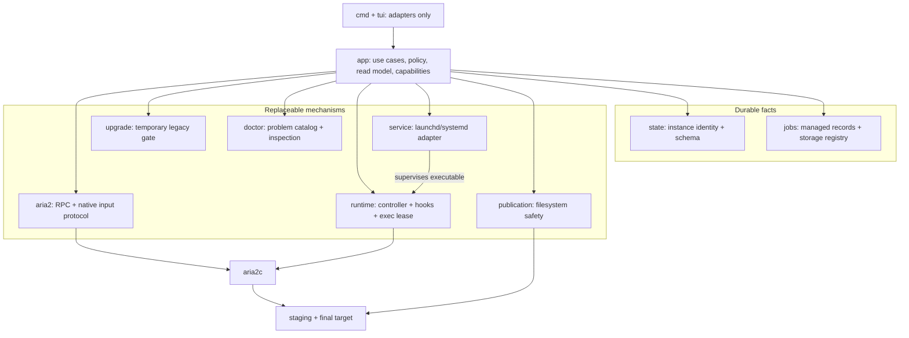

# Reliable Managed Download Lifecycle

Status: Proposed for discussion; move/detach/rehydrate, stable-GID magnet resolution, and
seed shutdown semantics were proven on local APFS with aria2 1.37.0, while structured
restart recipes, generated hook/controller execution, local durable-write crash injection,
and representative SMB/NFS validation remain schema/release gates

## Decision Summary

The requested behavior is not four independent presentation/configuration fixes. It
requires one managed-task lifecycle that owns the intent aria2 does not know: the final
target, whether a payload has been published, and how an interrupted publication is
reconciled.

This design makes the following key decisions:

1. aria2 continues to own transfer, resume, peer/protocol state, and live seeding. Each
   registered storage has one shared `.aria2s_staging/<storage-id>/` namespace, and every
   job has one isolated child directory directly used as aria2's `dir`. After publication,
   BitTorrent seeding is rehydrated against the final payload. aria2s persists only small
   publication/restart control state, not transfer progress.
2. Payload blocks are never copied or hard-linked. Once completion is confirmed, aria2s
   detaches the task from aria2, atomically moves its one payload root from staging to the
   final path with no-replace semantics, then rehydrates BitTorrent seeding from retained
   metainfo at the final path. A local black-box spike proved that this keeps one allocation
   and a clean target; changing only aria2's `dir` was disproved because it caused a second
   download into staging.
3. Every managed job has one ID that is also its only aria2 GID. Magnet and remote
   torrent descriptor acquisition disable aria2's automatic follow transition; aria2s
   validates the retained metainfo, clears the descriptor result, and reuses the same GID
   for payload transfer and final seeding. Pre-managed tasks are not imported. They and
   tasks added by another RPC client remain native aria2 tasks with normal status and basic
   controls, but without aria2s durability, publication, or restart guarantees.
4. Managed jobs persist one activity intent (`Running` or `Stopped`). Completeness,
   seedability, and transition labels are derived from lifecycle, metainfo, filesystem, and
   observed aria2 facts rather than stored as parallel state. Every row still has exactly
   one of the seven product statuses, classified once in the app read model.
5. Cold-start peer discovery is a managed runtime capability, not a default-config hint.
   The target architecture keeps IPv4 DHT, IPv6 DHT, PEX, explicit bootstrap entries, and
   managed DHT routing-table paths effective even when an older user config exists. This
   capability ships after the lifecycle release rather than expanding its breaking-change
   validation matrix.
6. `start`, `doctor`, and Dashboard share one typed problem/action catalog from the existing
   `doctor` owner. The lifecycle release includes the codes and recovery actions required by
   upgrade, storage, publication, manifest, launcher, and RPC failures; the full
   supervisor/config/log Inspector follows with managed DHT in the next release. Task
   workflows continue to supply storage/publication facts directly.
7. The new lifecycle is a deliberate breaking upgrade. `install` checks the runtime schema
   before changing the installed service. If pre-managed restart state exists, it leaves
   the old service and every payload untouched unless the user explicitly supplies
   `--discard-legacy-tasks`; that option archives only the old session and never deletes or
   moves payloads. Normal process starts generate `launch.input` only from manifests and
   never parse legacy blocks. aria2s stops creating or loading a managed `runtime.session`
   and makes no normal `saveSession` call; a session path explicitly configured by the user
   may still be written by aria2 but is never loaded or authoritative. Dashboard does not
   probe storage implicitly, normal task errors need no error hook, and a publication
   conflict retains bytes without continuing to seed. Before that upgrade, the new CLI may
   enter a bounded `LegacyRuntime` compatibility mode: it starts or connects to the exact
   already-installed old service artifact, shows its tasks as unmanaged, and offers only
   native basic controls. It never parses the old session or renders a new service from it.
   aria2 remains the only resident process.
8. Product status, durable ownership, and runtime compatibility are independent axes.
   `TaskStatus` remains the seven-state user view; `Ownership` determines whether aria2s
   promises recovery and publication; `RuntimeMode` determines whether managed creation is
   available. Capability lists are derived in `internal/app`, so external and legacy tasks
   are not mislabeled as errors and the TUI never guesses which actions are safe.

Add performs only byte-sized capability probes on the actual target mount. It does not
download a fixture or wait for a transfer: it proves successful and conflicting atomic
no-replace renames, same-filesystem identity, and object identity preservation, then removes
the probe entries. A full synthetic download is an integration/release test, not a per-Add
operation.

Delivery is deliberately phased. Ownership-aware external/legacy viewing and basic controls
can ship first without a schema change. The breaking release then closes the managed
lifecycle, upgrade, publication, restart, canonical history, and minimum typed-recovery
contracts. The next release enables managed dual-stack DHT and the full runtime Inspector
after the new lifecycle has passed its storage and crash-injection gates.

## Context

### Current Behavior

- `App.Add` passes the user's `dir` directly to `aria2.addUri`, so partial payloads,
  `.aria2` control files, and saved magnet metadata are created in the final target.
- aria2's periodic session file preserves unfinished work, but completed BitTorrent seeds
  are not guaranteed to remain in the session unless `force-save` is enabled for them.
- the service enables IPv4 DHT by aria2 default, leaves IPv6 DHT disabled by default, and
  does not own stable DHT routing-table paths or cold-start bootstrap options.
- Dashboard exposes aria2 transport buckets (`Active`, `Waiting`, `Stopped`) and derives
  labels and counts again in `tui`; one bucket therefore contains several user meanings.
- `doctor` records labels only, lifecycle backends reduce supervisor state to booleans,
  and Dashboard renders raw/generic RPC availability failures.

### Why the Reverted Implementation Was Not Sufficient

The repository history contains prior implementations for staging, DHT bootstrap, status
labels/grouping, and actionable diagnostics. They are useful evidence, but restoring them
would restore the same root problems:

- The staging implementation moved torrent files one by one. A multi-file task could
  therefore become partially visible, and a crash could leave payload split across two
  directories. Its `stat`-then-`os.Rename` sequence also had a TOCTOU window and
  `os.Rename` can replace an existing regular file on Unix, so "never overwrite" was not
  a filesystem invariant. `changeOption`, `saveSession`, and resume failures were logged
  and ignored after the move, even though they determined restart/seeding correctness.
- It used `on-download-complete`, which runs for BitTorrent after seeding is over; the
  earlier `on-bt-download-complete` event is the boundary needed for publication while
  seeding continues. The path convention also had no durable representation for
  collision or partially completed publication state.
- The DHT change wrote a singular `dht-entry-point` option twice, did not configure an
  IPv6 entry point, and affected only newly generated configs. Installation intentionally
  preserves existing `aria2.conf`, so existing users received no guarantee.
- Status mapping stayed in the TUI. Paused tasks were counted as queued, metadata rows
  were included in total but excluded from category counts, and not all seven requested
  states had independent statistics.
- Diagnostics added prose to individual call sites but no shared diagnosis model. Some
  advice was not executable as stated (for example, `aria2s install` does not install the
  `aria2c` package), and `restart` was suggested without establishing that restart could
  repair the identified cause.

## Assumptions

- "Not exposed in the target" means no partial payload, aria2 control file, or saved
  `.torrent` metadata is created anywhere under the target directory. Add may create only
  collision-resistant, byte-sized capability-probe entries derived from its pending
  manifest ID and removes them before dispatching RPC. A hidden staging namespace elsewhere
  on the same filesystem is acceptable.
- Pre-managed restart state is either left under the exact old installed runtime or
  explicitly discarded at upgrade; it is never converted into managed jobs. After the
  managed schema is committed, durable task creation and mutation must go through aria2s.
  A native row created or path-mutated by another RPC client remains usable as an unmanaged
  process-local task and is never silently promoted into durable managed state.
- Supported aria2s sources remain the current HTTP(S) and magnet inputs. Each resulting
  payload has one publishable root entry: one file for HTTP/single-file torrents, or the
  torrent root directory for multi-file torrents.
- The target exists and its filesystem can host one registered private staging namespace.
  The preferred anchor is the mount root; if it is not writable, aria2s registers the
  highest stable writable ancestor available on that mount. A target that is itself the
  mount root is always rejected because the shared staging namespace would be inside it;
  the user must choose a target subdirectory.
- macOS and Linux filesystems are the implementation scope. A filesystem that cannot
  perform a no-replace rename is reported as unsupported for managed publication; aria2s
  does not fall back to a racy `stat` plus ordinary rename.
- A small durable manifest per aria2s job is acceptable. It is publication metadata, not
  a second download database: progress, peers, protocol state, payload integrity, and
  seeding remain authoritative in aria2.

## Goals

- Keep download artifacts out of the target until one complete payload root can appear
  atomically; only the bounded Add capability probe is exempt.
- Never replace an existing target entry, including under concurrent external writes.
- Resume unfinished downloads and active seeds after service restart without depending on
  Dashboard uptime or retaining a second payload allocation.
- Make the incompatible upgrade explicit and fail-safe without parsing legacy task entries,
  moving old payloads, or carrying legacy lifecycle branches into managed job logic. Offer
  a narrow compatibility view so users can finish legacy work with the new CLI.
- Start the managed aria2 instance when one storage is unavailable, keep affected jobs
  visible without running them, and let the user retry an individual job after recovery.
- Bootstrap magnet discovery with no DHT cache and use available IPv4 and IPv6 paths
  without making IPv6 failure break IPv4.
- Give each visible task one canonical status and make every displayed task contribute to
  exactly one clearly scoped count.
- Explain startup, RPC, configuration, discovery, staging, and publication failures in
  user language with a recovery action that is valid for the detected condition.
- Preserve last-known-good Dashboard data and keep input/quit responsive while health
  diagnostics run.

## Non-Goals

- Adopt tasks created by another RPC client after the managed-schema upgrade, or import any
  pre-managed session task into the new job model. Viewing and issuing bounded native RPC
  controls is not adoption.
- Make cross-filesystem movement appear atomic. Staging and final publication must share a
  filesystem.
- Auto-suffix a conflicting name. A conflict remains explicit so a different payload is
  never mistaken for the requested final name.
- Maintain a remotely updated public tracker list. Trackers embedded in a torrent/magnet
  remain aria2 inputs; aria2s manages DHT bootstrap and dual-stack enablement only.
- Automatically edit or replace the user's existing `aria2.conf`.
- Turn aria2s into a second resident daemon or embed/lib-wrap aria2.
- Automatically poll or retry unavailable storage while Dashboard is closed or idle; an
  explicit Dashboard Retry or a later aria2 process restart is the recovery trigger for
  MVP. Calling `start` while the supervisor is already running does not reconcile jobs.
- Automatically accept a destination-only publication after a crash when the storage
  cannot provide a durable, non-reusable payload identity. That rare state requires an
  explicit user confirmation and is never handled by ordinary Retry.
- Persist canonical history for tasks created outside aria2s. Live unmanaged rows and a
  bounded native recent-result window are visible, but never enter managed history.
- Delete, move, validate, or repair a legacy payload during upgrade. Even explicit discard
  gives up only aria2 restart/task state; old payload and `.aria2` files remain for manual
  recovery or cleanup.
- Guarantee timely cancellation when the operating system has a hard-mounted network
  filesystem stuck in uninterruptible kernel I/O. Storage isolation covers absent,
  replaced, and normally failing mounts; representative SMB/NFS disconnect behavior is a
  release gate rather than a promise aria2s can enforce above the kernel.

## Requirements and Invariants

### Publication

1. A managed job's `TargetDir` never contains its aria2 `WorkDir`; the registered staging
   scope is outside every target directory using it.
2. `WorkDir` and `TargetDir` are confirmed to have the same mount identity before Add is
   dispatched and again before publication. `TargetDir` itself has a persisted object
   identity; source parent, target directory, storage marker, and payload root are reopened
   without following symlinks and revalidated immediately before the final operation.
3. Publication moves exactly one completed payload root into `TargetDir`; it never
   publishes files one by one and never creates a second payload allocation.
4. The final filesystem operation has no-replace semantics in the kernel/filesystem. An
   existing destination produces `PublicationConflict` and is not modified.
5. `Publishing` plus payload identity is atomically persisted before detach; `Published` is
   persisted after the rename and supported source/destination parent-durability steps. An
   explicitly unsupported directory fsync on the payload storage becomes a recorded
   warning, not a second move. The same write-ahead record covers the entire detach/rename
   window. Recovery distinguishes source-only, destination-only with strong matching
   identity, both-present, neither-present, and weak-identity destination-only cases. The
   last case is `PublicationIdentityUncertain` and requires explicit user confirmation; it
   is never guessed or accepted by Retry.
6. aria2 control files and transient saved `.torrent` metadata remain in staging and are
   never part of the published payload. Valid retained metainfo is copied to the small local
   job control store, not kept beside the final payload.

### Resume and Seeding

1. aria2 owns an incomplete payload only in staging. Before its root is moved, the completed
   task is paused and removed; aria2 never keeps a live task pointed at an empty old path.
2. A new managed task's job ID is its only GID across descriptor acquisition, payload
   transfer, publication, and final seeding. Final seed entries explicitly use
   `force-save=false` plus `bt-seed-unverified=true`, avoiding control files in the target
   while allowing an unknown Add/rehydration response to be reconciled. Pre-publish jobs do
   not override `force-save`; their restart contract does not use a native session.
3. Partial downloads retain `.aria2` control files in their isolated staging directory.
   aria2s rebuilds their managed launch entry from the durable source, retained metainfo,
   payload root when known, activity intent, and derived managed options; it does not copy
   aria2's session block into a second per-job restart envelope.
4. BitTorrent metainfo is retained outside the payload before detach. After publication,
   aria2 seeds the final payload directly; restart rehydrates that seed from the retained
   metainfo and the manifest-authoritative launch entry.
5. No cleanup failure may remove the only payload. Uncertain detach, publication, or seed
   rehydration retains the recoverable source and reports a typed problem.
6. Durable `ActivityStopped` prevents bytes from transferring after restart: incomplete
   entries load paused, while complete entries are omitted from aria2 but retain metainfo
   for an explicit future Start seeding.
7. Storage unavailability never mutates `ActivityIntent`. Running jobs wait for explicit
   Retry, while user-stopped jobs remain stopped after the storage returns.
8. Publishing a non-seed-capable HTTP payload persists `Published` and `ActivityStopped`
   together. A completed HTTP job cannot retain `Running` intent and later appear queued for
   recovery when there is no remaining activity to resume.

### Status and Statistics

1. A managed job stores one durable activity intent. Payload completeness is derived from
   lifecycle plus native/filesystem facts; pause/resume and stop/start-seeding all call one
   idempotent `SetActivity(jobID, running)` use case.
2. The app layer classifies every visible row once into one of the seven statuses. A native
   row without a manifest has `OwnershipUnmanaged` and keeps its native-derived status; lack
   of managed ownership is a capability limitation, not an error condition.
3. The same app classification pass drives row/detail status, grouping, counts, phase,
   ownership badge, available actions, and contextual Retry action; the TUI does not
   reclassify or infer eligibility.
4. `Visible total == Downloading + Seeding + Queued + Paused + Finished + Error + Removed`
   for every applied snapshot. Metadata acquisition is a phase of `Downloading` or
   `Queued`, not an eighth status.
5. Publication conflict/failure dominates aria2's transport state and maps to `Error`;
   detail retains both the completed transfer fact and the publication recovery action.
6. Statistics say `Visible` because stopped results are paged/bounded. They never imply a
   global count that was not fetched.
7. Absence of a native row is a usable classification fact only when the complete native
   list portion of that snapshot succeeded. On list failure, Dashboard retains the last
   complete canonical snapshot; before the first successful list it exposes only instance
   unavailability and no activity mutation inferred from manifest-only rows.
8. Unmanaged tasks may expose only read/detail, Pause, Resume, Stop seeding, Remove, and
   Clear when the corresponding native operation is meaningful. They never expose managed
   Retry, Start seeding, publication recovery, storage recovery, or durable activity intent.
9. A native row whose GID matches a managed manifest but whose source, path, or protocol
   facts contradict that manifest is `ManagedIdentityConflict`, not an unmanaged task.
10. A controlled stop, restart, or restarting install of `ManagedRuntime` refuses while an
    unmanaged task is active or retains incomplete resumable state, unless the user
    acknowledges `--discard-unmanaged-tasks`. The acknowledgement discards only native
    task/restart state;
    it never deletes payload or control files.

### Runtime Diagnostics

1. Health findings have stable machine identities and separate user-facing summary,
   explanation, evidence, and recovery steps.
2. Root-cause findings suppress derivative symptoms. For example, unreadable state does
   not also claim that its unknown endpoint is unreachable.
3. Secrets are redacted from log excerpts, rendered service arguments, and errors.
4. `start`, `doctor`, and Dashboard use the same `internal/doctor` problem/action catalog,
   with different compactness but no contradictory advice. The lifecycle release delivers
   the minimum catalog required by its own recovery paths; the follow-up full Inspector
   remains an instance startup/RPC/config owner. Task workflows supply their own problem
   facts in both releases.
5. Dashboard instance-health checks are asynchronous, coalesced, and rate-limited; stale
   task data remains visible. Task Retry performs its own one-shot storage/publication check.
6. Transient storage failure degrades affected jobs, not the instance. Unsafe identity
   mismatch is still fail-closed for those jobs, and no recovery path is auto-created.
   Dashboard performs no implicit storage probe; one explicit Retry gathers a fresh fact and
   runs the selected job's reconciler.

### Upgrade

1. `install` checks the runtime schema and legacy-service state before rewriting managed
   state or supervisor artifacts. The default outcome on uncertain or non-empty legacy
   state is no mutation.
2. Only the install-only `--discard-legacy-tasks` acknowledgement may cross from the old
   schema to the managed schema while legacy restart state remains.
3. The upgrade gate treats the legacy session as opaque. It never imports tasks or reads,
   moves, deletes, or validates legacy payload/control files.
4. Explicit discard confirms the old process is stopped, durably archives any non-empty
   session without replacement, then writes `RuntimeSchemaVersion` last in that transaction.
5. `managed-exec`, managed Add, service rendering, and schema migration reject an old schema.
   `LegacyRuntime` may start or connect to only the exact pre-existing service artifact and
   expose read/basic-control operations without rewriting it; `doctor` reports that bounded
   mode, and `stop` remains allowed.
6. Legacy tasks are always `OwnershipUnmanaged`. The new binary never parses their session,
   generates managed launch entries for them, or presents managed recovery guarantees.

## Proposed Architecture



### Ownership Boundaries

| Owner | Owns | Does not own |
| --- | --- | --- |
| `internal/app` | Use-case sequencing, managed/unmanaged policy, capability derivation, task classification, and joining durable/native facts | Persistence encoding, RPC wire fields, filesystem syscalls, supervisor syntax, or TUI state |
| `internal/state` | Instance identity, secrets, executable identity, and runtime schema version | Jobs, task history, launch policy, or service operations |
| `internal/jobs` | Managed job/storage schemas, CAS persistence, per-job locks, retained metainfo, and rebuildable catalog invalidation | Native tasks, transfer progress, RPC, publication syscalls, or UI grouping |
| `internal/aria2` | JSON-RPC, native facts/events/options, protocol errors, and deterministic input-file encoding | Ownership, product status, durable intent, target policy, or retries |
| `internal/publication` | Path validation, object identity, dirfd/no-follow access, durability, no-replace move, and cleanup primitives | Jobs, RPC sequencing, user confirmation policy, or task status |
| `internal/runtime` | Controller and hook artifacts, instance lease/FD inheritance, atomic `launch.input`, and final `exec` | Choosing jobs, reconciling lifecycle, interpreting sessions, or supervisor policy |
| `internal/service` | Structured supervisor facts and exact install/start/stop operations for launchd/systemd | Runtime diagnosis, job policy, launch-input contents, or user wording |
| `internal/upgrade` | Old-schema detection, exact legacy-artifact validation, bounded legacy-mode decision, and explicit opaque-session archive | Parsing/converting legacy tasks, managed launch composition, or permanent task APIs |
| `internal/doctor` | Shared problem/action catalog, diagnosis precedence, redaction, and instance inspection | Lifecycle mutation, durable job ownership, task storage policy, or rendering |
| `cmd` / `internal/tui` | Argument/input handling, asynchronous request coordination, and rendering app-owned read models | Calling infrastructure packages directly or inferring status/capabilities |

`internal/paths` remains a leaf resolver for platform-specific locations. It has no lifecycle
API and is passed into composition as concrete paths; promoting it to another service would
add indirection without creating an ownership boundary.

The dependency rule is one-way: adapters call `internal/app`; `internal/app` composes the
other owners; infrastructure owners do not import `internal/app` or each other's product
types. `publication` accepts its own request records rather than `jobs.Job`; `runtime`
accepts encoded input bytes and an executable spec rather than manifests; `service` accepts
a `ServiceSpec` rather than `state.State`; the TUI receives app read-model types rather than
raw RPC or manifest records. Interfaces are declared by the consuming workflow when tests
need a seam. There is no repository-wide `Manager`, cross-domain `Backend`, or event bus.

`internal/app` remains one package, not four new layers. Keep its implementation in cohesive
owner files: task query/classification, task actions, managed Add/reconciliation/publication,
and instance install/start/stop. They share unexported ownership/capability rules but call
mechanism ports directly rather than routing through each other. Extract another package
only if one of those policies gains an independent durable model or a second real consumer.

The new `jobs` store is intentionally narrow. `state.json` continues to own service and
controller executable identity, runtime schema version, and recent directories; versioned
storage registrations and per-job control directories live below a separate `JobsDir` so
concurrent hook and Dashboard updates do not contend on unrelated global state. No component
parses legacy session entries. The removable `upgrade` package treats that file only as an
opaque restart artifact and is not linked into job recovery or launch generation.

### Minimal Cross-Component API

These definitions are contract shapes, not a requirement to put every method on one Go
interface. Production composition may expose concrete types; small consumer-owned
interfaces should include only the methods used by one workflow.

The only task boundary exposed to CLI and TUI is the app service:

```go
type TaskService interface {
    Snapshot(context.Context, DashboardQuery) (DashboardSnapshot, error)
    Detail(context.Context, TaskRef) (TaskDetail, error)
    AddManaged(context.Context, AddRequest) (TaskRef, error)
    Perform(context.Context, ActionRequest) error
    ConfirmPublication(context.Context, PublicationConfirmation) error
}

type TaskRef struct {
    ID    string // managed job ID or unmanaged native GID
    Guard string // opaque app-issued runtime/identity guard
}

type ActionRequest struct {
    Task   TaskRef
    Action TaskAction
}
```

`TaskRef` does not trust a caller-supplied ownership bit. Its guard binds the current aria2
session identity plus stable task facts; it prevents a stale unmanaged GID from targeting a
different task after external replacement or process restart. `Perform` resolves the current
native row and manifest again, derives ownership and capability at mutation time, and
rejects a changed guard, stale action, or capability escalation. `AddManaged` is disabled in
`LegacyRuntime` and remains
disabled behind the schema gate until the full managed creation/recovery path is enabled.
`ConfirmPublication` is separate because it authorizes a weak-identity crash state and must
not be reachable through the ordinary Retry path.

Instance lifecycle commands use a second small app boundary so task actions cannot
accidentally call supervisor mechanisms:

```go
type InstanceService interface {
    Status(context.Context) (InstanceView, error)
    Start(context.Context) error
    Stop(context.Context, StopOptions) error
    Restart(context.Context, StopOptions) error
    Install(context.Context, InstallRequest) error
    Diagnose(context.Context) (doctor.Report, error)
}

type StopOptions struct {
    DiscardUnmanagedTasks bool
}
```

`Start` selects `ManagedRuntime` or validates and starts the exact `LegacyRuntime` artifact.
`Stop`, `Restart`, and a restarting `Install` own the unmanaged-loss guard; adapters never
compose Stop+Start themselves. Private controller/hook commands enter the app through only
`ManagedExec(context.Context) error` and
`HandleNativeEvent(context.Context, NativeEventRequest) error`; app invokes runtime and
aria2 mechanisms internally, so hidden command adapters never exchange manifests, exec
plans, or RPC event types.

The app consumes the following narrow persistence operations. The repository owns file
layout, generation/journal repair, and atomic writes; workflows never edit record files or
perform external side effects while a repository lock is held.

```go
type jobRepository interface {
    Create(context.Context, jobs.Job) error
    Load(context.Context, jobs.ID) (jobs.Job, error)
    SaveCAS(context.Context, jobs.Job, jobs.Revision) error
    DeleteCAS(context.Context, jobs.ID, jobs.Revision) error
    Scan(context.Context, jobs.Cursor, int) (jobs.Page, error)
    Changes(context.Context, jobs.Generation, int) (jobs.ChangePage, error)
    LoadStorage(context.Context, jobs.StorageID) (jobs.Storage, error)
    SaveStorageCAS(context.Context, jobs.Storage, jobs.Revision) error
}

type jobLocker interface {
    WithJob(context.Context, jobs.ID, func(context.Context) error) error
}

type metainfoStore interface {
    Put(context.Context, jobs.ID, []byte) (jobs.MetainfoRef, error)
    Load(context.Context, jobs.ID, jobs.MetainfoRef) ([]byte, error)
}
```

`Put` is durable and idempotent; a manifest references the returned digest-bearing
`MetainfoRef` only in a later CAS write. `DeleteCAS` removes the job control directory only
after lifecycle cleanup has established that no recovery recipe is still required.

The native aria2 boundary exposes native facts and closed mutations. It neither accepts nor
returns product statuses:

```go
type nativeClient interface {
    Snapshot(context.Context, aria2.Query) (aria2.Snapshot, error)
    Tell(context.Context, aria2.GID) (aria2.Task, error)
    Add(context.Context, aria2.Entry) (aria2.GID, error)
    Apply(context.Context, aria2.Mutation) (aria2.MutationResult, error)
    GlobalOptions(context.Context) (aria2.GlobalOptions, error)
}

func aria2.EncodeInput([]aria2.Entry) ([]byte, error)
```

`aria2.Mutation` is a closed set of concrete native actions such as Pause, Unpause,
ForceRemove, RemoveResult, and SaveSession. Product operations such as Retry publication do
not cross this boundary. `MutationResult` distinguishes confirmed, rejected, and unknown
outcomes so app workflows reconcile instead of blindly resubmitting. `aria2.Snapshot`
includes the native session ID used by the app's opaque `TaskRef.Guard`; ownership and guard
construction still remain app policy.

Publication is a filesystem mechanism with no knowledge of jobs or RPC:

```go
type publisher interface {
    Preflight(context.Context, publication.PreflightRequest) (
        publication.PreflightResult, error)
    Inspect(context.Context, publication.Ref) (publication.Facts, error)
    Commit(context.Context, publication.Ref) (publication.CommitResult, error)
    Cleanup(context.Context, publication.CleanupRequest) error
}
```

Requests contain absolute candidate paths, captured identities when available, and expected
relative roots. The owner performs all path validation. Typed
results distinguish conflict, unsupported no-replace, identity mismatch, uncertain commit,
and durability warning. App workflows decide which durable phase to write and whether an
explicit confirmation is allowed.

Runtime and supervisor mechanics remain separate so each can be implemented and tested
without a working job lifecycle:

```go
type runtimeController interface {
    EnsureArtifacts(context.Context, runtime.ArtifactSpec) (runtime.Drift, error)
    AcquireInstance(context.Context) (runtime.Lease, error)
    CommitInput(context.Context, []byte) error
    Exec(runtime.Lease, runtime.ExecSpec) error
    CloseInheritedLeaseFromEnv() error
}

type serviceBackend interface {
    Inspect(context.Context) (service.Facts, error)
    Apply(context.Context, service.Spec) error
    Start(context.Context) error
    Stop(context.Context) error
}
```

`internal/upgrade` exposes only a decision and an explicit discard transaction:

```go
type legacyGate interface {
    Inspect(context.Context, upgrade.Facts) (upgrade.Decision, error)
    Discard(context.Context, upgrade.DiscardConfirmation) error
}
```

`upgrade.Decision` contains only a package-local disposition, a typed reason, and an optional
`InstalledArtifactRef` used to prove the artifact inspected is the artifact already loaded.
The app maps that disposition to `RuntimeMode` and maps the reason through the doctor
catalog; `upgrade` imports neither package. The installed artifact may be inspected, started,
stopped, and connected to as-is. It is never converted to `service.Spec` or passed to
`service.Apply`, `runtime.EnsureArtifacts`, or managed input generation. This one rule keeps
the temporary compatibility code removable after the announced support window.

### Boundary Change Rules

- Add a field to a component's private model before expanding a cross-component request.
  Cross the boundary only when another owner must enforce the same invariant.
- Add new task presentation or capability rules in `internal/app`; do not expand
  `internal/aria2`, `internal/jobs`, or TUI APIs unless new facts are actually required.
- Add filesystem/platform support inside `publication`, supervisor support inside `service`,
  and wire-protocol support inside `aria2` without changing app workflows when semantics are
  unchanged.
- Never pass a whole `Job`, `State`, or `DashboardTask` into a mechanism owner. Narrow
  request records make accidental policy coupling visible in code review.
- Keep legacy branches out of `jobs`, `publication`, and managed launch generation. Removing
  legacy support should delete `internal/upgrade` compatibility paths and app routing, not
  require a persistence migration.

## Managed Job Model

Each registered filesystem has one storage record, and each job has one small local control
directory:

```text
<state-dir>/
  state.json                    # RuntimeSchemaVersion + controller/service identity
  catalog.generation            # tiny clean/dirty generation; never lifecycle truth
  catalog.journal               # rebuildable changed-job-ID invalidation log
  catalog.lock
  storages/<storage-id>.json
  jobs/<job-id>/
    manifest.json
    metainfo.torrent   # present only for seed-capable jobs
  hooks/<event-name>             # private executable launchers
  instance.lock
  backups/
    pre-managed-v1.session     # only after explicit discard; mode 0600
```

Authoritative local writes use `write temp -> fsync file -> rename -> fsync parent`; first
directory creation also fsyncs its parent. This applies to state/schema commits, storage
records, manifests, retained metainfo, launcher replacement, legacy backup rename, and
`launch.input`. Failure to establish local-state durability is fatal before the corresponding
RPC or service side effect; it is not treated like an unsupported directory fsync on a NAS.
Files are private (`0600`) and hook launchers are `0700` where supported.

A per-job advisory lock serializes hooks, startup reconciliation, Dashboard mutation, and
cleanup. An instance lock is acquired before pre-start reconciliation. `managed-exec`
duplicates it to a dedicated descriptor, clears close-on-exec only for that duplicate, and
overwrites the fixed-name `ARIA2S_INSTANCE_LOCK_FD` environment variable with its validated
decimal descriptor number before `exec` into aria2c. This is the only extra descriptor
deliberately inherited, proving process death by kernel lock release. A generated launcher
uses `exec` rather than leaving a shell parent; the controller's event-hook entrypoint closes
the descriptor named by that environment variable as its first operation, before RPC,
filesystem work, or child creation. Failure to parse/close it aborts the hook, so a hook can
never extend the old aria2 process's lifetime proof.

```go
type StorageScope struct {
    Version        int
    ID             string // random namespace and on-storage marker
    MountPoint     string // expected canonical mount point
    StagingAnchor  string // writable directory on that mount
    MarkerIdentity FileIdentity
}

type Job struct {
    Version           int
    ID                string // 16 hex chars; also the sole managed aria2 GID
    Source            string
    TargetDir         string // canonical physical target
    TargetIdentity    FileIdentity
    StorageID         string
    Phase             JobPhase
    PreflightComplete bool
    ActivityIntent    ActivityIntent
    PayloadRoot       string // one validated relative root; recorded as soon as it is known
    PayloadIdentity   FileIdentity
    ProblemCode       string // optional; prose/severity come from the shared catalog
    CreatedAt         time.Time
    UpdatedAt         time.Time
}
```

`FileIdentity` is a platform record, not an opaque inode number. It contains the mount
instance plus a durable object key and generation/version when the platform exposes one.
Every provider is `Weak` by default. It may be whitelisted as `Strong` only when the platform
offers a documented generation-bearing stable handle whose contract excludes alias/reuse
for the supported recovery interval; a finite rename/fault probe can validate preservation
but can never upgrade a provider to `Strong`. Root identity proves which directory entry
moved; it does not claim that users cannot edit file contents in place after publication. A
mount with only a weak/reusable ID may still use the normal atomic publication path, but
cannot auto-commit a destination-only crash state.

`JobPhase` is internal transaction state, not a Dashboard status:

- `Pending`: the manifest is durable, but preflight or native ownership of its generated
  launch entry has not been confirmed. `PreflightComplete=false` is a transaction fact, not
  a diagnostic code, and prevents launch generation until the recorded capability probes
  complete.
- `Staged`: aria2 owns or may reconstruct unpublished work in `WorkDir`. Metadata
  acquisition and payload transfer are derived read-model phases, not durable states.
- `Publishing`: payload root and identity are durable; detach, no-replace rename, or its
  durability reconciliation may still be in progress.
- `Published`: the final root is durable and visible; activity intent determines whether a
  torrent should currently seed.
- `Removed`: the user explicitly removed the task; the published payload is never deleted.

There are deliberately no `Resolving`, `Transferring`, `Conflict`, `Detached`,
`PublishPending`, `CleanupPending`, `Closed`, or `Failed` phases. A phase names the durable
business condition, while reconciliation uses aria2 ownership, source/final identity,
metainfo, and filesystem facts to find the next idempotent action. One primary durable
problem such as `PublicationConflict`, `StorageMismatch`, or a durability warning may
overlay the phase; the catalog severity decides whether it blocks and maps to `Error`.
Transient native errors and ordinary storage-offline observations are not persisted as
lifecycle state.

The following paths and properties are derived, never independently persisted:

- `StorageRoot = StorageScope.StagingAnchor/.aria2s_staging/StorageScope.ID`;
- `JobRoot = StorageRoot/Job.ID`;
- `WorkDir = JobRoot`;
- `JobStateDir = <state-dir>/jobs/Job.ID`;
- `MetainfoPath = JobStateDir/metainfo.torrent` when present;
- `FinalPath = TargetDir/PayloadRoot` once the root is known;
- payload completeness from phase plus native/filesystem facts;
- seed capability from a validated `MetainfoPath`;
- the typed managed launch-entry spec from `Source`, metainfo presence, `PayloadRoot`, phase,
  activity intent, and fixed managed options; `internal/aria2` alone encodes that spec;
- metadata resolution vs payload transfer from source/metainfo/native facts;
- storage availability from a `StorageScope` probe, never a job lifecycle phase;
- `pausing`, `stopping`, `resuming`, and `starting-seed` from the difference between
  `ActivityIntent` and observed aria2 state.

Activity and payload state remain conceptually orthogonal, but only user-owned intent must
be stored:

```go
type ActivityIntent string

const (
    ActivityRunning ActivityIntent = "running"
    ActivityStopped ActivityIntent = "stopped"
)
```

`ActivityIntent` is persisted before its RPC side effect. A response lost while stopping
therefore cannot make restart resume unwanted work; a response lost while starting cannot
lose the user's request to resume. The reconciler derives any transient activity label until
observed aria2 state confirms convergence. `Error` may override presentation, but it does
not erase the desired intent used after recovery.

### Add Transaction

1. Resolve and normalize the requested target without following any later payload-created
   symlinks.
2. Resolve the existing target to its physical mount. Reject a target equal to the mount
   root or containing the registered `StorageRoot`. Reuse the `StorageScope` for that mount,
   or register one by choosing the mount root when writable and otherwise the highest stable
   writable strict ancestor on the same mount. The resulting layout is:

   ```text
   <staging-anchor>/.aria2s_staging/<storage-id>/<job-id>/
     <payload-root>       # one file or one torrent root directory
     <payload>.aria2      # native resume control while incomplete
   ```

   `.aria2s_staging` is shared by this aria2s user's jobs on the disk; random `storage-id`
   namespaces the registration and acts as the on-storage marker. Each `job-id` directory
   is private and is passed directly as aria2's `dir`, so no target-name, `work`, `control`,
   or per-job marker layer is required. Managed directories use mode `0700` where supported.
   First registration creates and syncs the random marker before committing its local
   `StorageScope`; a crash may leave an unreferenced private marker, but a committed local
   scope never points at a marker that was not made durable. Recovery never adopts an
   unreferenced marker.
3. Generate a 16-hex job ID/GID using exclusive manifest and job-directory creation;
   regenerate on collision. Persist `Pending`, `PreflightComplete=false`, and the
   target-directory identity before creating anything in the target; exact reserved probe
   names are derived from the job ID rather than stored.
4. Confirm the registered storage root, new job directory, and target share a mount. Create
   byte-sized file and directory probes under the actual job/target parents, exercise
   successful and conflicting no-replace renames, and verify identity preservation. Remove
   the probes and persist `PreflightComplete=true`. Do not infer capability from filesystem
   type, NAS brand, or server disk format. A deterministic failure before RPC removes the
   manifest only after every reserved probe/job entry is confirmed absent; uncertain cleanup
   retains the incomplete manifest with a cleanup `ProblemCode` so Retry can remove or
   repeat only its exact derived entries.
5. Reject source or path values that cannot be represented as one generated input entry.
   In particular, URI control characters (`NUL`, CR, LF, and TAB) and path `NUL`/line breaks
   are unsupported rather than escaped into new entries or options. Call `aria2.addUri` with
   common managed per-task options:

   - `dir=<WorkDir>`;
   - `gid=<job-id>`;
   - `allow-overwrite=false`;
   - `auto-file-renaming=false`;
   - `remove-control-file=false`;
   - `follow-torrent=false`.

   A magnet additionally uses `bt-metadata-only=true`, `bt-save-metadata=true`, and
   `bt-load-saved-metadata=true`. Disabling automatic torrent following is what keeps one
   GID authoritative: aria2 never creates an implicit managed child.
6. After confirmed Add, persist `Staged`. Record `PayloadRoot` as soon as `tellStatus`
   exposes a single validated root. An unknown Add outcome remains `Pending` and is
   reconciled by GID while the process is reachable; after process death the same generated
   entry is safe to restore under the deterministic GID and isolated `WorkDir`. A
   deterministic rejection records an error-severity `ProblemCode` on `Pending` so Retry can
   reuse the same job identity. A problem-bearing entry is never generated automatically;
   Retry attempts reconciliation and clears the code only after success. No per-Add
   `saveSession` checkpoint is a correctness boundary.
7. When magnet metadata completes, validate the saved torrent against the requested info
   hash, copy/fsync that small descriptor to the local `MetainfoPath`, remove it from staging,
   remove and clear the descriptor result, and call `aria2.addTorrent` with the same GID and
   `WorkDir`. Confirm the payload entry; the durable phase remains `Staged` while the
   read-model phase changes from `metadata` to `transferring`.
8. `follow-torrent=false` also prevents an HTTP(S) torrent response from creating a child.
   On completion, aria2s checks whether the downloaded object is valid metainfo. If it is,
   it is copied to the local control store and removed from staging, the descriptor result
   is cleared, and `addTorrent` promotes the same GID to payload transfer; otherwise the
   object is the HTTP payload and proceeds directly to publication. The remote-torrent case
   is a release-gate integration scenario because the local spike has so far proven the
   magnet path only.

Recent-directory history records `TargetDir`, never `WorkDir`.

### Unified Activity Transaction

The app exposes one mutation rather than four status-specific workflows:

```go
SetActivity(jobID string, running bool)
```

The selected job decides the user-facing verb and protocol operation:

| Current product state | UI verb | Intent | Reconciliation |
| --- | --- | --- | --- |
| `Downloading` or download `Queued` | Pause | `Stopped` | `forcePause` and confirm paused; progress remains in payload-side control. |
| `Paused` | Resume | `Running` | Load/unpause the staging entry and confirm waiting/active. |
| `Seeding` or seed `Queued` | Stop seeding | `Stopped` | `forceRemove` if present, clear result/GID, exclude from next launch. |
| seed-capable `Finished` | Start seeding | `Running` | Validate final identity, add retained metainfo, confirm final seeder. |

The transaction persists intent before RPC, then runs the same idempotent reconciler used
by startup. Presentation follows observed reality until confirmation: an active download
requested to stop remains `Downloading` with derived `Phase=pausing`; an active seed remains
`Seeding` with derived `Phase=stopping`; a requested start that is not active yet is
`Queued` with derived `Phase=resuming` or `starting-seed`. A deterministic failure records a
problem and becomes `Error` while retaining the desired intent for Retry.

`Finished` therefore means "payload complete and activity stopped", not an irreversible
terminal state. `Start seeding` is offered only when valid retained metainfo exists and the
final payload identity still matches. HTTP jobs are finished but not seed-capable. `Remove`
stays separate: it records the `Removed` phase and never aliases Stop seeding.

All recoverable failures likewise share one mutation:

```go
Retry(jobID string)
```

The app derives whether this means reconstruct transfer, retry publication, check storage,
or rehydrate a final seed. `ActionRetry` and `ActionRetryPublication` are read-model
capabilities only so the TUI can show an exact contextual label; they do not select a
different TUI or app workflow.

`PublicationIdentityUncertain` is deliberately not an ordinary recoverable failure. On a
weak-identity storage, a destination-only crash state can be accepted only through a
high-friction `ConfirmPublication(jobID, exactFinalPath)` use case exposed by an explicit CLI
confirmation. It revalidates the target/storage paths and current facts, records that the
user accepted the exact final entry, then completes the `Published` commit. Dashboard Retry
never supplies this authority and full-content verification is not performed implicitly.

### Staging Directory Policy

Staging is shared per registered storage, while payload ownership remains isolated per job.
For a target such as `/Volumes/NAS/Downloads`, the usual layout is:

```text
/Volumes/NAS/
  .aria2s_staging/
    <storage-id>/
      <job-id>/
        <payload-root>      # partial/complete payload, absent after publication
        <payload>.aria2     # native incomplete-transfer control
  Downloads/
    <payload-root>          # absent until the atomic commit
```

The rules are deliberately strict:

1. **One registered scope per storage:** Add reuses one `StorageScope` for every target on
   the same mounted filesystem. `.aria2s_staging` is the common human-recognizable namespace;
   random `storage-id` separates registrations and is the marker used to reject a different
   disk mounted at the same path. "Shared" means common to this user's jobs, not
   world-readable.
2. **Outside every target:** the registered staging anchor is an ancestor outside the target,
   normally the mount root. Nothing under `.aria2s_staging` is created below `TargetDir`, so
   file watchers and media scanners on the target cannot observe partials. A target equal to
   the mount root is rejected and must be changed to a subdirectory.
3. **One directory per job, no internal control tree:** aria2 receives `<job-id>` itself as
   `dir`. Different jobs never share payload or `.aria2` files. Retained metainfo and
   manifests live in the local state directory, so staging needs no `work`, `control`,
   target-name, or per-job marker layer.
4. **Private where the mount permits it:** create managed directories with mode `0700`.
   The moved payload retains its inode, mode, and ownership. On mounts that do not implement
   POSIX modes, the server/share ACL remains authoritative;
   aria2s reports that staging is hidden from the target but cannot claim it is confidential
   from other share users.
5. **Never synthesize a missing storage during recovery:** only first-time Add may register
   and create a storage scope. Startup and Retry never recreate a missing mount, staging
   anchor, storage-ID directory, or target. A missing mount/transient I/O failure is
   `StorageOffline`; a mounted path with a missing storage ID, different filesystem, or
   mismatched target is `StorageMismatch` and requires explicit repair.
6. **Probe operations, not labels:** before RPC Add, prove no-replace rename and classify
   identity strength with tiny entries under the real job/target parents. Re-run storage-ID,
   target-directory identity, and mount checks on start/Retry and use the decisive no-replace
   syscall at publication. A remount can invalidate an earlier probe, so publication still
   handles `unsupported`/`cross-device` without an ordinary-rename or copy fallback.
7. **Cleanup is fact-driven and job-scoped:** collision or transaction uncertainty retains
   the complete source. After a successful move, the job directory contains only disposable
   native control remnants and can be removed after rehydration/finish is confirmed. Active
   or unrecognized job entries are never swept by age alone.
8. **Storage registration is not automatically collected:** the small local
   `StorageScope` record and empty storage-ID marker remain after the last job is cleared.
   This avoids reference counting, unknown-entry sweeps, and cleanup races. MVP exposes no
   automatic `forget storage`; uninstall also leaves the marker in place.

If the mount root is not writable, first-time Add registers the highest stable writable
strict ancestor of `TargetDir` on that mount; later targets reuse it. If that anchor
disappears, recovery treats the storage as unavailable rather than silently choosing
another path.

### Payload Root

Publication requires one root entry. The app obtains all selected file paths from
`tellStatus` and validates that they are descendants of `WorkDir`:

- an HTTP/single-file task has one file root;
- a multi-file torrent uses `bittorrent.info.name` and every selected file must be below
  that directory;
- metadata pseudo-downloads are never publishable;
- symlink roots, a symlink in either managed parent chain, and any path escape are rejected;
- an unexpected set of multiple top-level roots records a typed problem on the retained job
  instead of being exposed piecemeal.

Before detach, the relative payload root and source file identity are persisted with
`Publishing`; work, metainfo, and final paths remain derived. Source parent, target
directory, marker, and root are opened without following symlinks; identity is captured from
those descriptors and rechecked immediately before the no-replace move. A weak identity does
not block the normal syscall, but recovery cannot claim an unrelated destination merely
because its name and size happen to match.

## Publication and Recovery

### Detach, No-Replace Move, and Seed Rehydration

Once aria2 reports a complete payload, the app performs one idempotent transaction:

1. retain and validate torrent metainfo for BitTorrent; HTTP jobs need none;
2. persist `Publishing` with the relative payload root and file identity; all paths are
   derived from the job;
3. `forcePause` and confirm the task is complete and no longer active;
4. `forceRemove`, confirm the GID is no longer live, then call
   `removeDownloadResult(ID)` and confirm the sole GID is unoccupied;
5. reopen and revalidate the source parent, target directory, storage marker, payload
   identity, and mount relationship without following symlinks, then atomically rename that
   one source root between the held directory descriptors with no-replace semantics;
6. fsync both source and destination parents where the mount supports it, then persist
   `Published`. An explicit unsupported result is a durability warning rather than a
   fallback or a second move; other sync failures leave `Publishing` for identity-based
   reconciliation. For non-seed-capable HTTP, the same manifest commit also persists
   `ActivityStopped`;
7. when a BitTorrent job has `ActivityRunning`, add the retained metainfo with the same ID,
   `dir=TargetDir`, `bt-seed-unverified=true`, `check-integrity=false`, and
   `force-save=false`; confirm RPC reports `seeder=true` and every file path is below the
   final root. A stopped job generates no final aria2 entry.

The final commit uses the platform's atomic no-replace rename on the verified payload root:

- Linux: `renameat2(..., RENAME_NOREPLACE)`;
- macOS: `renameatx_np(..., RENAME_EXCL)`.

`golang.org/x/sys/unix` becomes a direct build dependency because it provides these
directory-relative platform calls and is already present transitively. The successful move
changes a directory entry, not payload allocation: the strong object identity is preserved
and staging no longer names the payload. Unsupported or cross-device results become typed
capability problems; there is no path-based check-then-rename, ordinary-rename, hard-link,
clone, or copy fallback.

The operation is intentionally performed only after detach. The local spike disproved
`changeOption(dir)` as a rebind primitive: although `getOption` reported the new `dir`,
`tellStatus.files[].path` retained the staging path, and unpause recreated and downloaded a
second 16 MiB file there. Removing the old task and adding a seed from retained metainfo is
the only locally validated transition.

The removed result must also be cleared before reuse. The spike confirmed that
`forceRemove` alone leaves the GID occupied and `addTorrent` fails as non-unique; after a
confirmed `removeDownloadResult`, the same GID can be added immediately and becomes the
final active seed. This internal removal is a transaction fact, not the user's `Removed`
product status; the manifest row suppresses the transient native result.

### BitTorrent Completion While Seeding

`on-bt-download-complete` fires after all pieces are present but while aria2 is seeding. The
worker briefly pauses and detaches that seed, moves the payload, and rehydrates it at the
final path. In the spike this transition required no WebSeed request, no full hash, and no
new payload inode. With `force-save=false`, the final task created no `.aria2` file during
seeding or clean shutdown.

The retained `.torrent` is control metadata, not a second payload. For a remote torrent,
the descriptor path downloads with automatic following disabled, validates it, and retains
it in the private local job state before payload submission. For a magnet, metadata
completion validates the saved torrent against the magnet info hash and copies/fsyncs it to
the same local store before payload submission. If valid metainfo is unavailable,
publication does not detach the only seed; the job reports `Error` with a repair/retry action.

After rehydration, aria2 reads the user's final payload directly, which has the same mutation
semantics as a conventional client: an in-place user edit can affect bytes being seeded.
aria2s does not make published files read-only. `.aria2` and transient saved `.torrent`
metadata stay in staging until cleanup; retained metainfo stays in local state. Neither is
moved into the target.

This deliberately treats completion as "payload verified by aria2 and safely published",
not merely `completedLength == totalLength`.

### Hooks and Missed Events

Generated launchers invoke one hidden `aria2s event-hook <kind>` command for:

- `on-bt-download-complete`: publish before/during seeding;
- `on-download-complete`: promote completed descriptors, publish non-BT tasks, and persist a
  naturally completed final seed as stopped;
- `on-download-start`: reconcile `Pending`, interrupted publication, and unpublished
  completed jobs after automatic service restart.

aria2 accepts a command path rather than embedded arguments, so service reconciliation
writes one launcher per event; each launcher adds its fixed `<kind>` before forwarding
aria2's GID/file-count/path arguments. The launchers and supervisor both use the canonical
aria2s controller executable recorded by `install`; they are atomically replaced, private,
executable, and checked for noexec/missing drift. Each launcher `exec`s the controller, whose
event-hook entrypoint closes the validated descriptor from
`ARIA2S_INSTANCE_LOCK_FD` before dispatching the fixed event kind. A start hook tolerates the
short RPC initialization race with a bounded readiness wait.

The hook uses RPC only to read current facts; all intent comes from the durable manifest.
It is idempotent and holds the per-job lock. `managed-exec` owns process-dead recovery and
the start hook owns post-start missed-event recovery; `start` and Dashboard do not run
duplicate full sweeps after RPC readiness. Dashboard snapshots remain read-only. There is no
detached `context.Background()` worker whose result is lost at process exit.

Actual command-hook execution and RPC reentrancy are schema-commit gates, not post-rollout
assumptions: a real aria2 integration test must prove that each generated launcher can query
and mutate the same process without deadlock, that a running hook cannot retain the instance
lock after aria2 exits, and that missed or killed hooks converge through the manifest on the
next process start.

There is no error hook. aria2's native error already isolates a normally failing task and
Dashboard shows it on the next regular snapshot. Explicit Retry then probes storage and
reconstructs that job; the next `managed-exec` also omits an unavailable scope. A runtime
disconnect integration test must confirm this behavior on representative SMB/NFS mounts;
an aggressive aria2 retry or kernel-level hard hang is not hidden by a second hook.

A real aria2 1.37.0 check distinguishes natural seed completion from service lifecycle:
expiry by seed policy invoked `on-download-complete`, while graceful shutdown of an active
seed invoked neither `on-download-complete` nor `on-download-stop`. Therefore natural
`seed-time`/`seed-ratio` completion can persist `ActivityStopped`, while stopping or
restarting the service leaves `ActivityRunning` intact and resumes seeding. No shutdown
phase or process-lifetime intent is required.

### Crash-State Reconciliation

Recovery first reconciles the manifest phase with source/final identities, then composes
the next launch input. It never launches aria2 against a path selected only by existence:

There are two detach contexts. Against a live aria2 process, the hook must pause, remove,
clear the result, and confirm the GID is free. During `managed-exec`, acquiring the inherited
instance lock proves that the previous managed process is gone; process death itself closes
all payload ownership and in-memory removed results. On an available storage, a matching
`Publishing` source may then be published before the next aria2 process starts. An offline
storage defers the transaction without blocking other launch entries. The final
authoritative entry is the only one generated for that GID on the next start.

| Durable state and observed facts | Recovery |
| --- | --- |
| `Publishing`, live/paused GID exists | Finish or retry detach; do not move. |
| `Publishing`, removed result still owns GID | Clear it and confirm GID absence; do not move yet. |
| `Publishing`, GID unoccupied, source identity matches, final absent | Retry the no-replace move. |
| `Publishing`, source absent, final strong identity matches | Move committed; fsync and mark `Published`. |
| `Publishing`, source absent, final exists but identity is weak | Keep `Publishing`; report `PublicationIdentityUncertain` and require exact-path CLI confirmation. |
| Source and final both present | Never overwrite; keep `Publishing` and record `PublicationConflict` or external mutation. |
| Source absent, final has different/unknown identity | Keep the phase and report indeterminate `Error`. |
| Source and final both absent | Keep manifest/control metadata and report payload loss. |
| `Published`, matching final, running torrent has no seed | Generate/retry the final seed entry. |
| `Published`, intent is stopped | Remove any stale managed result and generate no entry. |
| Expected mount absent or transient I/O failure | Omit this job, keep intent, and wait for explicit Retry. |
| Mount present but storage ID/path identity mismatches | Omit this job and report `Error`; never auto-adopt it. |

For a BitTorrent collision after detach, aria2s leaves the complete payload safely in
`WorkDir` but does not create a staging seed. The contextual `Retry publication` action
repeats the no-replace move after the user clears the name, then creates only the final seed.

### Collision Policy

A final-name collision maps the job to canonical `Error` with explanation:

```text
Download completed, but “ubuntu.iso” was not published because that name already exists.
The existing file was not changed. Move/rename it, then choose Retry publication.
```

The existing target and staging payload are both retained, but no bytes seed while the
conflict is unresolved. Dashboard labels the shared Retry use case as `Retry publication`;
it never re-downloads bytes. Automatic suffixing is rejected because it changes the
requested final identity and makes automation/media-scanner behavior unpredictable.

### Staging Cleanup

For HTTP, the now payload-free job directory and stale `.aria2` control can be removed after
`Published` is durable. For BitTorrent, retained metainfo lives in local state while the job
is expected to seed across restarts; after final seed rehydration is confirmed, the
payload-free staging job directory can also be removed. The registered storage-ID directory
remains as the durable storage marker even when no retained job references that scope.

Stopping seeding keeps that metainfo because `Finished` may be started again. Explicit
`Remove` first persists `Removed`, then detaches/clears any native entry. After native
ownership is confirmed absent it deletes every unpublished staging payload, `.aria2` file,
and retained metainfo; a published final payload is never deleted. An uncertain detach keeps
the source and reports a cleanup warning for the next start. The small `Removed` tombstone
remains until explicit Clear, which deletes only history/control metadata. Clearing a
seed-capable `Finished` job likewise keeps the final payload but intentionally gives up
future Start seeding.

After detach/rehydration the next generated `launch.input` follows the manifest; no native
session compaction is required. If cleanup is uncertain, keep the small control artifacts
and report a warning. Removing a task never deletes the published final payload.

## Explicit Legacy Upgrade Gate

The new job model intentionally does not migrate or grandfather pre-managed tasks. The
upgrade boundary remains `aria2s install`, with `aria2s install --start` as the normal
install-and-launch command. The gate runs before state or service artifacts are rewritten.
An old schema selects `LegacyRuntime`; it does not make every legacy task an error and does
not require the user to install an old CLI merely to finish existing work.

`LegacyRuntime` is a bounded compatibility mode, not a second managed lifecycle:

- `start` may load or start only the exact already-installed supervisor artifact after
  validating that it still references the expected old aria2s state paths. It never renders,
  repairs, or replaces that artifact.
- Dashboard connects to that runtime and classifies every native task normally with an
  `Unmanaged` badge. Detail, Pause, Resume, Stop seeding, Remove, and Clear use native RPC
  when applicable.
- Managed Add, managed Retry, Start seeding from retained metainfo, publication, storage
  recovery, managed-exec, and any service rewrite are disabled.
- The old service/session remains authoritative only for that legacy process. The new code
  treats the session as opaque and never copies a task from it into manifests or launch
  input.
- If the exact old artifact is missing, malformed, drifted, or cannot reach its RPC endpoint,
  the compatibility mode fails with a typed problem. It does not guess enough arguments to
  reconstruct the old runtime; the user must restore/use the old release or explicitly
  discard legacy restart state during install.

"Exact" means `service.Inspect` can prove the supervisor label/unit and artifact path, the
stored aria2c executable, RPC endpoint/secret wiring, config path, and opaque session path
match the readable old state and the known pre-managed artifact shape. If the service is
loaded, its observed program/argv must match that same artifact. The validator does not
normalize unknown arguments into a newly rendered equivalent. This is intentionally stricter
than ordinary drift repair because compatibility is allowed to run old state, not recreate it.

This mode deliberately reuses the same unmanaged read/action path used for tasks added by
an external RPC client. The only legacy-specific code chooses and validates the runtime; it
does not add legacy branches to task classification or actions.

`state.json` gains `RuntimeSchemaVersion` and the canonical aria2s controller executable
path used by `managed-exec` and generated hook launchers. `install` resolves and validates
that path before rendering service artifacts. A missing version plus a missing or
whitespace-only legacy session is a clean install. A non-empty legacy session is treated as
containing tasks without parsing its entries. If the old service is still running, the gate
also treats its task state as unknown and refuses the default upgrade even when the on-disk
session is currently empty. This avoids racing the old periodic session writer.

The user has two explicit paths:

1. **Finish under the old runtime.** Plain `aria2s install [--start]` reports
   `LegacyRuntimeActive` or `LegacyTasksPresent` before changing the service, state, or
   session. The existing service may keep running, and the new CLI can enter
   `LegacyRuntime` to show and perform bounded native controls. Once tasks are finished or
   removed, the user stops it cleanly and reruns the installer after its opaque session is
   empty. No task is adopted during this process.
2. **Abandon old restart state.** `aria2s install --start --discard-legacy-tasks` is the
   explicit acknowledgement that old tasks will not be resumed by the new runtime. The gate
   stops and confirms the old supervisor process, creates a private (`0700`) backup directory,
   constrains the session to mode `0600`, atomically renames it to
   `<state-dir>/backups/pre-managed-v1.session`, fsyncs the backup directory, and writes the
   new `RuntimeSchemaVersion` last in the archive transaction. It then installs and starts
   the managed service.

Explicit discard never parses a task, calls `saveSession`, probes its storage, or deletes,
moves, or validates payload and `.aria2` files. A graceful supervisor stop may update the
session, but the archived file is only a private (`0600`) safety copy, not a promised import
or resumable backup. Old data remains exactly where the old runtime left it. Re-adding the
same download may therefore need manual cleanup or relocation first; otherwise publication
will safely report a destination conflict.

The archive transaction has three recoverable facts: old session present, backup present,
and schema committed. A rerun after the session was renamed but before the schema write
continues from the existing backup. If both source and backup exist, the gate refuses to
overwrite either and explains the manual recovery. It never advances the schema until the
old process is confirmed stopped and any non-empty session is safely archived. A failure
after schema commit but before service installation is ordinary service drift: rerunning
`aria2s install [--start]` repairs the artifact without revisiting legacy data.

After the schema commit, managed execution has no legacy parser, mixed launch table,
aria2s-managed `runtime.session`, managed `--save-session` argument, periodic managed
session writer, or normal `saveSession` RPC. A user-supplied `save-session` in preserved
`aria2.conf` may still cause aria2 to write a file, but managed-exec never reads it and the
file has no lifecycle authority. Unexpected native tasks without manifests remain usable
as unmanaged process-local tasks but cannot survive a managed process restart through
aria2s. A controlled stop or restart warns and requires `--discard-unmanaged-tasks` while
such a task is incomplete or active.

After the announced compatibility window, version-specific legacy runtime selection and
archive handling can be deleted together; the minimum-schema check remains so an
unsupported old installation fails explicitly rather than being interpreted as current.
Deleting compatibility does not touch managed manifests, publication, or launch generation.

## Restart and DHT Contract

### Session Contract

Under the managed schema the supervisor executes the canonical controller as
`aria2s managed-exec`; that command acquires the instance lock, performs process-dead
reconciliation, atomically regenerates the one authoritative `launch.input`, and `exec`s the
stored aria2c executable with `--input-file=<launch.input>`. It never loads the old managed
session or any user-configured native session output.

For managed jobs, the manifest is a structured launch recipe. `Source`, metainfo presence,
`PayloadRoot` when known, phase, and activity intent combine with fixed managed options to
generate the correct URI, magnet-metadata, torrent-payload, or final-seed entry. Transfer
progress stays only in the isolated payload-side `.aria2`. When an HTTP output root was not
recorded before interruption, Retry inspects the now-available one-job staging directory and
its control file before falling back to the original source; it never guesses among multiple
roots.

Once an HTTP root is known, every reconstructed entry sets `out=<PayloadRoot>` so a redirect
or `Content-Disposition` change cannot select a second file. The full magnet source remains
durable; promotion preserves source-supplied discovery inputs such as `tr` values unless the
validated retained metainfo demonstrably contains an equivalent field. Before the managed
schema may be committed in a production install, real restart tests must prove partial and
paused HTTP (including redirects and `Content-Disposition`), resolving magnet, torrent
payload, and final-seed recipes. If a required effective value cannot be derived, only that
typed field is added to the manifest; an opaque session block remains rejected.

Managed service arguments own the local RPC listener/secret, the exact input file, hook
paths, a nonzero control-file auto-save interval, and
`--rpc-save-upload-metadata=false`. Managed per-entry options own GID, dir/out, pause,
overwrite/renaming, follow transition, control-file removal, and final-seed verification/
persistence. aria2s already retains submitted metainfo in its control store; allowing
`addTorrent` to save another copy writes a hash-named `.torrent` beside the final payload
and violates the clean-target invariant. These invariants are verified through effective
options and cannot be delegated to an old user config. User limits, proxy, allocation,
tracker additions, and seed policy remain authoritative.

The app launch selector first checks each referenced `StorageScope` once, then validates each
job's target within a healthy scope and emits typed entry specs. `internal/aria2` is the only
input encoder. It rejects values that cannot be represented without changing entry
boundaries, and systemd rendering likewise escapes each argv element instead of joining raw
paths/options. launchd and systemd fixtures must cover spaces, `%`, quotes, backslashes, and
rejected control characters.

| Managed job state | Launch behavior |
| --- | --- |
| Any phase with an unresolved error-severity `ProblemCode` | Generate nothing until the explicit recovery use case succeeds. |
| `Pending` + `PreflightComplete=false` | Reconcile the exact derived probe entries and rerun preflight; generate nothing until it commits. |
| `Pending`/`Staged` + `Running` | Generate the descriptor or payload entry selected by source, metainfo, and staging facts. |
| `Pending`/`Staged` + `Stopped` | Generate the same entry with `pause=true`. |
| `Publishing` | Reconcile source/final identity before generation, then emit only the authoritative staged or final entry when needed. |
| `Published` + `Running` + valid metainfo | Generate one final seed entry. |
| `Published` + `Stopped`, or published HTTP | Generate nothing. |
| `Removed` | Generate nothing. |

A `Pending` job is reconciled by GID while the current aria2 process is reachable. Once
process death is proven by the instance lock, it is reconstructed from the same durable
recipe. Exclusive GID and job-directory ownership make this idempotent; any established
block progress remains in `.aria2` rather than in the session envelope.

Storage availability is an orthogonal gate applied before that table:

| Storage fact | Launch behavior |
| --- | --- |
| Expected storage ID and target are available on one mount | Apply the normal managed-job table. |
| Expected mount absent or transient I/O failure | Omit only affected managed jobs; preserve their manifest, staging payload/control, and intent. |
| Mount present but storage ID, target, or filesystem identity mismatches | Omit affected jobs and attach an actionable `StorageMismatch` error. |

This is not a second session implementation: aria2 still owns piece/control state and
progress in its payload-side `.aria2` file. aria2s persists only the source/path/activity
envelope it already owns. A stopped seed cannot return from an abrupt stale file, a paused
incomplete job cannot briefly download after restart, and a published seed cannot recreate
its staging path because no independent native restart source is ever loaded. A previous
`launch.input` may remain on disk after failure but is never executed as fallback. A corrupt
or unreadable global state/jobs directory aborts before `exec`; a corrupt individual
manifest is omitted from a newly generated candidate and exposed as `CorruptManifest` by
its directory ID. Only after every job has either a safe entry or an explicit omission does
the new file complete its durable replacement and become eligible for `exec`.

`managed-exec` first requires the current runtime schema, checks each storage scope once,
reconciles available jobs without starting aria2, writes/fsyncs/renames `launch.input`, then
calls `exec`. It never creates a missing mount, scope, or target during recovery. One absent
or normally failing NAS no longer blocks the instance, even when every current managed job
is omitted; the local RPC service still starts so Dashboard can show and explicitly Retry
them. A hard-mounted filesystem stuck in kernel I/O is the stated platform limitation, not
something a Go timeout can reliably cancel.

There is no automatic retry loop. Dashboard Retry probes the selected job's storage and, if
safe, clears its stale native result and regenerates that job's entry through RPC. Other
jobs remain untouched until independently retried or included by a later aria2 process
restart. Calling `start` while aria2 is already running does not rerun `managed-exec`. No
timer, additional supervisor artifact, or resident controller is introduced.

Before any managed `stop`, `restart`, or install operation that will terminate the running
aria2 process, the app requires one complete native snapshot. If an unmanaged row is
incomplete, paused with resumable state, downloading, queued, or seeding, the operation
returns `UnmanagedTasksWouldBeLost` and leaves the process/service untouched. The user may
rerun it with `--discard-unmanaged-tasks`, explicitly acknowledging loss of only that
process-local task/restart state. Existing payload and `.aria2` files are never deleted.
Failure to obtain a complete snapshot returns `UnmanagedTaskStateUnknown`; it is not treated
as proof that no unmanaged tasks exist. A user-configured native session may happen to
preserve such a task, but aria2s neither loads nor promises it under `ManagedRuntime`.

Normal Stop/Restart does not call `saveSession`; graceful supervisor stop plus payload-side
`.aria2` durability and manifest regeneration are the restart contract. The official aria2
surface relied on here is limited to generated input-entry syntax, per-entry GIDs/options
(including `pause`), `force-save`, `bt-seed-unverified`, RPC task removal/addition, and the
completion/start hook events. Generated-entry fixtures and real restart tests gate supported
aria2 upgrades. The spike's duplicate-GID-first observation is fallback evidence only.

### Cold-Start Discovery and Dual Stack

This section is the target contract for the release after the managed lifecycle ships. It
does not expand the first breaking release's schema/publication validation matrix.

The earlier config-only approach cannot fix existing installations because reconciliation
must not overwrite user config. The following minimum capability set moves to managed
service arguments and is checked through `aria2.getGlobalOption` after readiness:

```text
--enable-dht=true
--enable-dht6=true
--disable-ipv6=false
--enable-peer-exchange=true
--dht-entry-point=dht.transmissionbt.com:6881
--dht-entry-point6=dht.transmissionbt.com:6881
--dht-file-path=<state-dir>/dht.dat
--dht-file-path6=<state-dir>/dht6.dat
```

There is exactly one entry per address family because aria2's entry-point option is
singular. The explicit entries provide a path when the routing tables do not exist; the
routing tables then persist under aria2s-managed state. Trackers embedded in the task and
PEX remain complementary sources. aria2 continues to suppress DHT/PEX for private torrents.

IPv6 is opportunistic: no `dht-listen-addr6` is forced, and failure to obtain a global IPv6
address is `Info`/`Degraded`, not a startup failure. IPv4 remains enabled independently.
The design does not force Local Peer Discovery because it broadcasts torrent participation
on the LAN and is not necessary for Internet cold bootstrap; users may enable it in their
config.

Command-line ownership is intentionally limited to lifecycle/service invariants (local RPC,
managed restart input, hooks, control-file durability, and, in the follow-up release,
baseline peer discovery). User limits, proxy settings, tracker additions, seed ratio/time,
allocation, and unrelated performance tuning remain authoritative in `aria2.conf`.

## Canonical Dashboard Read Model

### Native Facts vs Product Status

`internal/aria2` decodes native facts required for classification, including `status`,
`seeder`, files, error fields, and native bucket. It may retain `following`/`followedBy` as
native detail for legacy/external rows, but the app does not fold those rows into a synthetic
managed identity. New managed jobs never create an automatic followed child. The protocol
package does not rename native values or infer product ownership.

`internal/app` joins native facts with managed-job phase and emits:

```go
type TaskStatus string
type TaskOwnership string
type RuntimeMode string
type TaskAction string

const (
    StatusDownloading TaskStatus = "downloading"
    StatusSeeding     TaskStatus = "seeding"
    StatusQueued      TaskStatus = "queued"
    StatusPaused      TaskStatus = "paused"
    StatusFinished    TaskStatus = "finished"
    StatusError       TaskStatus = "error"
    StatusRemoved     TaskStatus = "removed"
)

const (
    OwnershipManaged   TaskOwnership = "managed"
    OwnershipUnmanaged TaskOwnership = "unmanaged"

    ManagedRuntime RuntimeMode = "managed"
    LegacyRuntime  RuntimeMode = "legacy"
)

const (
    ActionPause             TaskAction = "pause"
    ActionResume            TaskAction = "resume"
    ActionStopSeeding       TaskAction = "stop-seeding"
    ActionStartSeeding      TaskAction = "start-seeding"
    ActionRetry             TaskAction = "retry"
    ActionRetryPublication TaskAction = "retry-publication"
    ActionRemove            TaskAction = "remove"
    ActionClear             TaskAction = "clear"
)

type DashboardSnapshot struct {
    Runtime RuntimeMode
    Tasks   []DashboardTask
    Counts  TaskCounts
    // groups and instance problems omitted
}

type DashboardTask struct {
    Ref       TaskRef
    Ownership TaskOwnership
    Status    TaskStatus
    Phase     string // metadata, waiting-recovery, publishing, ...
    Actions   []TaskAction
    Problem   *doctor.Problem
    // progress/speed/name fields omitted
}

type TaskCounts struct {
    Visible     int
    Unmanaged   int
    Downloading int
    Seeding     int
    Queued      int
    Paused      int
    Finished    int
    Error       int
    Removed     int
}
```

`TaskStatus` answers what the task is doing, `TaskOwnership` answers which guarantees aria2s
owns, and `RuntimeMode` answers which lifecycle may create durable work. None is encoded in
another. `Unmanaged` is rendered as a badge/secondary label, never by replacing a healthy
status with `Error`. `Actions` is the complete closed capability set for that snapshot; the
app revalidates it before mutation.

The capability matrix is deliberately small:

| Capability | Managed task in `ManagedRuntime` | Unmanaged task in `ManagedRuntime` | Task in `LegacyRuntime` |
| --- | --- | --- | --- |
| List, detail, status, progress | Yes | Yes | Yes |
| Pause / Resume | Yes, with durable intent | Yes, native current process only | Yes, native current process only |
| Stop seeding | Yes, retaining managed recipe | Yes, irreversible native removal | Yes, irreversible native removal |
| Start seeding | Yes when retained metainfo permits | No | No |
| Remove / Clear | Yes | Yes | Yes |
| Retry storage/publication | Yes | No | No |
| Managed publication and recovery | Yes | No | No |
| Managed Add | Runtime capability | No | Disabled for the whole runtime |
| Survive a managed restart | Guaranteed by the job contract | Not promised | Governed only by the untouched old runtime |

An action is shown only when the current native state makes it meaningful; a `Yes` cell is
not an unconditional button. `LegacyRuntime` may start/connect to the exact old artifact,
but that process-level compatibility does not promote its tasks or promise that the new
lifecycle can reconstruct them.

### Classification Precedence

This precedence runs only after the native list portion of the snapshot has succeeded. A
failed or partial list cannot prove that a GID is absent: Dashboard keeps the previous
complete canonical snapshot, and before the first successful list it exposes instance
unavailability without synthesizing task activity or actions from manifests alone.

1. A native GID matching a managed manifest but contradicting its durable source, protocol,
   or authoritative path -> `Error` with `ManagedIdentityConflict`. It remains managed and
   is never downgraded to unmanaged to bypass recovery checks.
2. An explicit user removal recorded in the managed manifest -> `Removed`. The transient
   native result created by publication detach is suppressed and cleared; it is never a
   user-visible removal.
3. An error-severity durable `ProblemCode`, including `StorageMismatch`,
   `PublicationConflict`, `PublicationIdentityUncertain`, or deterministic seed
   rehydration failure -> `Error`. A warning-severity code remains attached without
   replacing the otherwise derived status.
4. A managed manifest with no native row and no blocking problem remains visible. A stopped
   incomplete job is `Paused`; a stopped published job is `Finished`; a running job is
   `Queued` with `Phase=waiting-recovery`. No storage fact is inferred until explicit Retry.
5. Any native `error` not suppressed by a more specific durable problem -> `Error`.
6. While intent reconciliation is pending, observed activity remains the primary status so
   the UI never claims work has stopped while bytes are still transferring. Phase explains
   `pausing`, `stopping`, `resuming`, or `starting-seed`.
7. Derived incomplete + `Stopped` + inactive -> `Paused`.
8. `Published` + `Stopped` + inactive -> `Finished`.
9. `Running` + native waiting/not-yet-active -> `Queued`; phase distinguishes download from
   seed startup.
10. `Published` + `Running` + active seeder -> `Seeding`.
11. Pre-publish + `Running` + active -> `Downloading`; descriptor acquisition is
   `Phase=metadata`.
12. A healthy `Publishing` transaction -> `Downloading` with `Phase=publishing`, whether the
   old native result is complete or already detached; it is not counted as finished early.
13. Any inconsistent/unknown managed combination -> `Error` with a state-reconciliation problem
    rather than an eighth `Unknown` group.
14. A native row with no manifest is unmanaged. Native active+seeder maps to `Seeding`,
    active non-seeder to `Downloading`, waiting to `Queued`, paused to `Paused`, complete to
    `Finished`, removed to `Removed`, and native error to `Error`. Metadata acquisition is a
    phase of Downloading/Queued. No missing managed fact is invented for it.

For managed magnets and remote torrents, descriptor acquisition and payload transfer reuse
the same GID and row. Legacy/external parent and followed rows may remain separate unmanaged
native rows; supporting basic operations does not justify a second identity-merging model.

### Grouping and Counts

The app returns primary status groups in this fixed order:

```text
Downloading, Seeding, Queued, Paused, Finished, Error, Removed
```

The TUI renders group headings only for non-empty groups and uses `TaskStatus` directly for
row/detail labels. It executes app-supplied `Actions` instead of reconstructing eligibility
from status and internal fields. The header/footer says `Visible`, displays all seven counts,
and includes `Unmanaged N` as an ownership count (zero values may move to a second compact
line on narrow terminals).
Metadata is a secondary phase label and remains included in Downloading/Queued counts.

Counts are derived in the same pass that builds groups. An invariant check in tests (and a
debug assertion in development builds if useful) guarantees their sum equals the visible
row count. Selection identity changes from GID to stable task ID so regrouping and magnet
transitions do not jump unexpectedly for managed jobs; unmanaged selection uses its native
GID plus the opaque runtime/identity guard.

Every complete applied catalog includes all live/incomplete managed manifests and all
native live rows from the successful RPC snapshot. While an
initial or recovery scan is running, Dashboard retains the previous complete catalog (or
shows history loading before the first one) rather than applying a partial set. Historical
`Published + Stopped` and `Removed` manifests alone form the canonical
`UpdatedAt`-ordered offset/limit window. Native stopped results without manifests never
enter it; a separately bounded `Unmanaged recent` section shows the native result window in
aria2 order without claiming durable chronology or pagination. `Visible` and the seven
status counts include every currently displayed primary or recent row, while `Unmanaged`
counts the cross-cutting ownership subset.
Tombstones and seed-capable Finished manifests remain on disk until explicit Clear even when
they are outside the current page.

Dashboard maintains an in-session catalog of job ID, phase, and `UpdatedAt`; manifests
remain authoritative. Session startup snapshots `catalog.generation`, scans manifests once
asynchronously, then publishes the catalog only if the generation is still clean and
unchanged. If writers raced the scan, it replays the bounded invalidation journal or
coalesces another scan while the UI remains responsive. Thus an authoritative rebuild may
be proportional to retained manifests, but regular refresh never reparses the full store.

Every manifest mutation holds the short catalog lock only around local writes: durably mark
the generation dirty, commit the manifest, append/fsync a job-ID invalidation record, then
durably publish the next clean generation. External RPC/service side effects occur only
after that sequence. A crash after the manifest but before the journal/clean generation is
therefore detectable, not a silently valid stale cache. Regular refresh reads the tiny
generation and consumes at most a bounded number of journal records; dirty state, excessive
lag, or corruption retains the last complete catalog and schedules one asynchronous
authoritative rebuild. The generation and journal are rebuildable invalidation metadata,
never restart or lifecycle truth.

A native row without a manifest is a supported unmanaged runtime task. It participates in
selection, detail, normal status, visible counts, and its bounded action set. It does not
enter the managed catalog, acquire a manifest, participate in publication/recovery, or gain
restart guarantees. Dashboard may explain those limits, but does not emit a problem merely
because ownership is unmanaged.

### Activity Shortcut

The list uses one `p` binding for the unified activity toggle. `p` is retained from the
existing Pause shortcut and also reads naturally as Play/Pause; Space is not used. The
binding dispatches the matching app-supplied action and its help text is contextual:

| App-supplied action | `p` help/action | Ownership |
| --- | --- | --- |
| `ActionPause` | Pause | Managed or unmanaged |
| `ActionResume` | Resume | Managed or unmanaged |
| `ActionStopSeeding` | Stop seeding | Managed or unmanaged |
| `ActionStartSeeding` | Start seeding | Managed only |

The app omits an activity action for non-seed-capable HTTP `Finished`, `Removed`,
unknown-outcome mutations, and every action that would start/resume I/O before a blocking
problem is reconciled. A managed `Error` or missing-native row with Running intent may still
expose Pause/Stop seeding because changing it to Stopped persists intent and suppresses
future I/O. An unmanaged Stop seeding is an irreversible native removal because aria2s has
no retained recipe; it never implies future Start seeding.

`r` is present only when `Actions` contains `ActionRetry` or `ActionRetryPublication`; it
never means Resume and is never exposed for unmanaged tasks. Retry performs one fresh
storage probe and reconciles only the selected managed job. If its intent is Stopped, it may
restore an incomplete entry paused but does not change intent; the row then exposes Resume
or Start seeding through `p`. A failed probe returns the precise problem for the row/notice
but creates no polling, cache, or automatic mutation. The authoritative `bubbles/key`
keymap remains the source for matching and help rendering.

### Existing Dashboard Runtime Contract

The asynchronous mechanics in `docs/dashboard-runtime-architecture.md` remain in force: one
bounded multicall per snapshot, at most one read in flight, generation-based stale-result
rejection, independent list/detail validity, last-known-good preservation, and no blind
retry of unknown mutations. This lifecycle design supersedes that document's aria2-only
durable-ownership assumption, GID-only selection, Pause/Resume service methods, and
replacement-GID Retry. The app now joins local manifests into canonical task groups,
selection uses guarded `TaskRef`, managed activity uses `SetActivity`, unmanaged activity
uses bounded native mutations, and managed Retry keeps the same ID.

There is still only one regular snapshot pipeline. After a successful native list, missing
rows are classified from manifests and the rebuildable local catalog without starting a
storage probe. Health diagnosis is a separate coalesced command only for instance-level
transport/config failures, not task storage facts and not an operation inside Bubble Tea
`Update` or `View`.

## Unified Runtime Diagnostics

The shared data model and lifecycle-specific codes ship with the managed lifecycle. The full
Inspector, supervisor/log precedence, and managed DHT diagnosis described below are the
follow-up release; this phasing does not permit the lifecycle release to emit raw or
contradictory recovery advice.

### Data Model

Evolve the existing message-only `internal/doctor.Issue` into the shared typed model; do not
create a parallel `runtimehealth` package:

```go
type Problem struct {
    Code        Code
    Severity    Severity // info, warning, error
    Summary     string
    Explanation string
    Evidence    []string
    Recovery    []RecoveryStep
}

type RecoveryStep struct {
    Instruction string
    Command     string // optional, displayed but never auto-executed
}

type Report struct {
    Problems []Problem
}
```

`Report.Condition()` derives `healthy`, `degraded`, or `broken` from the highest problem
severity. Condition is not independently stored and cannot drift from its problems.

Errors retain typed causes for programmatic matching, but renderers do not dump their raw
chains. `start` returns a `ProblemError` wrapping the primary cause; `errors.Is` behavior is
preserved.

### Probe Facts

One `doctor.Inspector` gathers instance facts in dependency order:

1. managed state readability/schema plus aria2c, controller, hook-launcher, and noexec
   validity;
2. user config readability/basic syntax plus rendered service drift;
3. structured supervisor status (`loaded`, `running`, last exit/status output), replacing
   repeated boolean commands;
4. RPC transport result separated into refused, timeout, HTTP status, auth rejection,
   malformed protocol, and success;
5. effective managed options via `aria2.getGlobalOption` when RPC is reachable;
6. whether the configured listener is free when the supervisor is stopped, without a
   process-owner discovery subsystem;
7. a bounded, redacted log excerpt only when supervisor/start facts need it.

The inspector returns facts even when some probes fail. A diagnosis table then emits the
smallest non-redundant problem set. It does not scan jobs, storage scopes, DHT cache age, or
bootstrap DNS. Effective DHT options prove aria2s configured the required capability; live
peer and DNS availability remain external network facts. Job workflows emit storage and
publication problem codes and reuse the same presentation catalog without making `doctor`
their probe owner.

### Representative Diagnosis and Recovery

| Root cause | Explanation | Recovery |
| --- | --- | --- |
| Not installed/state invalid | aria2s cannot determine its managed service identity. | `aria2s install --start` |
| Upgrade required | The installed state predates managed jobs; legacy view may inspect/control it but cannot create managed work or rewrite it. | Finish/remove tasks in Dashboard, then `aria2s install --start`; or explicitly discard legacy restart state. |
| Legacy runtime active | The exact old service is running in bounded compatibility mode. Its native tasks are visible as unmanaged; no task was imported. | Finish/remove tasks with basic controls and stop it, or explicitly run `aria2s install --start --discard-legacy-tasks`. |
| Legacy tasks present | The stopped old runtime has a non-empty opaque session. It may be started only through the exact old artifact; no task was parsed or imported. | Start legacy view and finish/remove tasks, use the previous release if the artifact is invalid, or explicitly discard legacy restart state. |
| Unmanaged tasks would be lost | A managed stop/restart would discard process-local tasks that aria2s cannot reconstruct. | Finish/remove them, or rerun the lifecycle command with `--discard-unmanaged-tasks`. |
| Legacy archive conflict | Both the old session and the fixed private backup exist, so aria2s cannot choose or overwrite either. | Confirm the old service is stopped, preserve or remove one file manually, then rerun the explicit discard command. |
| Stored aria2c missing | The recorded binary is not executable; aria2s does not install packages. | Install `aria2c` with the system package manager, then `aria2s install --start`. |
| Controller/launcher invalid | The service cannot run managed-exec or one of its exact event launchers from the installed path. | Rerun `aria2s install --start` from the intended aria2s executable. |
| Corrupt manifest | One job cannot be decoded safely, so it was omitted while healthy jobs were allowed to start. | Preserve the reported job directory and run the documented repair/remove command; do not hand-edit `launch.input`. |
| User config invalid | aria2 exited while parsing a specific config line/option. | Fix the named line in the displayed config path, then `aria2s start`. |
| Service artifact drift | Supervisor is loading stale/missing managed arguments. | `aria2s install --start` (preserves user config). |
| Managed port occupied | The configured endpoint is unavailable and does not answer as the managed RPC. | Run `aria2s install --start` to explicitly reconcile a free endpoint, or stop the conflicting process and run `aria2s start`. |
| Supervisor started then exited | Last exit and redacted log evidence identify config, permission, or binary failure. | Cause-specific edit/permission action, then `aria2s start`; `aria2s logs` is secondary evidence, not the only advice. |
| RPC refused while supervisor running | Process is starting, crashed, or listening with mismatched managed arguments. | Reconcile with `aria2s install --start`; if it repeats, run `aria2s doctor`. |
| RPC auth mismatch | Endpoint answers but not with the state secret. | `aria2s install --start` to reconcile state/service identity. |
| Managed option mismatch | RPC works but effective restart/DHT/local-listener invariants differ. | `aria2s install --start`; report the exact expected/actual keys. |
| Storage unavailable | The selected task cannot currently prove its registered storage and target. Its manifest, payload-side progress, and intent were retained. | Restore the storage, then select the job and choose Retry. |
| Storage mismatch | A mount is present, but the registered storage ID, target, or filesystem relationship does not match. aria2s will not adopt it automatically. | Mount the original registered storage, then Retry; replacement registration is a separate product decision. |
| Publication conflict | Transfer is complete but the final name belongs to another entry. | Move/rename the existing entry, then Retry publication. |
| Publication identity uncertain | Rename may have committed on a storage whose object IDs cannot safely prove that the destination is the moved payload. aria2s did not guess. | Inspect the exact final path, then use the explicit CLI confirmation if it is the intended payload. |
| Cleanup uncertain | The authoritative payload is safe, but disposable staging/control data was retained. | Fix the reported storage or RPC cause; the next aria2 process restart retries cleanup. |

`start` does not rotate endpoints, rewrite service artifacts, reinstall the supervisor, or
edit user config. It starts the installed managed or exact legacy contract and explains
failures. `aria2s install
--start` is the explicit repair boundary for managed state/service drift and may choose a
free endpoint only after verifying the previous managed service is stopped. An old runtime
schema is not repaired by `start`: it enters `LegacyRuntime` only if the exact artifact is
valid, otherwise it reports `UpgradeRequired` without modification.

### Surface Behavior

- `start`: on timeout, run the inspector once and print the primary explanation, evidence,
  and first recovery step. The schema gate runs before supervisor start and RPC readiness
  timing. A successful start does not run a second job/storage scan; omitted manifests
  appear in Dashboard as waiting for explicit Retry.
- `doctor`: render all non-redundant findings grouped by `Broken` and `Degraded`; exit
  non-zero only for `error` severity. In the follow-up release it also verifies configured
  IPv4/IPv6 DHT capability but does not infer live Internet reachability from an ad hoc DNS
  probe.
- Dashboard: the first transport/config failure triggers an asynchronous health request.
  Task Retry returns storage/publication problems directly and does not trigger the full
  inspector. An old schema selects the bounded legacy view and offers install/discard
  guidance rather than upgrading inside the TUI. Further instance diagnostic requests coalesce.
  Last-known-good tasks remain interactive where their mutations are safe.

Raw log/RPC text is evidence only after redaction of `token:...`, `rpc-secret`, URLs with
credentials, and home-directory details not needed for the action.

## Alternatives Considered

### Move and `changeOption(dir)`

Rejected by black-box evidence. `changeOption` returned success and `getOption` showed the
new directory, but the task's file path stayed in staging. Unpause created another full file
there and issued a new WebSeed request. Treating the option response as a path rebind would
violate both the one-allocation and no-re-download requirements.

The accepted move design first removes aria2's ownership, then creates a new final seed. The
manifest and generated launch input, not an in-place RPC option mutation, bridge the crash
window.

### Hard-Link Publication

Rejected as the product default. It preserves one physical allocation and lets aria2 seed
through staging, but Apple's SMB mount implementation does not support the link operation.
That would exclude a major macOS-to-NAS path before even considering server/share policy.
The detach/move design needs only rename, which is already required for atomic publication.

### Clone or Copy While Seeding

Rejected after product review. CoW is not reliably available on NAS targets, and a full-copy
fallback doubles capacity and write traffic for the largest expected payloads. Correctness
cannot depend on users having enough space for a second complete torrent.

Seed rehydration reads the one moved final allocation directly. No capacity fallback is
offered when the move invariant cannot be met.

### Always Copy to a Central State Directory

Rejected. Staging in the global state directory can be on another filesystem, making final
publication a non-atomic cross-device copy. Per-storage same-filesystem staging is required;
only small manifests and retained metainfo live in local state.

### One Staging Tree Per Target

Rejected after review. A target-name layer and per-job marker duplicate information already
owned by the job manifest, scatter hidden directories across one disk, and require repeated
availability probes. One registered storage scope plus isolated job directories preserves
the same atomicity with fewer paths and one shared storage probe.

### Path Convention Without Job Manifests

Rejected. A reversible staging path can recover the target but cannot durably distinguish
Add-unknown, committed rename, name collision, seed rehydration, or user activity intent.
The reduced manifest contains only the facts that aria2 and the filesystem cannot derive.

### Automatic Full-Content Recovery on Weak Identities

Rejected for MVP. A weak destination identity cannot prove that a post-crash file is the
moved HTTP payload unless aria2s computed and persisted a full digest before the rename;
doing that on every publication for such a mount adds a complete payload read to the normal
path. Torrent metainfo can verify pieces, but that still adds large I/O and a protocol-
specific recovery branch. Normal publication remains supported; only the rare
destination-only crash state requires exact-path user confirmation.

### Mixed Native and Managed Canonical History

Rejected. Native stopped results and managed manifests have different clocks, durability,
and pagination semantics. A chronological merge would require a second cross-source index
for tasks that are explicitly outside the managed contract. Managed manifests own canonical
history; unmanaged native results remain fully usable in a separately bounded recent window
without pretending to have managed chronology.

### One Breaking Release for Lifecycle, DHT, and Full Diagnostics

Rejected after review. The publication/restart schema already crosses storage, RPC,
supervisor, and Dashboard boundaries. Shipping dual-stack DHT and the full Inspector in the
same breaking release multiplies the rollout and failure-diagnosis matrix without improving
payload correctness. The lifecycle release keeps its minimum typed recovery catalog; DHT
and the full Inspector follow after lifecycle crash/storage gates pass.

### Native Magnet/Torrent Follow Transition

Rejected for new managed jobs. Allowing aria2 to create a followed child introduces two
identities for one product task, then forces manifests, restart composition, Dashboard
selection, and RPC actions to track a mutable `CurrentGID`. A real metadata-only magnet
spike proved that aria2s can disable automatic following, validate the descriptor, clear its
result, and reuse the original GID for payload transfer. Pre-managed relationships are not
decoded or imported.

### Resident aria2s Controller

Rejected for now. Supervising aria2c inside another long-lived process would make event and
health reporting easier, but adds signal forwarding, child lifecycle, restart, and logging
semantics already owned by launchd/systemd. Durable one-shot hooks plus reconciliation keep
aria2 as the only resident process.

### Instance-Wide Storage Fail-Closed

Rejected after making the manifest a structured launch recipe. Under the managed schema,
blocking the whole instance for one unavailable storage unnecessarily stops healthy jobs:
durable source/metainfo/path intent plus payload-side `.aria2` control reconstructs an
omitted managed job without a second transfer engine.

### Automatic Storage Retry

Rejected for MVP. A retry loop needs Dashboard polling, an additional launchd/systemd timer,
or a resident controller, and can repeatedly wake or pressure an unhealthy NAS. The task
remains visible with a contextual Retry; one explicit user action performs one fresh probe
and reconciles only the selected job.

### Per-Job Opaque Session Block

Rejected after global review. `resume.input` duplicated URI/options already owned by the
manifest while progress remained in `.aria2`; it added checkpoints, corruption/redaction
paths, and a second restart truth source. Managed entries are generated from structured job
facts; no session parser exists in the managed runtime or upgrade gate.

### Full Legacy Task Migration

Rejected after step-back review. Correct conversion would need to parse the session grammar,
recover magnet parent/child identity and torrent metainfo, prove every old payload root,
reverse-move partial data into staging, and journal failures across unavailable NAS mounts.
That is substantial high-risk code used once, while an incorrect guess could lose resume or
seeding state. The explicit gate leaves every old byte untouched and makes abandonment a
user decision.

### Permanent Legacy Session Compatibility

Rejected after product review. A lexical transformer would permanently bind every start to
aria2's session grammar, unknown legacy options, duplicate-GID filtering, and mixed truth
sources. The bounded compatibility mode instead runs the exact installed artifact and treats
its native rows like other unmanaged tasks. The upgrade gate keeps the session opaque, and
managed launch generation has no parser or legacy branch.

### Grandfather Legacy Payload Paths

Rejected. Letting the new runtime drain old tasks in place would require a second lifecycle,
status/action rules, mixed restart composition, and a removal condition that depends on
user behavior. `LegacyRuntime` lets the exact old runtime drain them while the new CLI uses
the shared unmanaged view/control path. `ManagedRuntime` never adopts their payload paths or
mixes them into launch generation.

### Continue Seeding During Publication Conflict

Rejected after global review. Rehydrating a detached torrent back into staging only to
detach it again after Retry adds a second seed-placement branch to a rare error path. The
complete staging payload is retained but remains inactive until the user clears the name;
successful Retry creates only the final seed.

### Config-Only DHT Defaults

Rejected. Defaults are written only when the config is missing, and reconciliation must not
overwrite existing user configuration. Required discovery capability belongs in managed
service arguments and effective-runtime validation.

### TUI-Local Status Mapping and Error Prose

Rejected. Multiple render/action/stat paths drift immediately, and CLI/Dashboard remedies
contradict each other. Canonical app status and shared typed `doctor` findings are smaller
over the full system lifetime.

### Separate Pause, Resume, Stop-Seed, and Start-Seed Workflows

Rejected. They differ only in payload completeness and the aria2 reconciliation primitive.
Four app methods would duplicate authorization, unknown-outcome handling, restart intent,
and UI eligibility. One durable Running/Stopped intent plus derived lifecycle facts produces
the same user semantics with one transaction and one `p` toggle; contextual labels preserve
clarity.

## Trade-offs and Risks

### Brief Seeding Interruption

Publication pauses/removes the staging seed and adds a final seed. The locally measured
interruption is short, but it is not literally gap-free. This is preferred over a second
payload allocation or an unproven live path mutation. If final rehydration fails, the
manifest makes the final path authoritative on the next launch and Dashboard reports the
pending recovery instead of claiming `Finished`.

Final seeds use `bt-seed-unverified=true` to avoid a full hash and target-side control file
on every restart. This trusts the atomic move and persisted identity just as a normal saved
aria2 session trusts its control state. Subsequent in-place user modification can affect
seeded bytes; aria2s does not make files read-only. A future explicit `Verify` action may
rehash, but verification is not part of each restart.

### Conflict Pauses Seeding

A torrent that cannot publish because the final name exists stays complete in staging but
does not seed until the user resolves the name and retries. This is a deliberate small loss
of availability on a rare error path: it removes staging-seed rehydration, a special restart
entry, and a second detach transaction while preserving every payload byte.

### Structured Launch Regeneration

Removing `resume.input` assumes every managed launch envelope is reproducible from the one
submitted source, isolated staging facts, retained metainfo, and fixed aria2s options. That
matches the current Add surface but must be proven against partial/paused HTTP, redirects,
Content-Disposition names, magnet metadata, and torrent payload restart before release. If
the spike finds a native option that cannot be derived, persist that specific structured
field; do not restore an opaque second session truth source by default.

### Breaking Upgrade

There is no one-click conversion of pre-managed task progress. A user may finish those tasks
through the bounded legacy view, fall back to the previous release if its exact artifact is
unusable, or explicitly abandon their restart state. This is a real upgrade cost, but it is
bounded to one release and avoids both a risky data-moving converter and a permanent second
lifecycle. Discard leaves old payloads in place, so manual cleanup may be needed before
re-adding the same download. The opaque session backup may contain sensitive URIs/options,
stays mode `0600`, and is never diagnostic evidence.

### Target at a Filesystem Root

A shared staging namespace would be inside a target that equals its mount root. The resolved
behavior is to reject Add with an explanation and require a subdirectory target. There is no
hidden-inside-target or cross-filesystem fallback.

### Shared Staging Anchor

Some NAS users can write a download subdirectory but not the share root. First Add therefore
registers the highest stable writable strict ancestor on the same mount when the mount root
is unavailable. This adds one durable `StorageScope` record. Recovery never chooses a new
anchor automatically: disappearance is treated as offline/mismatch so a path on the local
underlying mountpoint cannot be adopted silently.

### Explicit Storage Recovery

Jobs do not resume merely because a Dashboard refresh happens after the NAS returns. This
avoids hidden mutations and background retry machinery, but requires the user to select
Retry or cause a later aria2 process restart. A no-op `start` against an already-running
supervisor does not reconcile jobs. A missing native row deliberately says
`waiting-recovery` rather than claiming a current storage diagnosis; the Retry result gives
the fresh, precise explanation.

### Network Filesystem Liveness

Missing mounts and ordinary SMB/NFS errors can be isolated per storage. A hard-mounted
network filesystem stuck in uninterruptible kernel I/O can block a filesystem syscall beyond
any Go context deadline and may also stall aria2 itself. MVP documents this platform limit
instead of adding a resident watchdog or claiming strict per-job isolation that one aria2
process cannot enforce. Representative disconnect tests determine which common mount modes
meet the normal fast-failure contract.

### No-Replace Support on Network Filesystems

The platform syscall may return unsupported through some FUSE/SMB/NFS mounts. aria2s must
fail closed. A capability probe occurs before Add, but a remount/change can still fail at
publish time and is reported without overwriting.

### External Mutation

Users can delete or alter staging/final files outside aria2s. File identity and phase-aware
reconciliation prevent overwrite, but cannot recreate missing data. Such jobs become Error
with the exact missing path and keep all surviving data. This differs from adding an
independent task through native RPC: a distinct GID is a valid unmanaged task, while reuse
or contradiction of a manifest-owned GID is `ManagedIdentityConflict`. The distinction
prevents benign external use from becoming Error without letting it impersonate a managed
job.

### Bootstrap Dependency

aria2 accepts one DHT entry point per family, so a cold cache still depends on DNS and one
configured domain for each family. Persisted routing tables and task trackers reduce this
after first contact. aria2s verifies effective capability but does not add its own DNS/cache
health model or pretend it can guarantee peers when the external DHT/network is unavailable.

### Directory Durability on NAS

Atomic no-replace rename is the visibility and overwrite boundary. aria2s also fsyncs both
source and destination parents when supported, but network mounts vary in directory-fsync
behavior. An explicit unsupported result is reported as a durability warning rather than
causing a copy fallback or rejecting an otherwise safe rename; identity-based reconciliation
or explicit weak-identity confirmation covers the client crash window. SMB/NFS release
tests must record the actual behavior.

### Manifest Lifecycle

Manifests add schema-versioning and cleanup work. Keeping one file per job localizes
corruption and concurrent writes. `Removed` tombstones and seed-capable `Finished` manifests
remain until explicitly cleared but are paged through the in-session catalog plus detectable
generation/journal invalidation rather than parsed on every refresh; a separate `Closed`
phase would add no recoverable fact.

## Validation and Rollout

### Completed Publication-Mechanism Spike

On 2026-07-22 a disposable black-box spike used a real aria2 1.37.0 process, isolated RPC
and session files, a deterministic 16 MiB single-file torrent, and a loopback HTTP WebSeed.
This exercised real completion and seeding without a public tracker, DHT dependency, or
large wait. The evidence is:

1. aria2 downloaded only to staging and reached RPC `status=active`, `seeder=true`; the
   target stayed empty until publication.
2. Pause -> same-filesystem move -> `changeOption(dir)` -> unpause failed the requirements.
   RPC accepted the option but retained the old file path, created a new 16 MiB staging file
   with a different inode, and issued a second WebSeed GET. This candidate is rejected.
3. `forceRemove` -> `removeDownloadResult` -> move -> `addTorrent` from retained metainfo
   succeeded. `forceRemove` alone kept the stable GID occupied and re-add was rejected;
   clearing the removed result allowed immediate reuse. The task
   immediately reported the final path and `seeder=true`; the target inode did not change,
   no WebSeed request occurred, and no second payload appeared.
4. `force-save=false` and managed `rpc-save-upload-metadata=false` were both necessary for
   the rehydrated final seed. With them, neither `.aria2` nor hash-named `.torrent` metadata
   appeared in the target during running or clean shutdown. Omitting the RPC option
   immediately reproduced target pollution; the corrected run stayed clean. Native session
   persistence alone was insufficient for RPC-uploaded metainfo, confirming that aria2s
   must reconstruct published seeds.
5. A generated input entry for the final seed restarted directly into seeding. Placing a
   stale staging entry with the same GID after it produced a duplicate-GID error but kept
   the first/final task; staging stayed empty and there was no WebSeed request.
6. After `SIGKILL`, the same generated input recovered the final seed with the same inode,
   no target control file, and no network re-download.
7. On local APFS, macOS `renamex_np(RENAME_EXCL)` behaved correctly for both file and
   directory payload roots: collision returned `EEXIST` while both identities stayed
   unchanged; successful rename preserved the source inode and removed its old name.
8. A magnet submitted with `bt-metadata-only=true`, `bt-save-metadata=true`, and
   `follow-torrent=false` completed descriptor acquisition under the deterministic GID,
   saved valid metainfo, created no payload child/GID, and downloaded no payload bytes.
   Combined with the proven remove/clear/re-add behavior, this validates same-GID promotion
   from magnet descriptor to torrent payload.
9. Natural seed expiry invoked `on-download-complete`. Gracefully shutting down an active
   seed invoked neither completion nor stop hook, while still saving its session. This
   validates preserving `ActivityRunning` across service lifecycle and persisting
   `ActivityStopped` only when seed policy naturally completes or the user requests it.

The disposable evidence remains under `/tmp/aria2s-move-spike.66OVQv` for this review
session; it is not project code or a permanent test artifact.

This proves the single-file aria2 lifecycle and local macOS syscall semantics, not all NAS
mounts. The remaining release gates are:

- prove local-state `fsync -> rename -> parent fsync` durability with termination after each
  step for first manifest/directory creation, metainfo, storage record, catalog dirty/
  journal/clean sequence, schema commit, backup rename, hook launcher, and launch input;
- implement the manifest reconciler and inject termination at every durable phase, not only
  abrupt process restart after publication;
- prove structured manifest regeneration resumes partial/paused HTTP, resolving magnet, and
  torrent payload work without a copied session block, including redirects,
  `Content-Disposition`, explicit `out`, and magnet-supplied trackers; this proof precedes
  production schema commit;
- run the same flow for a multi-file torrent and a remote HTTP(S) torrent descriptor;
- run the byte-sized Add probe and full fixture on representative macOS SMB, Linux SMB, and
  NFS mounts, recording directory-fsync, identity strength/reuse, and runtime-disconnect
  behavior;
- prove shared storage-ID refusal when a NAS is absent/replaced, partial launch of healthy
  jobs, target-directory replacement refusal, corrupt-job omission, stale-input non-exec,
  inherited instance-lock exclusion, and launchd/systemd generated-argument equivalence;
- prove actual aria2 completion/start hook execution, same-process RPC reentrancy,
  readiness-race handling, hook closure of the inherited instance-lock descriptor, and
  per-job lock serialization rather than only the underlying RPC sequence.

The per-Add production probe is intentionally much smaller than this spike: create tiny
entries under the registered job root and target parent, exercise success and collision
rename, compare identities, and delete them. It completes before `aria2.add*` and downloads
no user data.

### Automated Tests

Focus test budget on the new high-risk boundaries:

- minimal job-phase transitions plus fact-driven recovery at every detach/rename boundary;
- sole-GID reconciliation for confirmed, rejected, and unknown descriptor/payload Add
  outcomes, including same-GID magnet promotion;
- StorageScope registration/reuse, writable-anchor fallback, mount-root target refusal, and
  storage-ID mismatch without automatic recreation;
- partial managed-exec composition with one offline storage: affected managed blocks are
  omitted, healthy manifest-derived blocks are still emitted, and aria2 starts;
- manifest-generated launch entries for partial/paused HTTP, magnet metadata, torrent
  payload, final seed, and unknown Add outcomes without a copied native block;
- payload-root/path traversal validation for HTTP and multi-file torrent fixtures;
- platform no-replace behavior, including an externally created collision;
- fd-relative no-follow path validation, target-directory replacement, strong/weak identity
  recovery, and exact-path manual confirmation authorization;
- launch-input encoding/control-character rejection, deterministic managed-GID ownership,
  HTTP `out`, `pause=true` override, malformed per-job omission, global-store refusal,
  stale-input non-exec, and atomic replacement;
- activity matrix coverage for incomplete/complete × Running/Stopped × observed native
  state, including HTTP completion persisting `ActivityStopped`, start/stop unknown outcomes,
  and stale native-row suppression;
- derivation tests proving storage/job paths, completeness, seed capability, transient
  phase, ownership, and `Actions` do not drift from authoritative facts;
- status/capability classification tables for every native status, seeder flag, metadata
  phase, managed publication state, unmanaged native row, and legacy runtime mode;
- manifest-GID contradiction is `ManagedIdentityConflict`, while a distinct external GID is
  a normally classified unmanaged row;
- an unmanaged task reference is rejected after native GID reuse, stable-fact replacement,
  or aria2 session change, before any RPC mutation is sent;
- list-failure behavior proving native absence is never inferred from a failed/partial
  snapshot and last-known-good actions remain unchanged;
- invariants that seven status counts sum to visible rows, `Unmanaged` counts the ownership
  subset, and every row appears in one primary group or `Unmanaged recent`;
- managed-only asynchronous catalog rebuild, clean/dirty generation races, bounded journal
  catch-up, bounded unmanaged recent results, and ownership-specific Remove/Clear cleanup;
- managed stop/restart/install refusal for active/incomplete unmanaged tasks, unknown list
  state, explicit discard acknowledgement, and payload/control non-deletion;
- diagnosis precedence, redaction, and action correctness from supervisor/RPC/config facts;
- upgrade-gate cases for a running old service, empty/non-empty opaque session, explicit
  discard, exact-artifact legacy view, invalid-artifact refusal, archive/schema crash
  windows, fixed-backup conflict, and payload non-mutation;
- controller/hook executable drift, systemd argv escaping, launchd parity, and effective
  managed-option validation.

Do not add tests for styling, static command glue, or trivial formatting.

### Real aria2 Integration Scenarios

Run isolated aria2 1.37.x instances with temporary state and targets:

1. Local HTTP server: assert target absent during transfer, then one atomic final entry;
   interrupt between final rename and control cleanup, verify no re-download/data loss, and
   confirm the resulting non-seed-capable manifest is `Published + Stopped`.
2. Pre-existing final name: assert existing bytes/inode unchanged, `Publishing` gains a
   conflict problem, and the retained staging torrent does not seed until Retry succeeds.
3. Kill hook at each detach/rename/rehydration boundary, restart service, and assert
   convergence.
4. Local torrent fixture: publish on `on-bt-download-complete`, verify the brief detach and
   final seed rehydration, restart aria2, and verify it resumes from the final path without
   downloading or creating target-side control files.
5. Multi-file torrent: observe only the complete root directory appearing.
6. Magnet metadata-only acquisition: assert no child GID or payload bytes, promote the
   validated metainfo under the same GID, then complete and publish normally.
7. Remote HTTP(S) torrent: download with following disabled, recognize and retain the
   descriptor, promote the same GID, and ensure the descriptor itself is not published.
8. Toggle activity and crash after durable intent but before/after each RPC: incomplete
   work must restart paused or running as requested; a stopped final seed must remain
   `Finished`, and starting it must return to `Seeding` without target metadata.
9. Let seed policy end one job, then gracefully restart another active seed: the former
   becomes `Finished`; the latter returns to `Seeding` without a shutdown lifecycle phase.
10. Fresh empty IPv4/IPv6 DHT cache: verify effective options, routing-table creation, and
    magnet metadata discovery when the corresponding network family is available. Keep this
    as an opt-in follow-up-release network test rather than flaky CI.
11. Invalid config, port conflict, stale service args, auth mismatch, and RPC timeout: verify
   `start`, `doctor`, and Dashboard select the same problem code and compatible action.
12. Two storage scopes with one NAS absent: aria2 starts the healthy job, the unavailable
   job remains `Queued/waiting-recovery`, and manifest-based reconstruction starts no
   duplicate transfer.
13. Restore that NAS while Dashboard is open: ordinary refresh does not restart the job;
   selecting `Retry` restores only that job with its original GID and payload-side
   progress. A user-paused job remains paused.
14. Mount a different filesystem at the expected path: missing storage ID becomes `Error`
   and Retry never creates/adopts a new scope.
15. Disconnect storage during transfer: aria2 reports only the affected native task as
   failed/stopped while work on another storage continues; explicit Retry performs the first
   aria2s storage diagnosis. Record any mount mode that hard-hangs instead of fast-failing.
16. Submit targets in multiple directories on one storage: all job roots appear directly
   under the same `.aria2s_staging/<storage-id>/`, with no target/work/control/marker layers.
17. Remove incomplete, conflict, published HTTP, active seed, and Finished seed jobs across
   detach/crash boundaries; unpublished staging is eventually deleted, final payload is
   always retained, and Clear removes only history/control state.
18. Begin from a pre-managed service/session: verify default install changes nothing; the
   exact old artifact starts/connects in `LegacyRuntime`, its tasks render as unmanaged and
   accept only basic native controls, and managed Add remains disabled. Then verify explicit
   discard stops the old service, archives only the session, survives every archive/schema/
   install crash boundary, and leaves all payload/control files untouched.
19. Replace `TargetDir` with a symlink or different directory after Add: descriptor-relative
    validation refuses publication and never follows the replacement.
20. Simulate a weak-identity destination-only crash: ordinary Retry remains fail-closed;
    exact-path CLI confirmation commits only the currently revalidated final entry.
21. Corrupt one manifest while keeping another healthy and leave a stale `launch.input`:
    managed-exec emits only the healthy candidate, exposes `CorruptManifest`, and never
    executes stale entries.
22. Add HTTP and torrent tasks through a second RPC client in `ManagedRuntime`: verify normal
    status/detail/Pause/Resume/Stop-seeding/Remove/Clear behavior, no managed Retry or Start
    seeding, no manifest creation, and no Error merely because they are unmanaged.
23. Attempt a managed restart with an incomplete unmanaged task: verify refusal leaves the
    process untouched; explicit `--discard-unmanaged-tasks` restarts managed jobs, retains
    unmanaged payload/control files, and makes no claim that the unmanaged row returns.

### Rollout

Implementation is split into independently reviewable slices. A slice may add private code
or a safely usable public behavior, but no slice before activation may create a half-managed
task.

| Slice | Primary owners | Independently usable outcome | Exit gate |
| --- | --- | --- | --- |
| A. Ownership and compatibility | `app`, `aria2`, `tui`, `upgrade`, `service` | Seven normal statuses for all native rows, `Unmanaged` capabilities, exact-artifact `LegacyRuntime`, and managed stop-loss guard. This can ship on the existing runtime without a new job schema. | Ownership/action table tests, exact-artifact refusal tests, and real external-RPC task scenario pass. |
| B. Durable facts and filesystem safety | `state`, `jobs`, `publication` | Versioned records, CAS, locks, catalog invalidation, storage identity, and no-replace publication primitives exist behind an uncommitted schema gate. No CLI creates a job. | Local crash injection, path/identity, durability, and representative filesystem probes pass. |
| C. Runtime mechanics | `runtime`, `aria2`, `service` | Deterministic input encoding, controller lease, hook artifacts, stale-input refusal, and launchd/systemd specs work with fixtures and isolated aria2. Existing installed services are not switched yet. | Controller/hook crash tests, argv fixtures, process-death proof, and real restart recipes pass. |
| D. Managed lifecycle core | `app`, `jobs`, `publication`, `aria2` | Add, descriptor promotion, activity intent, publication, rehydration, cleanup, and reconciliation work through internal/integration entrypoints. Public `AddManaged` remains disabled. | Every RPC-unknown and detach/rename crash boundary converges without overwrite, duplicate payload, or new GID. |
| E. Recovery UX and activation | `app`, `doctor`, `cmd`, `tui`, `upgrade` | Managed Add/actions, contextual problems, explicit publication confirmation, schema upgrade/discard, and service switch become public together. | All lifecycle/storage/upgrade scenarios pass; only then may install commit the managed schema and select managed-exec. |
| F. Discovery and full inspection | `doctor`, `aria2`, `service` | Managed dual-stack DHT, effective-option verification, and the full Inspector ship as a follow-up without changing the job/publication contracts. | Opt-in network tests and supervisor/config diagnosis matrix pass. |

Slice A is intentionally first: it solves external and legacy task usability without waiting
for the high-risk persistence/publication work. Slices B and C have no dependency on each
other and may be implemented in parallel after their request/result records are fixed.
Slice D composes them but remains dark. Slice E is the only production enablement point.

Before Slice E:

- `AddManaged` returns typed `ManagedLifecycleUnavailable` before creating a manifest,
  staging directory, or RPC task.
- install never writes the production managed `RuntimeSchemaVersion` or points the
  supervisor at managed-exec.
- runtime artifacts and job records exist only in tests or explicitly disabled development
  state; stale candidates are never executable fallbacks.
- legacy view and unmanaged controls remain independent of the managed-schema decision.

At Slice E activation, install first resolves the legacy gate and stops the exact old
process, then commits the new schema according to the archive transaction and installs the
already-validated service/runtime artifacts. A failure after the schema commit is repaired
as service drift; it cannot fall back to legacy launch or stale input. The schema is not
activated in one release while Managed Add waits for another.

### Expected Change Locality

The boundaries are designed so common follow-up work stays inside one owner:

| Future change | Expected owner | Boundary impact |
| --- | --- | --- |
| Decode another native field or support an aria2 RPC method | `internal/aria2` | None unless app policy needs the new fact. |
| Change a status, badge, or action eligibility rule | `internal/app` | App read model only; TUI renders the supplied value. |
| Add a filesystem/platform publication implementation | `internal/publication` | Preserve existing typed request/result contract. |
| Evolve managed record storage or catalog repair | `internal/jobs` | Migrate repository internals; app keeps CAS/scan operations. |
| Add or change a supervisor backend | `internal/service` | Implement `service.Spec` and `service.Facts`; no task changes. |
| Change controller, hook, lock, or input-file mechanics | `internal/runtime` | Preserve `ArtifactSpec`, `Lease`, and `ExecSpec`. |
| Add problem wording, precedence, or evidence | `internal/doctor` | Stable problem codes/actions keep callers unchanged. |
| End legacy compatibility | `internal/upgrade` plus app runtime routing | Delete compatibility paths; no job or publication migration. |

If a proposed iteration requires coordinated edits in more than two mechanism owners, treat
that as evidence that policy leaked across a boundary and revisit the request records before
adding another abstraction. Cross-owner changes remain legitimate for new invariants, but
they must be explicit rather than smuggled through shared mega-types.

Move this document to `docs/implemented/` only after Slice E integration scenarios pass.
During implementation, fold the durable ownership/invariants into owner package headers and
update `AGENTS.md` Component Map and cross-layer contracts. The permanent structural changes
are `jobs`, `publication`, and the small `runtime` mechanism boundary plus expansion of the
existing `doctor` owner. `internal/upgrade` remains deliberately temporary; no parallel
health package, session parser, or resident controller is introduced.

## Resolved Review Decisions

- Weak/reusable file identity does not block normal publication, but destination-only crash
  recovery is fail-closed and requires exact-path user confirmation; implicit full-content
  verification is rejected for MVP.
- Managed manifests exclusively own durable canonical history. External and legacy native
  tasks retain normal status and bounded basic controls, with recent stopped results shown
  separately rather than merged into managed pagination.
- Status, ownership, and runtime mode are independent; unmanaged is a capability label, not
  an Error status. A manifest-GID contradiction remains a managed identity error.
- Exact-artifact legacy view is temporary and reuses unmanaged task behavior; it never parses
  sessions or crosses into managed launch/publication code.
- The breaking lifecycle release includes minimum typed recovery only; managed dual-stack
  DHT and the full Inspector ship in the following release.

## Remaining Open Decisions

1. **Discovery ownership:** should users be allowed to disable managed DHT/IPv6 via an
   explicit aria2s setting, or are they non-negotiable service capabilities as proposed?
2. **Intentional storage replacement:** keep MVP limited to remounting the original
   registered storage (current proposal), or add an explicit high-friction forget/adopt
   command for replaced NAS volumes or deleted markers?

## External Behavioral References

- [aria2 1.37 manual: session saving, DHT, hooks, RPC, and file options](https://aria2.github.io/manual/en/html/aria2c.html)
- [aria2 README: DHT routing-table behavior and BitTorrent file layout](https://github.com/aria2/aria2/blob/master/README.rst)
- [Apple SMBClient: mounted SMB hard-link operation returns unsupported](https://github.com/apple-oss-distributions/SMBClient/blob/main/kernel/smbfs/smbfs_vnops.c)
- [Linux CIFS client: hard-link support on SMB mounts](https://docs.kernel.org/6.8/admin-guide/cifs/usage.html)
- [SMB hard-link and no-replace rename protocol structures](https://learn.microsoft.com/en-us/openspecs/windows_protocols/ms-fscc/280df540-49d6-4a06-b337-3cdef045cb2a)
- [NFSv4 LINK operation and advertised link support](https://www.rfc-editor.org/rfc/rfc7530.html)
